# SSVI Kaggle Fit: 2020-03-13

Surface calibration with calendar arbitrage penalty.

- k penalty range: -0.8 to 0.2, step 0.02
- lambda: 50
- IV rule: P_IV (k < -0.1), mean(P_IV,C_IV) (-0.1..0.1), C_IV (k > 0.1)

## Calibration Summary

| DTE | T | max err (bps) | RMSE (bps) | avg err (bps) | eta | gamma | rho | phi | cal viol | converged |
|----:|------:|--------------:|-----------:|--------------:|------:|------:|------:|------:|---------:|:---------:|
| 3 | 0.0082 | 2769.1 | 1023.2 | 726.5 | 0.5324 | 0.5393 | -0.3642 | 11.547 | 0 | yes |
| 5 | 0.0137 | 2227.3 | 880.0 | 657.6 | 0.5317 | 0.5568 | -0.5383 | 9.325 | 0 | yes |
| 7 | 0.0192 | 8347.1 | 1329.1 | 963.4 | 0.5369 | 0.6255 | -0.5693 | 11.191 | 0 | yes |
| 10 | 0.0274 | 5227.3 | 947.5 | 636.3 | 0.5385 | 0.6077 | -0.5980 | 9.596 | 10 | yes |
| 12 | 0.0329 | 3201.4 | 655.8 | 461.8 | 0.5191 | 0.6026 | -0.6508 | 8.351 | 3 | yes |
| 14 | 0.0384 | 2396.7 | 631.0 | 465.0 | 0.5450 | 0.6047 | -0.7140 | 7.775 | 0 | yes |
| 17 | 0.0466 | 2252.3 | 546.5 | 367.4 | 0.5572 | 0.5783 | -0.7775 | 6.680 | 4 | yes |
| 18 | 0.0493 | 3579.6 | 882.7 | 531.2 | 0.5288 | 0.6067 | -0.6600 | 6.965 | 0 | yes |
| 19 | 0.0521 | 1286.4 | 510.9 | 366.6 | 0.5323 | 0.5920 | -0.7464 | 6.298 | 5 | yes |
| 21 | 0.0575 | 1899.4 | 567.0 | 416.1 | 0.5332 | 0.6007 | -0.7630 | 6.349 | 2 | yes |
| 24 | 0.0658 | 1405.0 | 433.9 | 305.3 | 0.5677 | 0.5488 | -0.8712 | 5.087 | 3 | yes |
| 26 | 0.0712 | 1028.9 | 391.2 | 272.8 | 0.5716 | 0.5322 | -0.9332 | 4.624 | 3 | yes |
| 27 | 0.0740 | 2172.7 | 528.8 | 351.4 | 0.5208 | 0.5574 | -0.9429 | 4.552 | 1 | yes |
| 31 | 0.0849 | 1312.7 | 361.9 | 242.4 | 0.5361 | 0.5416 | -0.9722 | 4.302 | 2 | yes |
| 33 | 0.0904 | 813.5 | 265.7 | 193.8 | 0.5275 | 0.5332 | -0.9990 | 3.892 | 0 | yes |
| 35 | 0.0959 | 1736.1 | 503.9 | 380.7 | 0.5382 | 0.5916 | -0.7435 | 4.794 | 0 | yes |
| 38 | 0.1041 | 101.5 | 54.7 | 44.8 | 0.5375 | 0.5388 | -0.9990 | 3.876 | 19 | yes |
| 42 | 0.1151 | 1408.3 | 372.5 | 247.6 | 0.5025 | 0.5549 | -0.9990 | 3.589 | 0 | yes |
| 49 | 0.1342 | 1856.9 | 374.3 | 242.8 | 0.5323 | 0.5273 | -0.9990 | 3.173 | 0 | yes |
| 63 | 0.1726 | 1434.6 | 412.1 | 291.0 | 0.5041 | 0.5522 | -0.9104 | 2.989 | 0 | yes |
| 98 | 0.2685 | 1505.6 | 453.2 | 326.5 | 0.5143 | 0.5749 | -0.8973 | 2.789 | 0 | yes |
| 109 | 0.2986 | 827.7 | 306.4 | 215.5 | 0.5966 | 0.6236 | -0.8115 | 3.716 | 9 | yes |
| 126 | 0.3452 | 1152.4 | 358.6 | 272.2 | 0.5480 | 0.6030 | -0.9038 | 3.004 | 2 | yes |
| 189 | 0.5178 | 1404.1 | 345.4 | 233.8 | 0.5506 | 0.6624 | -0.8050 | 3.235 | 0 | yes |
| 201 | 0.5507 | 535.4 | 216.0 | 162.9 | 0.5911 | 0.6711 | -0.8184 | 3.511 | 8 | yes |
| 217 | 0.5945 | 1282.6 | 342.8 | 235.6 | 0.5624 | 0.7136 | -0.7387 | 3.712 | 0 | yes |
| 252 | 0.6904 | 757.4 | 187.3 | 131.7 | 0.5631 | 0.6603 | -0.8668 | 3.061 | 4 | yes |
| 280 | 0.7671 | 598.2 | 192.2 | 138.7 | 0.5405 | 0.6466 | -0.8962 | 2.683 | 0 | yes |
| 293 | 0.8027 | 1070.0 | 213.6 | 144.1 | 0.5856 | 0.7075 | -0.7598 | 3.470 | 15 | yes |
| 308 | 0.8438 | 680.5 | 214.0 | 175.0 | 0.5676 | 0.6553 | -0.8760 | 2.728 | 3 | yes |
| 371 | 1.0164 | 1203.6 | 230.5 | 142.1 | 0.5617 | 0.7137 | -0.8150 | 3.048 | 0 | yes |
| 462 | 1.2658 | 1215.0 | 295.6 | 202.2 | 0.5607 | 0.7961 | -0.6818 | 3.591 | 0 | yes |
| 553 | 1.5151 | 863.2 | 209.6 | 139.8 | 0.5605 | 0.7627 | -0.6932 | 3.026 | 2 | yes |
| 644 | 1.7644 | 817.7 | 201.4 | 154.0 | 0.5667 | 0.7772 | -0.6680 | 2.927 | 0 | yes |
| 679 | 1.8603 | 419.2 | 130.9 | 97.8 | 0.5624 | 0.7698 | -0.6734 | 2.805 | 9 | yes |
| 735 | 2.0137 | 571.9 | 227.4 | 177.6 | 0.5771 | 0.8128 | -0.5895 | 2.926 | 0 | yes |
| 1008 | 2.7616 | 230.4 | 89.4 | 69.4 | 0.5653 | 0.7383 | -0.6501 | 2.163 | 1 | yes |

## Fit Plots

### DTE = 3 (T = 0.0082)

max err: 2769.1 bps | RMSE: 1023.2 bps | eta=0.5324, gamma=0.5393, rho=-0.3642 | cal viol: 0

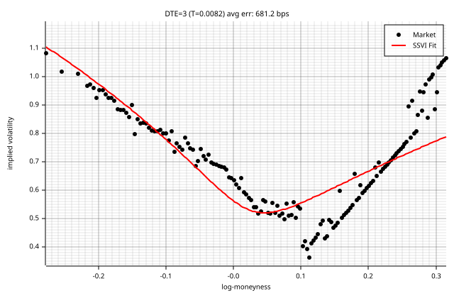

### DTE = 5 (T = 0.0137)

max err: 2227.3 bps | RMSE: 880.0 bps | eta=0.5317, gamma=0.5568, rho=-0.5383 | cal viol: 0

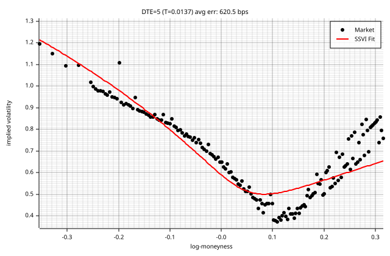

### DTE = 7 (T = 0.0192)

max err: 8347.1 bps | RMSE: 1329.1 bps | eta=0.5369, gamma=0.6255, rho=-0.5693 | cal viol: 0

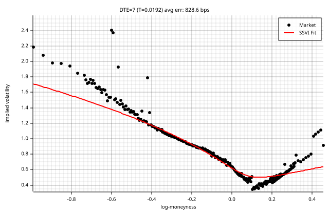

### DTE = 10 (T = 0.0274)

max err: 5227.3 bps | RMSE: 947.5 bps | eta=0.5385, gamma=0.6077, rho=-0.5980 | cal viol: 10

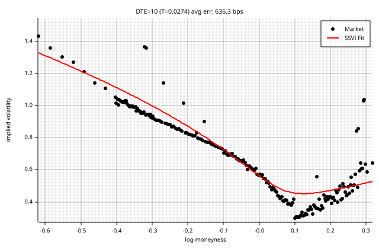

### DTE = 12 (T = 0.0329)

max err: 3201.4 bps | RMSE: 655.8 bps | eta=0.5191, gamma=0.6026, rho=-0.6508 | cal viol: 3

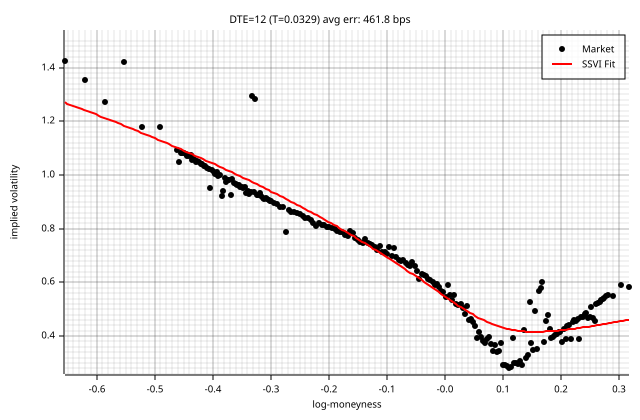

### DTE = 14 (T = 0.0384)

max err: 2396.7 bps | RMSE: 631.0 bps | eta=0.5450, gamma=0.6047, rho=-0.7140 | cal viol: 0

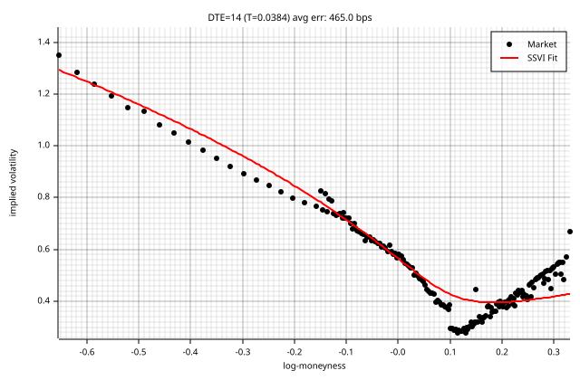

### DTE = 17 (T = 0.0466)

max err: 2252.3 bps | RMSE: 546.5 bps | eta=0.5572, gamma=0.5783, rho=-0.7775 | cal viol: 4

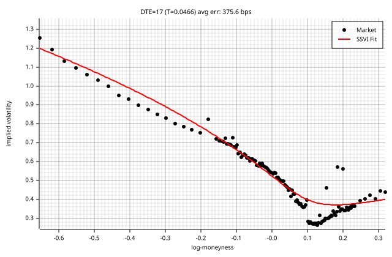

### DTE = 18 (T = 0.0493)

max err: 3579.6 bps | RMSE: 882.7 bps | eta=0.5288, gamma=0.6067, rho=-0.6600 | cal viol: 0

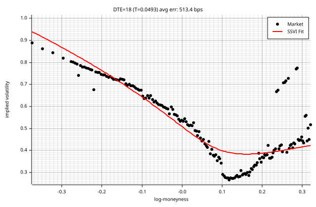

### DTE = 19 (T = 0.0521)

max err: 1286.4 bps | RMSE: 510.9 bps | eta=0.5323, gamma=0.5920, rho=-0.7464 | cal viol: 5

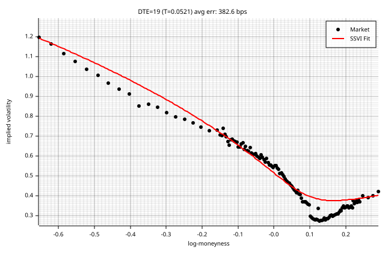

### DTE = 21 (T = 0.0575)

max err: 1899.4 bps | RMSE: 567.0 bps | eta=0.5332, gamma=0.6007, rho=-0.7630 | cal viol: 2

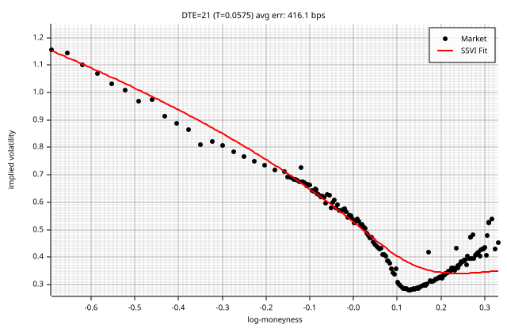

### DTE = 24 (T = 0.0658)

max err: 1405.0 bps | RMSE: 433.9 bps | eta=0.5677, gamma=0.5488, rho=-0.8712 | cal viol: 3

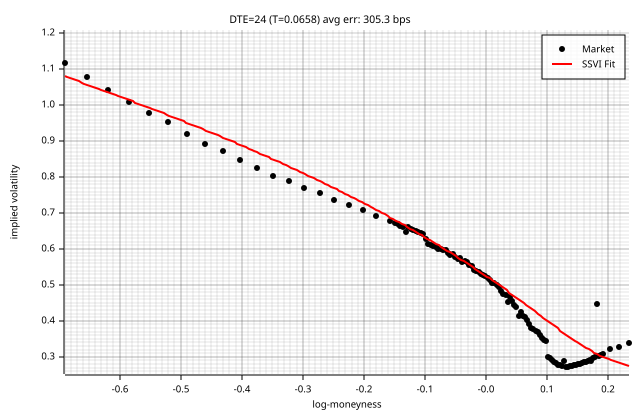

### DTE = 26 (T = 0.0712)

max err: 1028.9 bps | RMSE: 391.2 bps | eta=0.5716, gamma=0.5322, rho=-0.9332 | cal viol: 3

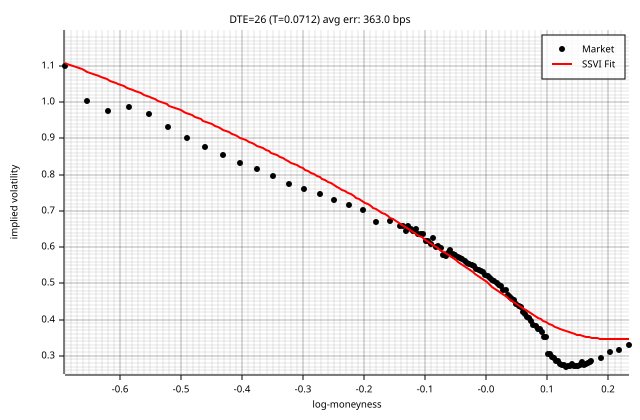

### DTE = 27 (T = 0.0740)

max err: 2172.7 bps | RMSE: 528.8 bps | eta=0.5208, gamma=0.5574, rho=-0.9429 | cal viol: 1

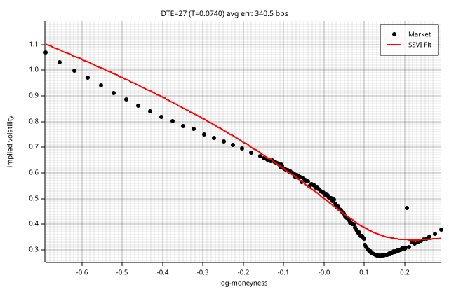

### DTE = 31 (T = 0.0849)

max err: 1312.7 bps | RMSE: 361.9 bps | eta=0.5361, gamma=0.5416, rho=-0.9722 | cal viol: 2

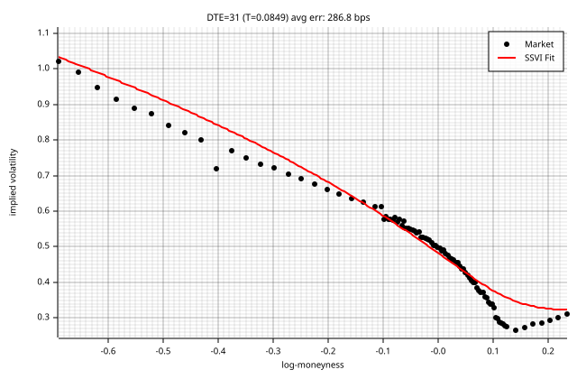

### DTE = 33 (T = 0.0904)

max err: 813.5 bps | RMSE: 265.7 bps | eta=0.5275, gamma=0.5332, rho=-0.9990 | cal viol: 0

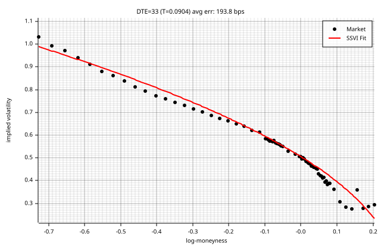

### DTE = 35 (T = 0.0959)

max err: 1736.1 bps | RMSE: 503.9 bps | eta=0.5382, gamma=0.5916, rho=-0.7435 | cal viol: 0

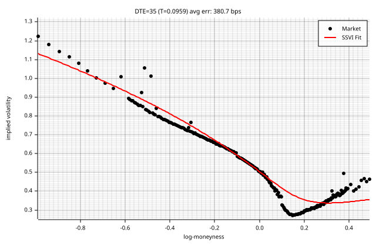

### DTE = 38 (T = 0.1041)

max err: 101.5 bps | RMSE: 54.7 bps | eta=0.5375, gamma=0.5388, rho=-0.9990 | cal viol: 19

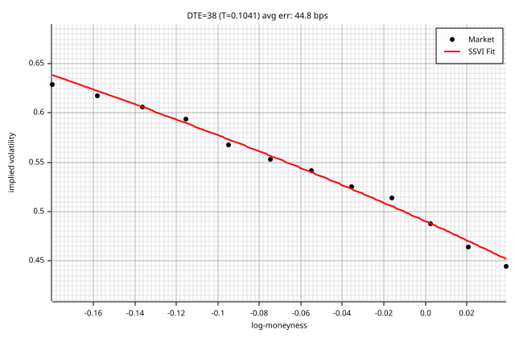

### DTE = 42 (T = 0.1151)

max err: 1408.3 bps | RMSE: 372.5 bps | eta=0.5025, gamma=0.5549, rho=-0.9990 | cal viol: 0

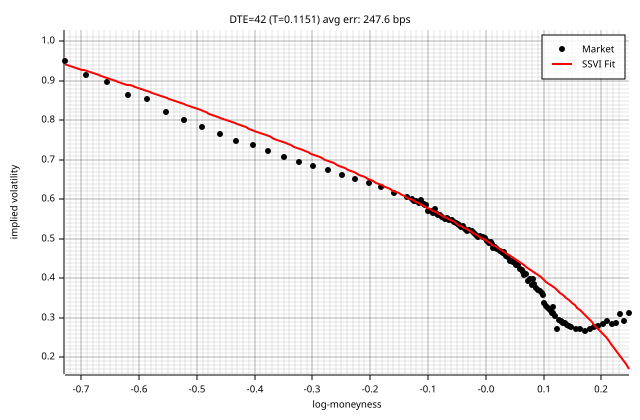

### DTE = 49 (T = 0.1342)

max err: 1856.9 bps | RMSE: 374.3 bps | eta=0.5323, gamma=0.5273, rho=-0.9990 | cal viol: 0

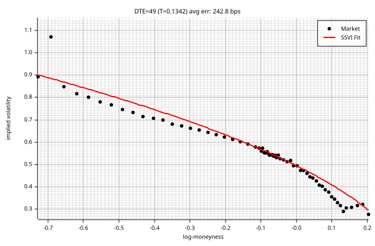

### DTE = 63 (T = 0.1726)

max err: 1434.6 bps | RMSE: 412.1 bps | eta=0.5041, gamma=0.5522, rho=-0.9104 | cal viol: 0

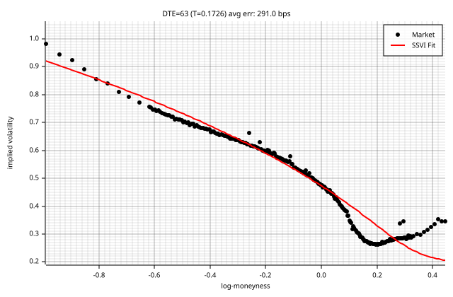

### DTE = 98 (T = 0.2685)

max err: 1505.6 bps | RMSE: 453.2 bps | eta=0.5143, gamma=0.5749, rho=-0.8973 | cal viol: 0

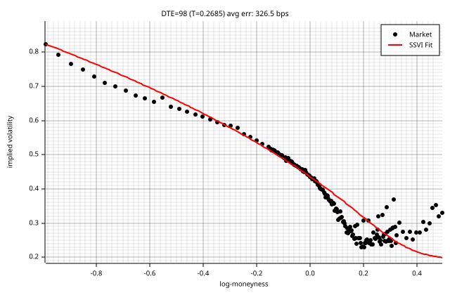

### DTE = 109 (T = 0.2986)

max err: 827.7 bps | RMSE: 306.4 bps | eta=0.5966, gamma=0.6236, rho=-0.8115 | cal viol: 9

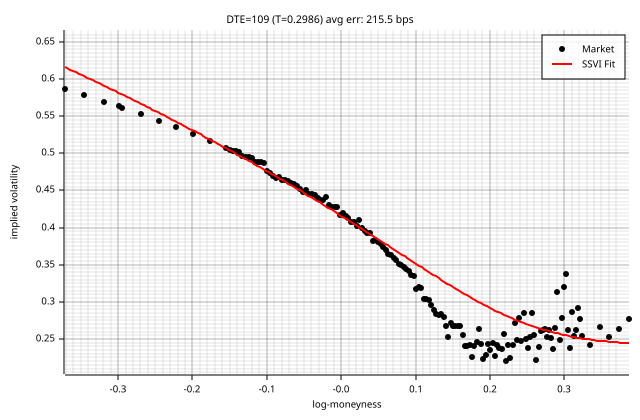

### DTE = 126 (T = 0.3452)

max err: 1152.4 bps | RMSE: 358.6 bps | eta=0.5480, gamma=0.6030, rho=-0.9038 | cal viol: 2

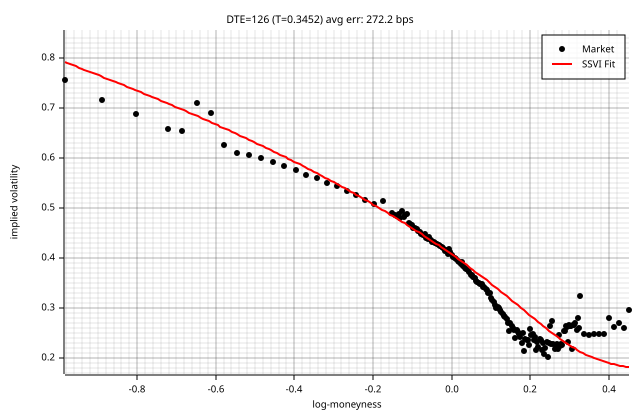

### DTE = 189 (T = 0.5178)

max err: 1404.1 bps | RMSE: 345.4 bps | eta=0.5506, gamma=0.6624, rho=-0.8050 | cal viol: 0

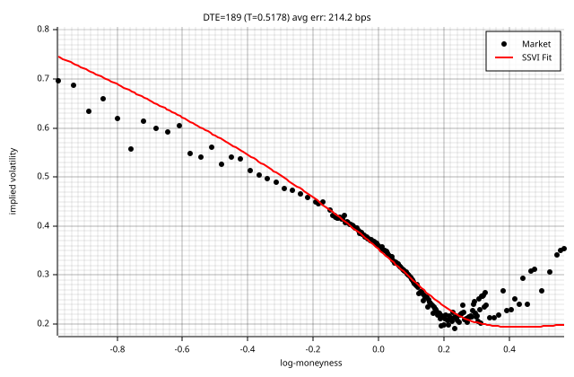

### DTE = 201 (T = 0.5507)

max err: 535.4 bps | RMSE: 216.0 bps | eta=0.5911, gamma=0.6711, rho=-0.8184 | cal viol: 8

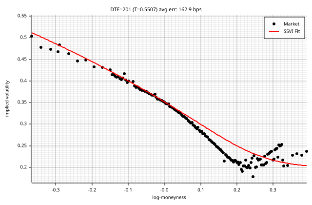

### DTE = 217 (T = 0.5945)

max err: 1282.6 bps | RMSE: 342.8 bps | eta=0.5624, gamma=0.7136, rho=-0.7387 | cal viol: 0

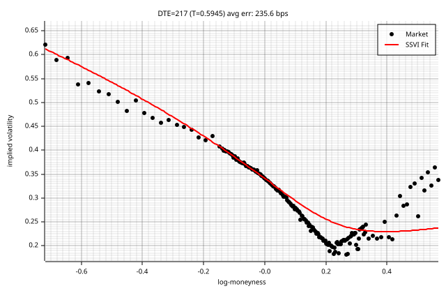

### DTE = 252 (T = 0.6904)

max err: 757.4 bps | RMSE: 187.3 bps | eta=0.5631, gamma=0.6603, rho=-0.8668 | cal viol: 4

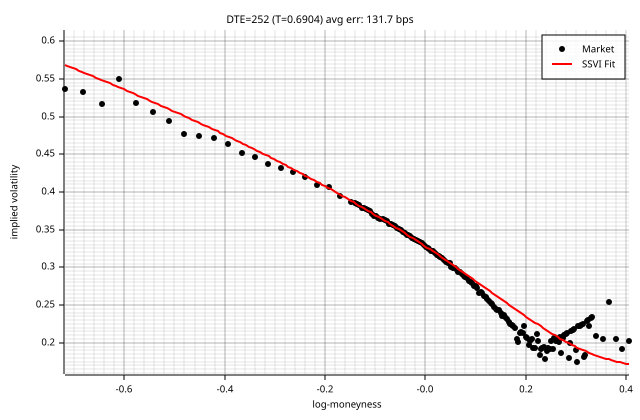

### DTE = 280 (T = 0.7671)

max err: 598.2 bps | RMSE: 192.2 bps | eta=0.5405, gamma=0.6466, rho=-0.8962 | cal viol: 0

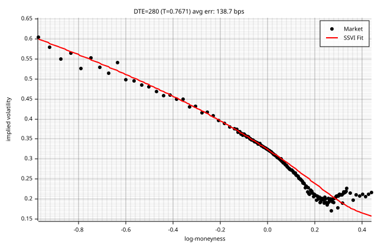

### DTE = 293 (T = 0.8027)

max err: 1070.0 bps | RMSE: 213.6 bps | eta=0.5856, gamma=0.7075, rho=-0.7598 | cal viol: 15

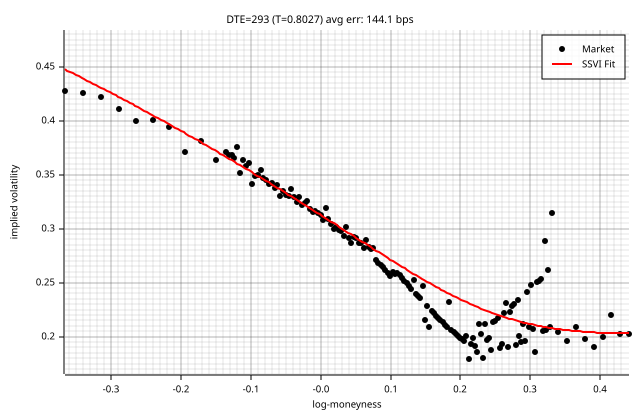

### DTE = 308 (T = 0.8438)

max err: 680.5 bps | RMSE: 214.0 bps | eta=0.5676, gamma=0.6553, rho=-0.8760 | cal viol: 3

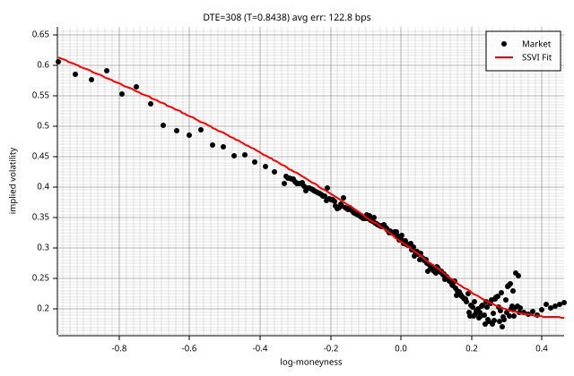

### DTE = 371 (T = 1.0164)

max err: 1203.6 bps | RMSE: 230.5 bps | eta=0.5617, gamma=0.7137, rho=-0.8150 | cal viol: 0

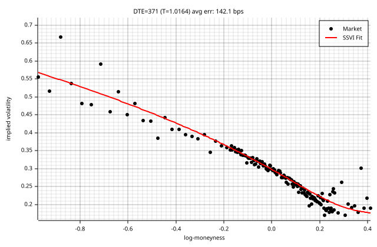

### DTE = 462 (T = 1.2658)

max err: 1215.0 bps | RMSE: 295.6 bps | eta=0.5607, gamma=0.7961, rho=-0.6818 | cal viol: 0

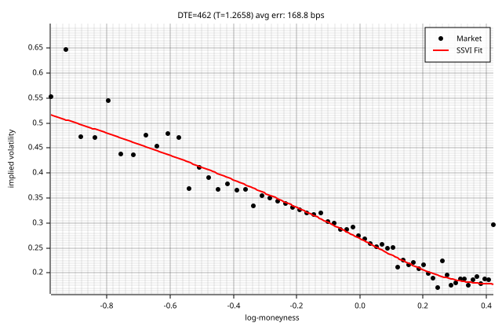

### DTE = 553 (T = 1.5151)

max err: 863.2 bps | RMSE: 209.6 bps | eta=0.5605, gamma=0.7627, rho=-0.6932 | cal viol: 2

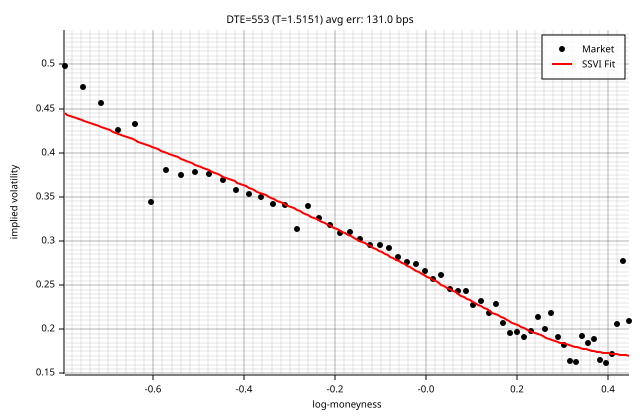

### DTE = 644 (T = 1.7644)

max err: 817.7 bps | RMSE: 201.4 bps | eta=0.5667, gamma=0.7772, rho=-0.6680 | cal viol: 0

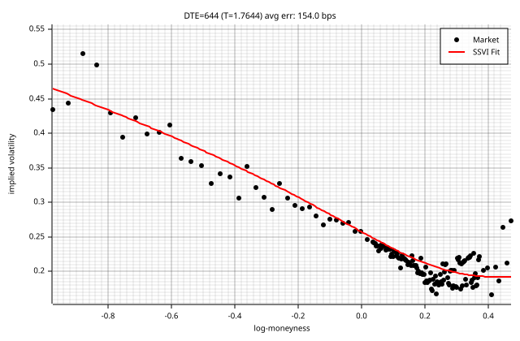

### DTE = 679 (T = 1.8603)

max err: 419.2 bps | RMSE: 130.9 bps | eta=0.5624, gamma=0.7698, rho=-0.6734 | cal viol: 9

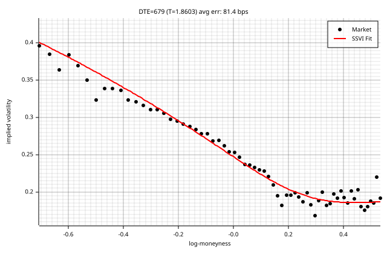

### DTE = 735 (T = 2.0137)

max err: 571.9 bps | RMSE: 227.4 bps | eta=0.5771, gamma=0.8128, rho=-0.5895 | cal viol: 0

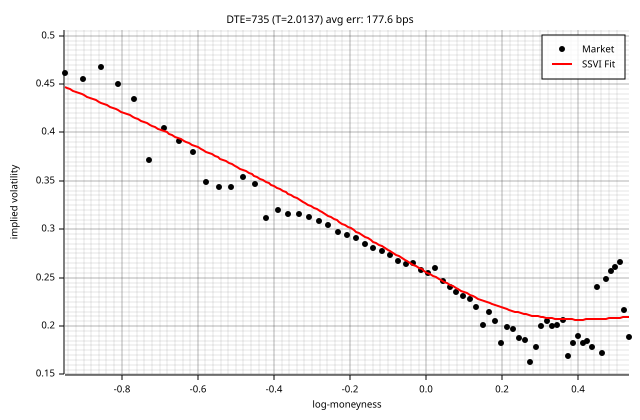

### DTE = 1008 (T = 2.7616)

max err: 230.4 bps | RMSE: 89.4 bps | eta=0.5653, gamma=0.7383, rho=-0.6501 | cal viol: 1

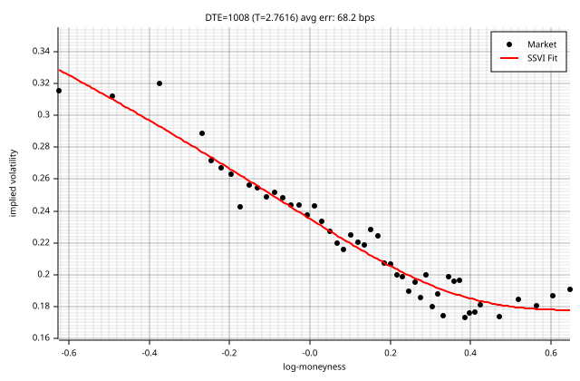

