# SSVI Direct Solver Fit: Kaggle SPY (2020-03-13)

4D Nelder-Mead direct solver with algebraic no-arb barrier.

- Objective: pure SSE on total variance
- No-arb barrier: eta*(1+|rho|) <= 2
- Calendar penalty: theta monotonicity via lambda_calendar
- Butterfly: post-hoc validation
- IV rule: P_IV (k < -0.1), mean(P_IV,C_IV) (-0.1..0.1), C_IV (k > 0.1)

## Calibration Summary

| DTE | T | max err (bps) | RMSE (bps) | avg err (bps) | eta | gamma | rho | phi | cal viol | converged |
|----:|------:|--------------:|-----------:|--------------:|------:|------:|------:|------:|---------:|:---------:|
| 3 | 0.0082 | 2517.8 | 940.8 | 688.2 | 0.3420 | 0.6511 | -0.3520 | 16.017 | 0 | yes |
| 5 | 0.0137 | 2034.8 | 784.1 | 614.6 | 1.1354 | 0.4463 | -0.5124 | 12.047 | 0 | yes |
| 7 | 0.0192 | 8249.7 | 1257.5 | 921.8 | 0.7174 | 0.6134 | -0.5296 | 17.701 | 1 | yes |
| 10 | 0.0274 | 4925.0 | 917.6 | 649.4 | 0.5269 | 0.6420 | -0.5458 | 12.256 | 37 | yes |
| 12 | 0.0329 | 3197.2 | 642.6 | 467.8 | 0.4912 | 0.6389 | -0.5767 | 9.789 | 8 | yes |
| 14 | 0.0384 | 1907.0 | 561.5 | 441.4 | 0.8436 | 0.5368 | -0.6454 | 9.401 | 10 | yes |
| 17 | 0.0466 | 1846.1 | 550.2 | 418.6 | 1.1783 | 0.4517 | -0.6627 | 8.591 | 10 | yes |
| 18 | 0.0493 | 3450.3 | 832.7 | 521.4 | 0.8912 | 0.5157 | -0.6289 | 8.378 | 0 | yes |
| 19 | 0.0521 | 1200.8 | 536.7 | 427.2 | 0.4880 | 0.6559 | -0.6517 | 8.132 | 13 | yes |
| 21 | 0.0575 | 1350.8 | 508.6 | 399.1 | 0.1686 | 0.9051 | -0.6751 | 7.590 | 10 | yes |
| 24 | 0.0658 | 986.4 | 464.1 | 372.7 | 0.8763 | 0.5067 | -0.6943 | 7.055 | 10 | yes |
| 26 | 0.0712 | 993.1 | 458.6 | 364.1 | 0.8349 | 0.5067 | -0.7142 | 6.433 | 10 | yes |
| 27 | 0.0740 | 1248.3 | 420.8 | 339.3 | 0.3504 | 0.7224 | -0.7264 | 6.356 | 13 | yes |
| 31 | 0.0849 | 990.2 | 351.0 | 274.0 | 0.3659 | 0.7010 | -0.7414 | 5.773 | 23 | yes |
| 33 | 0.0904 | 896.3 | 264.4 | 201.5 | 0.1111 | 0.9998 | -0.7607 | 5.193 | 7 | yes |
| 35 | 0.0959 | 1735.2 | 420.1 | 336.4 | 0.1315 | 0.9890 | -0.7063 | 5.798 | 0 | yes |
| 38 | 0.1041 | 115.2 | 63.9 | 53.1 | 0.3835 | 0.6975 | -0.7306 | 5.003 | 5 | yes |
| 42 | 0.1151 | 991.9 | 363.8 | 289.4 | 0.9680 | 0.4499 | -0.7471 | 4.932 | 11 | yes |
| 49 | 0.1342 | 1765.8 | 363.0 | 260.4 | 0.6311 | 0.5486 | -0.7848 | 4.234 | 6 | yes |
| 63 | 0.1726 | 1000.6 | 335.6 | 265.3 | 0.1800 | 0.8966 | -0.8334 | 3.527 | 6 | yes |
| 98 | 0.2685 | 1295.7 | 379.8 | 294.0 | 0.3233 | 0.7535 | -0.8498 | 3.184 | 0 | yes |
| 109 | 0.2986 | 852.7 | 266.5 | 192.7 | 0.7899 | 0.5592 | -0.7992 | 4.108 | 5 | yes |
| 126 | 0.3452 | 905.3 | 285.9 | 228.7 | 0.5824 | 0.6378 | -0.8214 | 3.675 | 39 | yes |
| 189 | 0.5178 | 1280.7 | 306.9 | 217.6 | 0.3845 | 0.8109 | -0.7725 | 3.560 | 0 | yes |
| 201 | 0.5507 | 558.6 | 193.2 | 142.6 | 0.2869 | 0.9651 | -0.7690 | 3.968 | 7 | yes |
| 217 | 0.5945 | 1182.7 | 306.4 | 215.2 | 0.2850 | 0.9853 | -0.7123 | 4.167 | 11 | yes |
| 252 | 0.6904 | 507.0 | 193.6 | 146.8 | 0.9080 | 0.5386 | -0.7456 | 3.657 | 37 | yes |
| 280 | 0.7671 | 484.4 | 166.3 | 126.3 | 0.7826 | 0.5589 | -0.7847 | 3.179 | 37 | yes |
| 293 | 0.8027 | 1059.6 | 206.3 | 138.0 | 0.4260 | 0.8421 | -0.7487 | 3.626 | 7 | yes |
| 308 | 0.8438 | 544.4 | 155.8 | 112.9 | 0.8232 | 0.5807 | -0.7613 | 3.470 | 40 | yes |
| 371 | 1.0164 | 1185.0 | 221.9 | 135.5 | 0.9409 | 0.5295 | -0.7784 | 3.283 | 0 | yes |
| 462 | 1.2658 | 1194.9 | 290.2 | 200.9 | 1.1381 | 0.5382 | -0.6481 | 4.009 | 0 | yes |
| 553 | 1.5151 | 832.8 | 205.1 | 137.5 | 0.8616 | 0.6034 | -0.6668 | 3.276 | 29 | yes |
| 644 | 1.7644 | 692.3 | 179.7 | 131.4 | 0.3813 | 0.9965 | -0.5864 | 3.522 | 0 | yes |
| 679 | 1.8603 | 390.6 | 120.0 | 92.6 | 0.3891 | 0.9652 | -0.6156 | 3.161 | 37 | yes |
| 735 | 2.0137 | 530.4 | 210.2 | 159.1 | 0.4615 | 0.9553 | -0.5502 | 3.425 | 0 | yes |
| 1008 | 2.7616 | 230.0 | 89.5 | 69.4 | 0.7696 | 0.5967 | -0.6432 | 2.221 | 29 | yes |

## Fit Plots

### DTE = 3 (T = 0.0082)

max err: 2517.8 bps | RMSE: 940.8 bps | eta=0.3420, gamma=0.6511, rho=-0.3520 | cal viol: 0

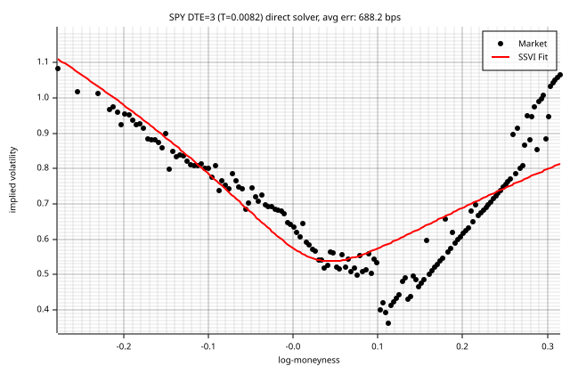

### DTE = 5 (T = 0.0137)

max err: 2034.8 bps | RMSE: 784.1 bps | eta=1.1354, gamma=0.4463, rho=-0.5124 | cal viol: 0

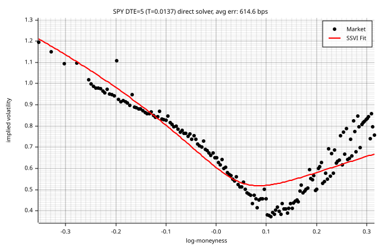

### DTE = 7 (T = 0.0192)

max err: 8249.7 bps | RMSE: 1257.5 bps | eta=0.7174, gamma=0.6134, rho=-0.5296 | cal viol: 1

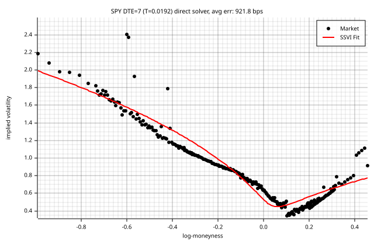

### DTE = 10 (T = 0.0274)

max err: 4925.0 bps | RMSE: 917.6 bps | eta=0.5269, gamma=0.6420, rho=-0.5458 | cal viol: 37

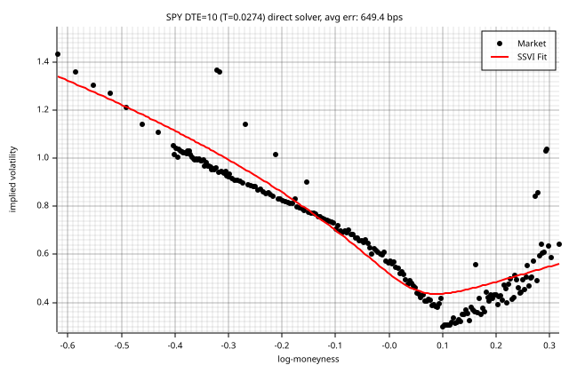

### DTE = 12 (T = 0.0329)

max err: 3197.2 bps | RMSE: 642.6 bps | eta=0.4912, gamma=0.6389, rho=-0.5767 | cal viol: 8

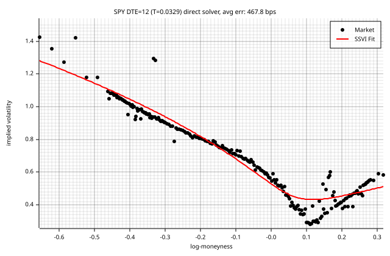

### DTE = 14 (T = 0.0384)

max err: 1907.0 bps | RMSE: 561.5 bps | eta=0.8436, gamma=0.5368, rho=-0.6454 | cal viol: 10

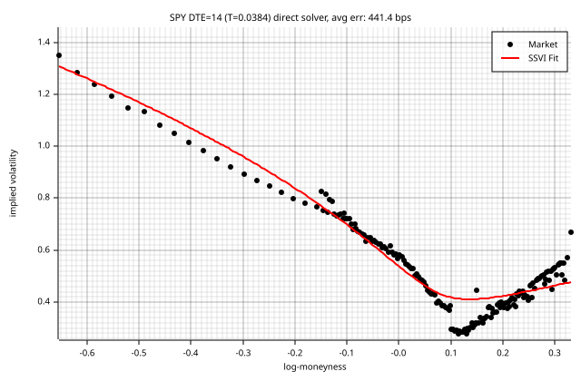

### DTE = 17 (T = 0.0466)

max err: 1846.1 bps | RMSE: 550.2 bps | eta=1.1783, gamma=0.4517, rho=-0.6627 | cal viol: 10

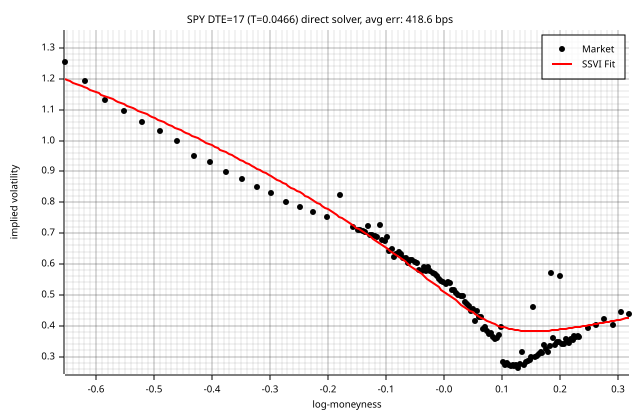

### DTE = 18 (T = 0.0493)

max err: 3450.3 bps | RMSE: 832.7 bps | eta=0.8912, gamma=0.5157, rho=-0.6289 | cal viol: 0

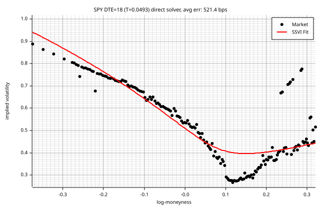

### DTE = 19 (T = 0.0521)

max err: 1200.8 bps | RMSE: 536.7 bps | eta=0.4880, gamma=0.6559, rho=-0.6517 | cal viol: 13

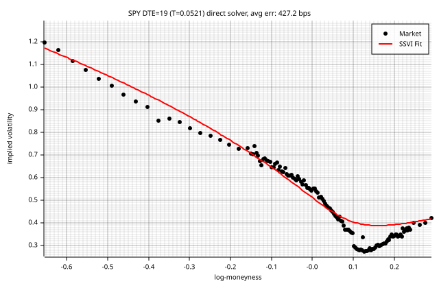

### DTE = 21 (T = 0.0575)

max err: 1350.8 bps | RMSE: 508.6 bps | eta=0.1686, gamma=0.9051, rho=-0.6751 | cal viol: 10

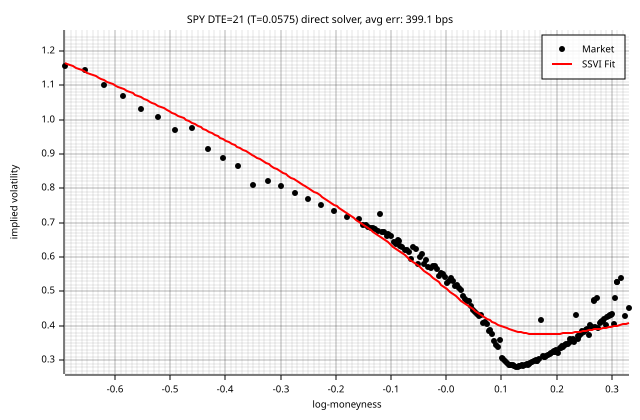

### DTE = 24 (T = 0.0658)

max err: 986.4 bps | RMSE: 464.1 bps | eta=0.8763, gamma=0.5067, rho=-0.6943 | cal viol: 10

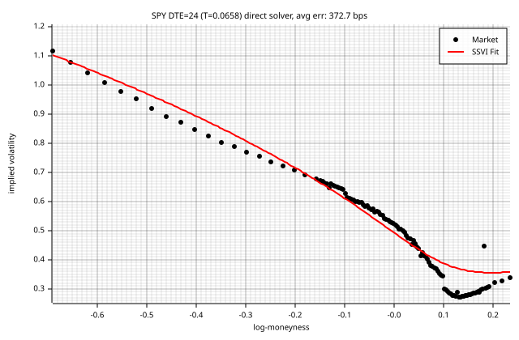

### DTE = 26 (T = 0.0712)

max err: 993.1 bps | RMSE: 458.6 bps | eta=0.8349, gamma=0.5067, rho=-0.7142 | cal viol: 10

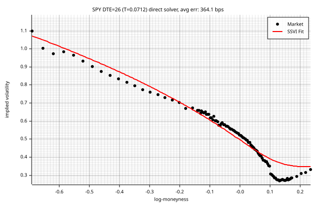

### DTE = 27 (T = 0.0740)

max err: 1248.3 bps | RMSE: 420.8 bps | eta=0.3504, gamma=0.7224, rho=-0.7264 | cal viol: 13

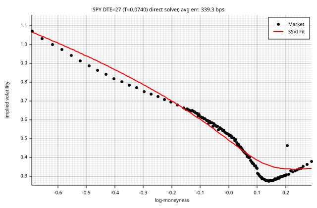

### DTE = 31 (T = 0.0849)

max err: 990.2 bps | RMSE: 351.0 bps | eta=0.3659, gamma=0.7010, rho=-0.7414 | cal viol: 23

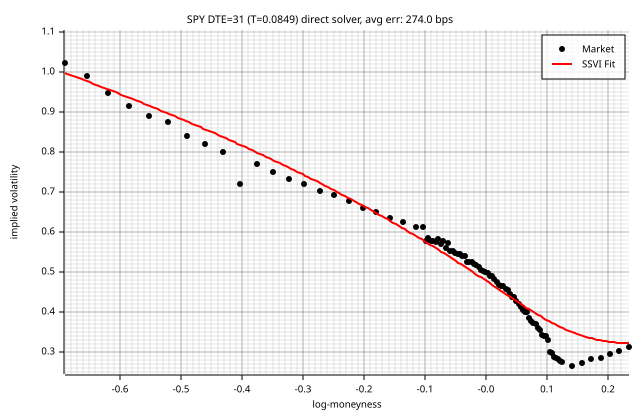

### DTE = 33 (T = 0.0904)

max err: 896.3 bps | RMSE: 264.4 bps | eta=0.1111, gamma=0.9998, rho=-0.7607 | cal viol: 7

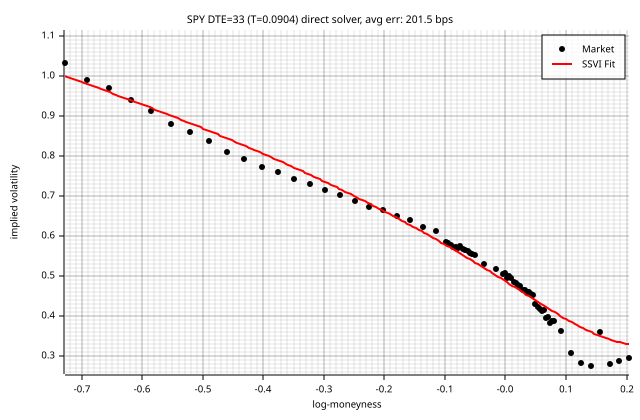

### DTE = 35 (T = 0.0959)

max err: 1735.2 bps | RMSE: 420.1 bps | eta=0.1315, gamma=0.9890, rho=-0.7063 | cal viol: 0

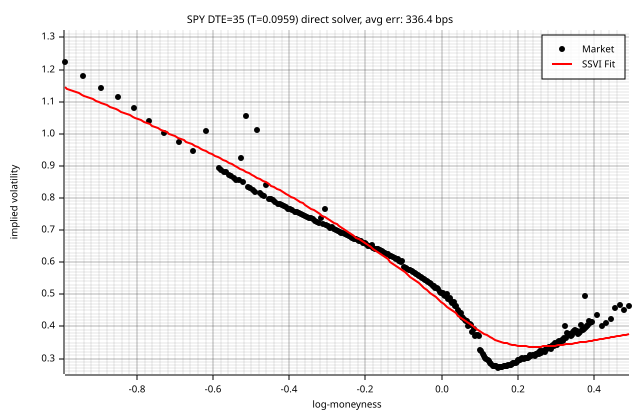

### DTE = 38 (T = 0.1041)

max err: 115.2 bps | RMSE: 63.9 bps | eta=0.3835, gamma=0.6975, rho=-0.7306 | cal viol: 5

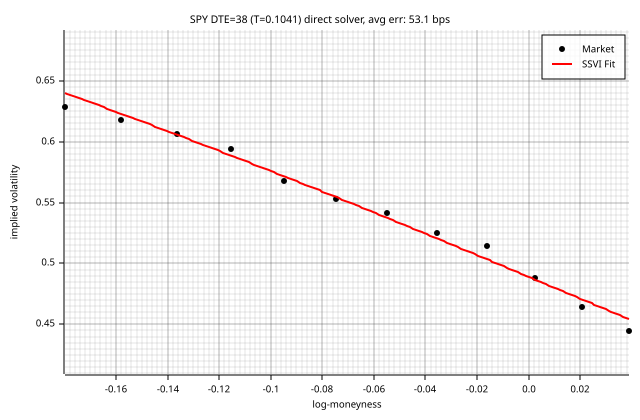

### DTE = 42 (T = 0.1151)

max err: 991.9 bps | RMSE: 363.8 bps | eta=0.9680, gamma=0.4499, rho=-0.7471 | cal viol: 11

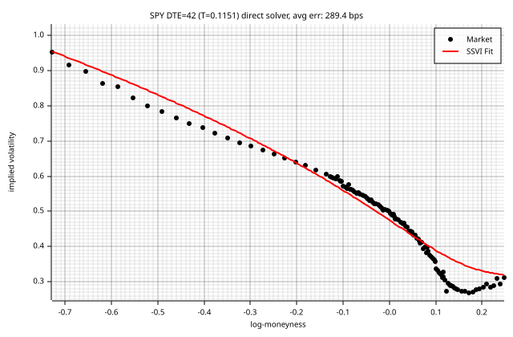

### DTE = 49 (T = 0.1342)

max err: 1765.8 bps | RMSE: 363.0 bps | eta=0.6311, gamma=0.5486, rho=-0.7848 | cal viol: 6

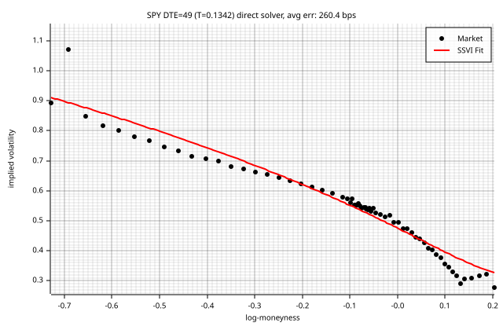

### DTE = 63 (T = 0.1726)

max err: 1000.6 bps | RMSE: 335.6 bps | eta=0.1800, gamma=0.8966, rho=-0.8334 | cal viol: 6

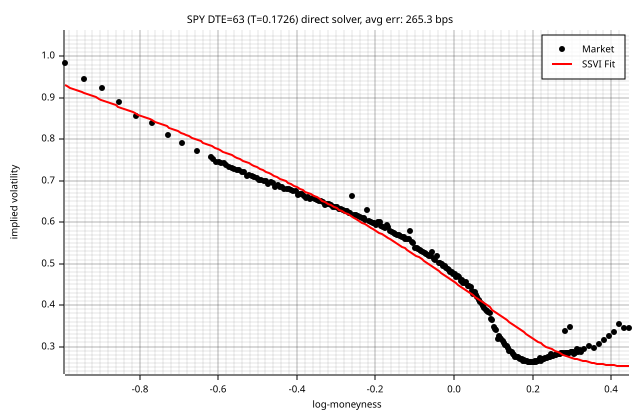

### DTE = 98 (T = 0.2685)

max err: 1295.7 bps | RMSE: 379.8 bps | eta=0.3233, gamma=0.7535, rho=-0.8498 | cal viol: 0

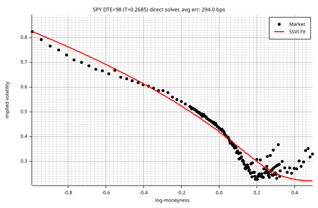

### DTE = 109 (T = 0.2986)

max err: 852.7 bps | RMSE: 266.5 bps | eta=0.7899, gamma=0.5592, rho=-0.7992 | cal viol: 5

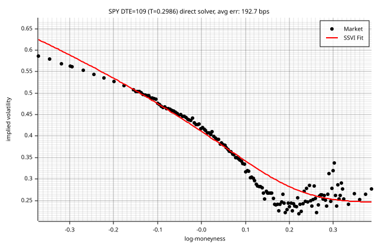

### DTE = 126 (T = 0.3452)

max err: 905.3 bps | RMSE: 285.9 bps | eta=0.5824, gamma=0.6378, rho=-0.8214 | cal viol: 39

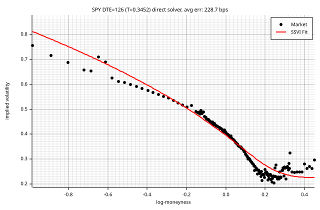

### DTE = 189 (T = 0.5178)

max err: 1280.7 bps | RMSE: 306.9 bps | eta=0.3845, gamma=0.8109, rho=-0.7725 | cal viol: 0

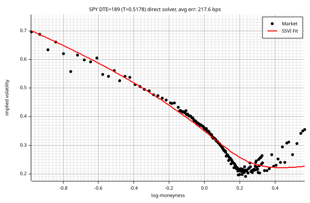

### DTE = 201 (T = 0.5507)

max err: 558.6 bps | RMSE: 193.2 bps | eta=0.2869, gamma=0.9651, rho=-0.7690 | cal viol: 7

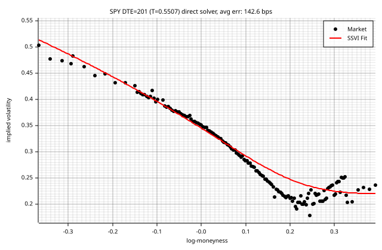

### DTE = 217 (T = 0.5945)

max err: 1182.7 bps | RMSE: 306.4 bps | eta=0.2850, gamma=0.9853, rho=-0.7123 | cal viol: 11

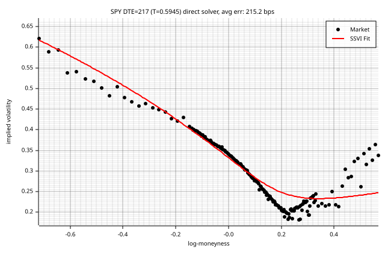

### DTE = 252 (T = 0.6904)

max err: 507.0 bps | RMSE: 193.6 bps | eta=0.9080, gamma=0.5386, rho=-0.7456 | cal viol: 37

### DTE = 280 (T = 0.7671)

max err: 484.4 bps | RMSE: 166.3 bps | eta=0.7826, gamma=0.5589, rho=-0.7847 | cal viol: 37

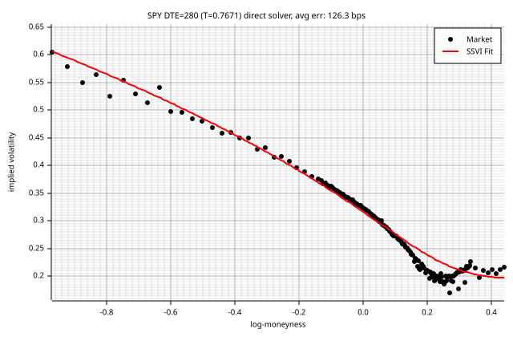

### DTE = 293 (T = 0.8027)

max err: 1059.6 bps | RMSE: 206.3 bps | eta=0.4260, gamma=0.8421, rho=-0.7487 | cal viol: 7

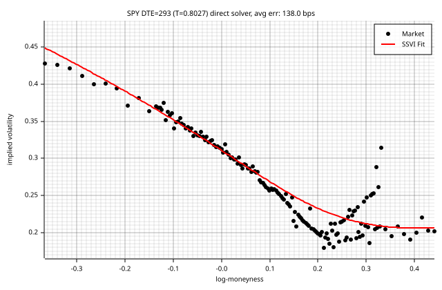

### DTE = 308 (T = 0.8438)

max err: 544.4 bps | RMSE: 155.8 bps | eta=0.8232, gamma=0.5807, rho=-0.7613 | cal viol: 40

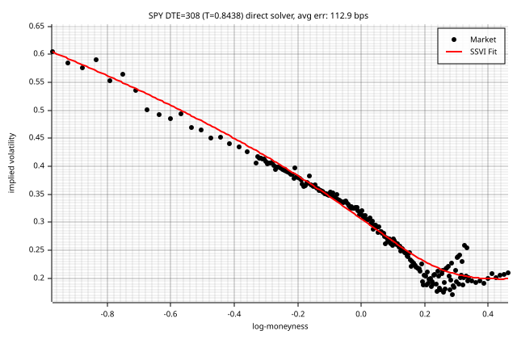

### DTE = 371 (T = 1.0164)

max err: 1185.0 bps | RMSE: 221.9 bps | eta=0.9409, gamma=0.5295, rho=-0.7784 | cal viol: 0

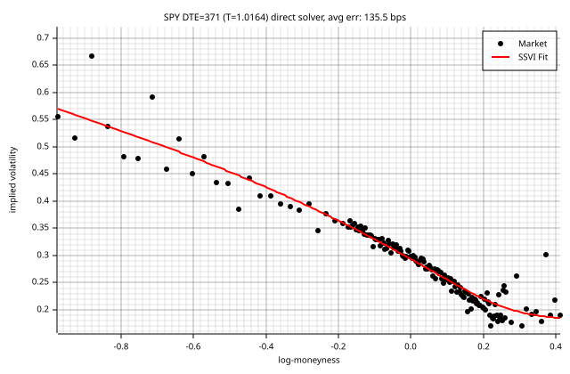

### DTE = 462 (T = 1.2658)

max err: 1194.9 bps | RMSE: 290.2 bps | eta=1.1381, gamma=0.5382, rho=-0.6481 | cal viol: 0

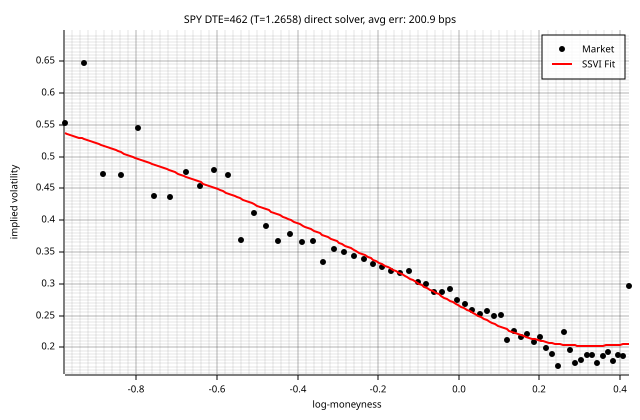

### DTE = 553 (T = 1.5151)

max err: 832.8 bps | RMSE: 205.1 bps | eta=0.8616, gamma=0.6034, rho=-0.6668 | cal viol: 29

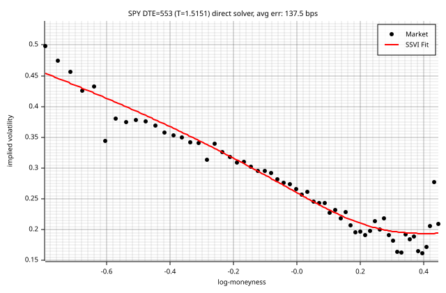

### DTE = 644 (T = 1.7644)

max err: 692.3 bps | RMSE: 179.7 bps | eta=0.3813, gamma=0.9965, rho=-0.5864 | cal viol: 0

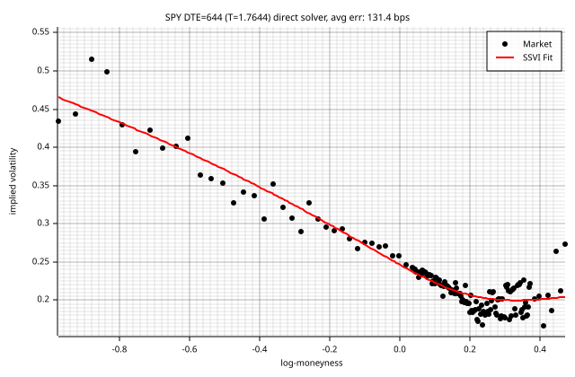

### DTE = 679 (T = 1.8603)

max err: 390.6 bps | RMSE: 120.0 bps | eta=0.3891, gamma=0.9652, rho=-0.6156 | cal viol: 37

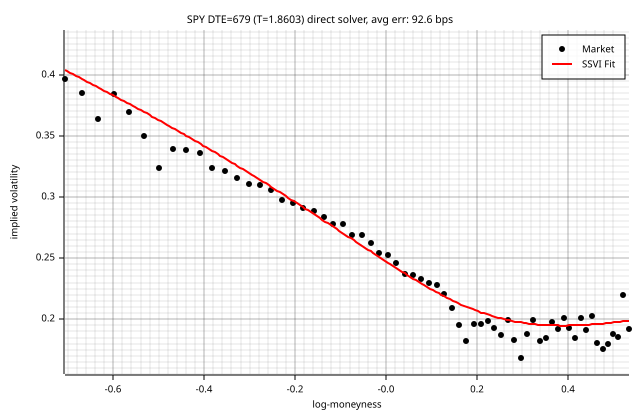

### DTE = 735 (T = 2.0137)

max err: 530.4 bps | RMSE: 210.2 bps | eta=0.4615, gamma=0.9553, rho=-0.5502 | cal viol: 0

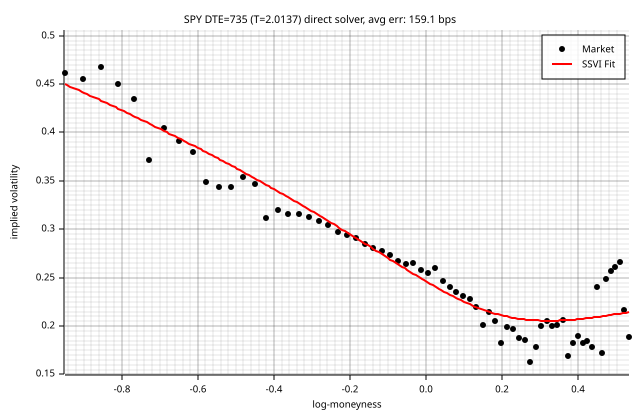

### DTE = 1008 (T = 2.7616)

max err: 230.0 bps | RMSE: 89.5 bps | eta=0.7696, gamma=0.5967, rho=-0.6432 | cal viol: 29

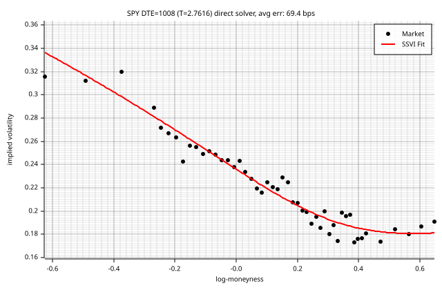

