# SSVI Kaggle Fit: 2020-03-16

Surface calibration with calendar arbitrage penalty.

- k penalty range: -1.5 to 0.5, step 0.025
- lambda: 100
- IV rule: P_IV (k < -0.1), mean(P_IV,C_IV) (-0.1..0.1), C_IV (k > 0.1)

## Calibration Summary

| DTE | T | max err (bps) | RMSE (bps) | avg err (bps) | eta | gamma | rho | phi | cal viol | converged |
|----:|------:|--------------:|-----------:|--------------:|------:|------:|------:|------:|---------:|:---------:|
| 2 | 0.0055 | 4118.9 | 1537.7 | 1145.5 | 0.5358 | 0.4598 | -0.5652 | 4.686 | 0 | yes |
| 4 | 0.0110 | 6212.9 | 1443.4 | 988.9 | 0.5183 | 0.5157 | -0.7076 | 4.441 | 0 | yes |
| 7 | 0.0192 | 7442.0 | 995.6 | 685.1 | 0.5185 | 0.5521 | -0.7236 | 4.541 | 0 | yes |
| 9 | 0.0247 | 2133.1 | 823.1 | 600.6 | 0.5460 | 0.5290 | -0.7688 | 3.888 | 1 | yes |
| 11 | 0.0301 | 2371.2 | 1116.9 | 934.9 | 0.5037 | 0.5708 | -0.8069 | 3.772 | 0 | yes |
| 14 | 0.0384 | 1977.2 | 763.6 | 608.7 | 0.5339 | 0.5596 | -0.8183 | 3.724 | 4 | yes |
| 15 | 0.0411 | 1745.7 | 786.4 | 618.0 | 0.5773 | 0.5430 | -0.8111 | 3.741 | 0 | yes |
| 16 | 0.0438 | 1612.8 | 706.2 | 558.7 | 0.5486 | 0.5565 | -0.8275 | 3.554 | 2 | yes |
| 18 | 0.0493 | 1701.7 | 806.1 | 655.8 | 0.5329 | 0.5632 | -0.8468 | 3.315 | 1 | yes |
| 21 | 0.0575 | 1382.0 | 657.0 | 514.5 | 0.5956 | 0.5293 | -0.8611 | 3.180 | 3 | yes |
| 23 | 0.0630 | 1318.6 | 604.5 | 476.0 | 0.7323 | 0.4629 | -0.8732 | 3.057 | 3 | yes |
| 24 | 0.0658 | 1692.0 | 696.4 | 559.1 | 0.5700 | 0.5479 | -0.8847 | 2.999 | 3 | yes |
| 28 | 0.0767 | 2890.4 | 720.0 | 529.2 | 0.5643 | 0.5181 | -0.9990 | 2.648 | 28 | yes |
| 30 | 0.0822 | 1256.6 | 540.3 | 426.0 | 0.4643 | 0.5709 | -0.9990 | 2.491 | 1 | yes |
| 32 | 0.0877 | 4806.2 | 1007.0 | 740.5 | 0.5237 | 0.5320 | -0.9238 | 2.414 | 3 | yes |
| 35 | 0.0959 | 901.6 | 363.9 | 268.0 | 0.4638 | 0.5649 | -0.9990 | 2.406 | 81 | yes |
| 39 | 0.1068 | 1522.5 | 536.6 | 415.7 | 0.5274 | 0.5516 | -0.9919 | 2.361 | 0 | yes |
| 46 | 0.1260 | 913.8 | 403.8 | 296.7 | 0.4793 | 0.5557 | -0.9990 | 2.037 | 2 | yes |
| 60 | 0.1644 | 4186.8 | 828.6 | 507.9 | 0.5429 | 0.5346 | -0.9990 | 1.973 | 0 | yes |
| 95 | 0.2603 | 2799.5 | 841.2 | 546.4 | 0.5497 | 0.6506 | -0.9781 | 2.254 | 0 | yes |
| 106 | 0.2904 | 1162.7 | 414.5 | 323.2 | 0.5600 | 0.6939 | -0.9482 | 2.411 | 0 | yes |
| 123 | 0.3370 | 1840.6 | 569.7 | 435.7 | 0.6090 | 0.6605 | -0.9574 | 2.310 | 1 | yes |
| 186 | 0.5096 | 2409.0 | 653.7 | 433.5 | 0.5718 | 0.7302 | -0.9614 | 2.341 | 1 | yes |
| 198 | 0.5425 | 927.4 | 289.4 | 220.7 | 0.5700 | 0.7684 | -0.9265 | 2.512 | 5 | yes |
| 214 | 0.5863 | 2928.5 | 719.6 | 408.1 | 0.5774 | 0.7555 | -0.9322 | 2.435 | 3 | yes |
| 249 | 0.6822 | 999.5 | 339.5 | 266.0 | 0.5736 | 0.7692 | -0.9417 | 2.358 | 1 | yes |
| 277 | 0.7589 | 1919.0 | 409.4 | 279.5 | 0.5983 | 0.7457 | -0.9436 | 2.331 | 3 | yes |
| 290 | 0.7945 | 831.2 | 289.0 | 203.3 | 0.5796 | 0.7686 | -0.9345 | 2.366 | 12 | yes |
| 305 | 0.8356 | 1241.4 | 271.8 | 189.2 | 0.6154 | 0.7585 | -0.9034 | 2.472 | 17 | yes |
| 368 | 1.0082 | 859.5 | 226.1 | 161.3 | 0.5816 | 0.7769 | -0.9081 | 2.358 | 1 | yes |
| 459 | 1.2575 | 527.3 | 185.5 | 135.3 | 0.6618 | 0.7328 | -0.8040 | 2.361 | 2 | yes |
| 550 | 1.5068 | 1980.7 | 582.1 | 371.5 | 0.6637 | 0.6221 | -0.9990 | 1.775 | 20 | yes |
| 641 | 1.7562 | 993.8 | 260.0 | 199.9 | 0.6693 | 0.6421 | -0.8945 | 1.814 | 1 | yes |
| 676 | 1.8521 | 3154.1 | 1006.9 | 685.9 | 0.5432 | 0.7345 | -0.9990 | 1.812 | 81 | yes |
| 732 | 2.0055 | 727.2 | 228.5 | 171.7 | 0.7045 | 0.8515 | -0.6065 | 2.934 | 4 | yes |
| 1005 | 2.7534 | 406.8 | 153.0 | 118.3 | 1.1078 | 0.4885 | -0.6487 | 2.003 | 1 | yes |

## Fit Plots

### DTE = 2 (T = 0.0055)

max err: 4118.9 bps | RMSE: 1537.7 bps | eta=0.5358, gamma=0.4598, rho=-0.5652 | cal viol: 0

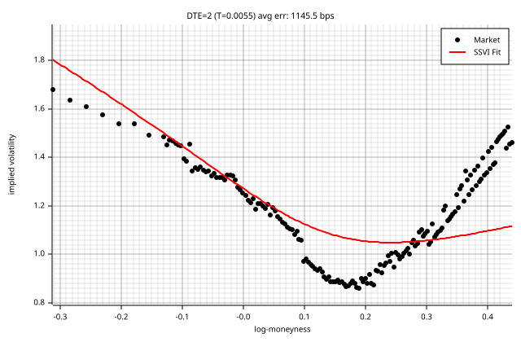

### DTE = 4 (T = 0.0110)

max err: 6212.9 bps | RMSE: 1443.4 bps | eta=0.5183, gamma=0.5157, rho=-0.7076 | cal viol: 0

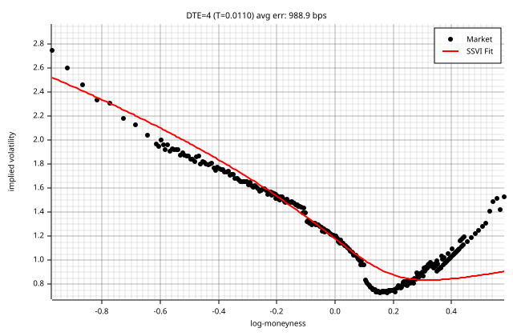

### DTE = 7 (T = 0.0192)

max err: 7442.0 bps | RMSE: 995.6 bps | eta=0.5185, gamma=0.5521, rho=-0.7236 | cal viol: 0

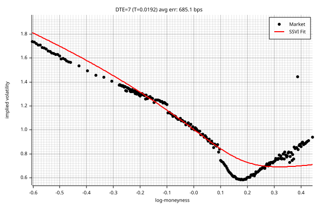

### DTE = 9 (T = 0.0247)

max err: 2133.1 bps | RMSE: 823.1 bps | eta=0.5460, gamma=0.5290, rho=-0.7688 | cal viol: 1

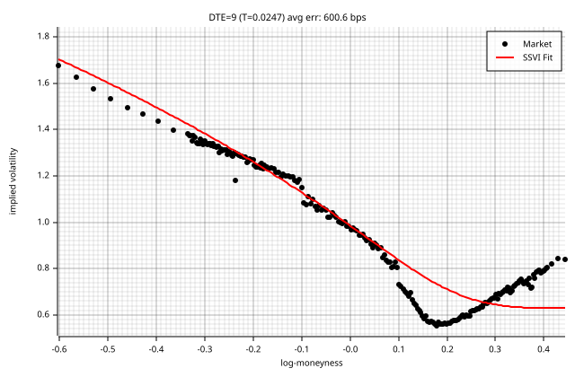

### DTE = 11 (T = 0.0301)

max err: 2371.2 bps | RMSE: 1116.9 bps | eta=0.5037, gamma=0.5708, rho=-0.8069 | cal viol: 0

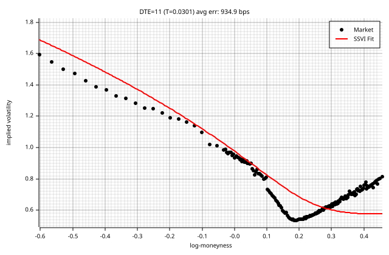

### DTE = 14 (T = 0.0384)

max err: 1977.2 bps | RMSE: 763.6 bps | eta=0.5339, gamma=0.5596, rho=-0.8183 | cal viol: 4

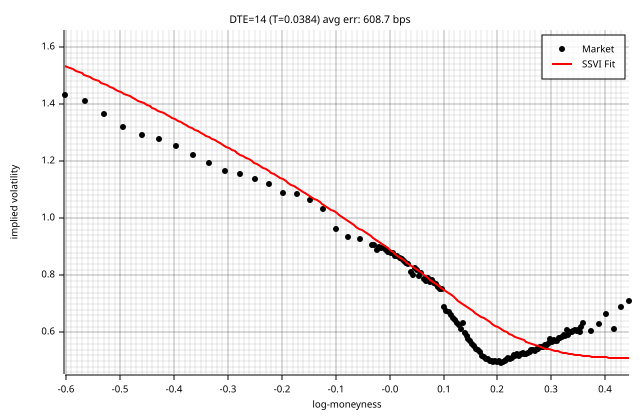

### DTE = 15 (T = 0.0411)

max err: 1745.7 bps | RMSE: 786.4 bps | eta=0.5773, gamma=0.5430, rho=-0.8111 | cal viol: 0

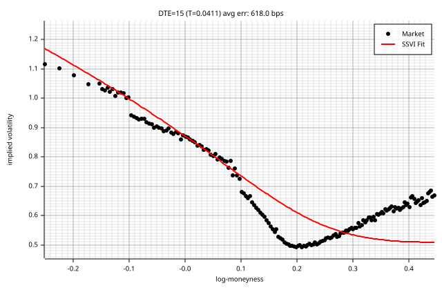

### DTE = 16 (T = 0.0438)

max err: 1612.8 bps | RMSE: 706.2 bps | eta=0.5486, gamma=0.5565, rho=-0.8275 | cal viol: 2

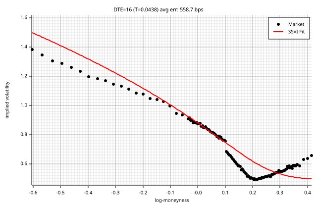

### DTE = 18 (T = 0.0493)

max err: 1701.7 bps | RMSE: 806.1 bps | eta=0.5329, gamma=0.5632, rho=-0.8468 | cal viol: 1

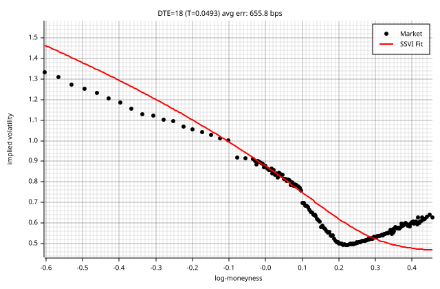

### DTE = 21 (T = 0.0575)

max err: 1382.0 bps | RMSE: 657.0 bps | eta=0.5956, gamma=0.5293, rho=-0.8611 | cal viol: 3

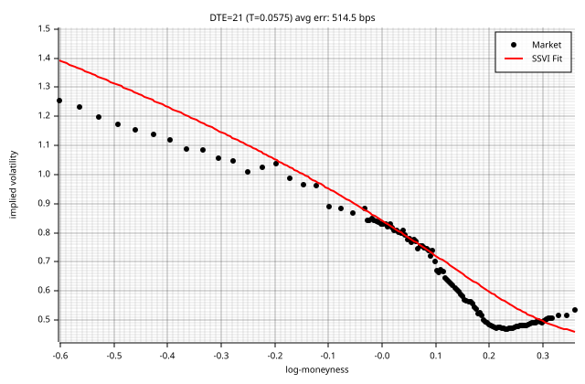

### DTE = 23 (T = 0.0630)

max err: 1318.6 bps | RMSE: 604.5 bps | eta=0.7323, gamma=0.4629, rho=-0.8732 | cal viol: 3

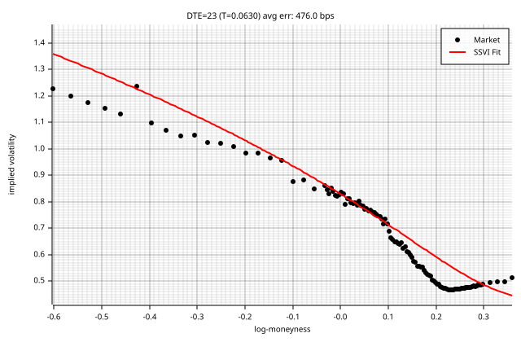

### DTE = 24 (T = 0.0658)

max err: 1692.0 bps | RMSE: 696.4 bps | eta=0.5700, gamma=0.5479, rho=-0.8847 | cal viol: 3

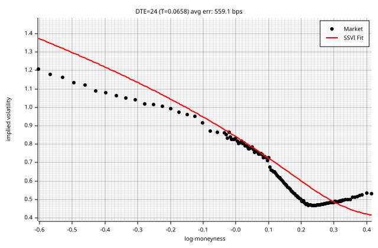

### DTE = 28 (T = 0.0767)

max err: 2890.4 bps | RMSE: 720.0 bps | eta=0.5643, gamma=0.5181, rho=-0.9990 | cal viol: 28

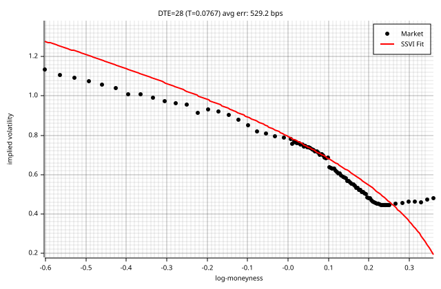

### DTE = 30 (T = 0.0822)

max err: 1256.6 bps | RMSE: 540.3 bps | eta=0.4643, gamma=0.5709, rho=-0.9990 | cal viol: 1

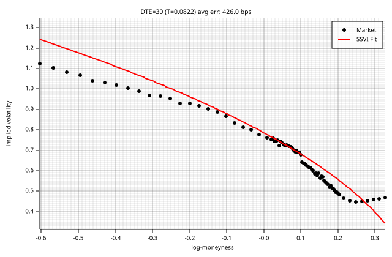

### DTE = 32 (T = 0.0877)

max err: 4806.2 bps | RMSE: 1007.0 bps | eta=0.5237, gamma=0.5320, rho=-0.9238 | cal viol: 3

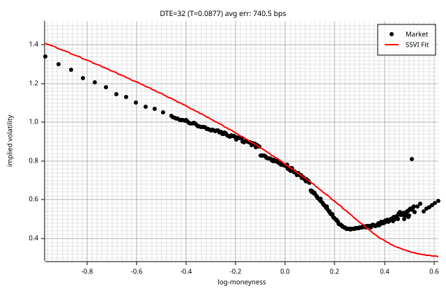

### DTE = 35 (T = 0.0959)

max err: 901.6 bps | RMSE: 363.9 bps | eta=0.4638, gamma=0.5649, rho=-0.9990 | cal viol: 81

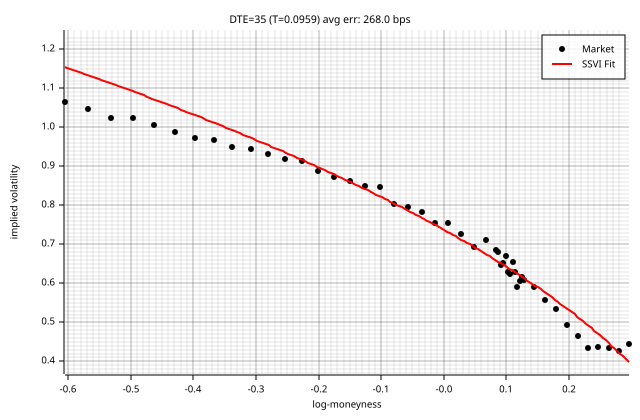

### DTE = 39 (T = 0.1068)

max err: 1522.5 bps | RMSE: 536.6 bps | eta=0.5274, gamma=0.5516, rho=-0.9919 | cal viol: 0

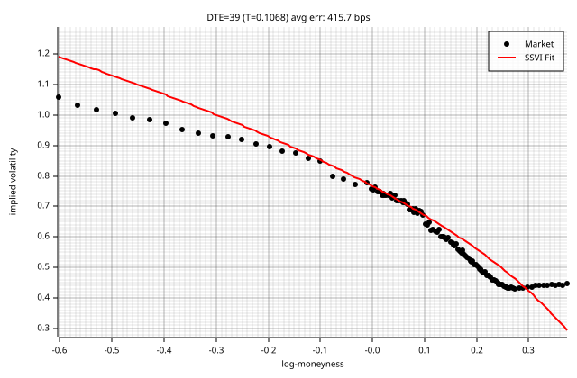

### DTE = 46 (T = 0.1260)

max err: 913.8 bps | RMSE: 403.8 bps | eta=0.4793, gamma=0.5557, rho=-0.9990 | cal viol: 2

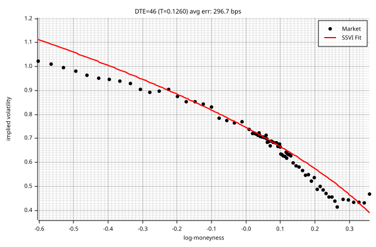

### DTE = 60 (T = 0.1644)

max err: 4186.8 bps | RMSE: 828.6 bps | eta=0.5429, gamma=0.5346, rho=-0.9990 | cal viol: 0

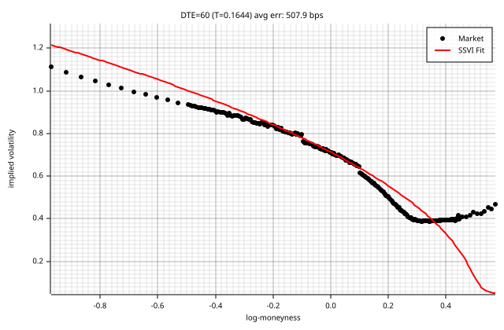

### DTE = 95 (T = 0.2603)

max err: 2799.5 bps | RMSE: 841.2 bps | eta=0.5497, gamma=0.6506, rho=-0.9781 | cal viol: 0

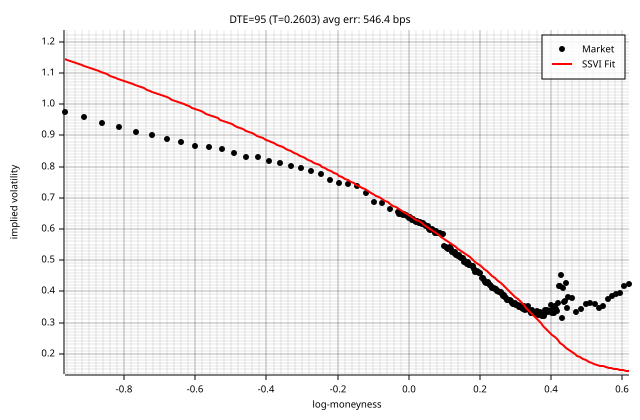

### DTE = 106 (T = 0.2904)

max err: 1162.7 bps | RMSE: 414.5 bps | eta=0.5600, gamma=0.6939, rho=-0.9482 | cal viol: 0

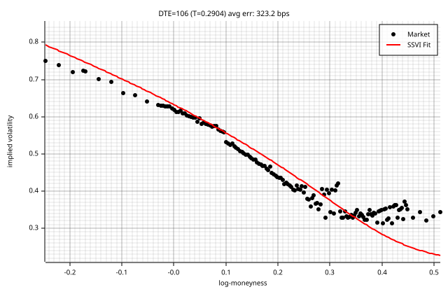

### DTE = 123 (T = 0.3370)

max err: 1840.6 bps | RMSE: 569.7 bps | eta=0.6090, gamma=0.6605, rho=-0.9574 | cal viol: 1

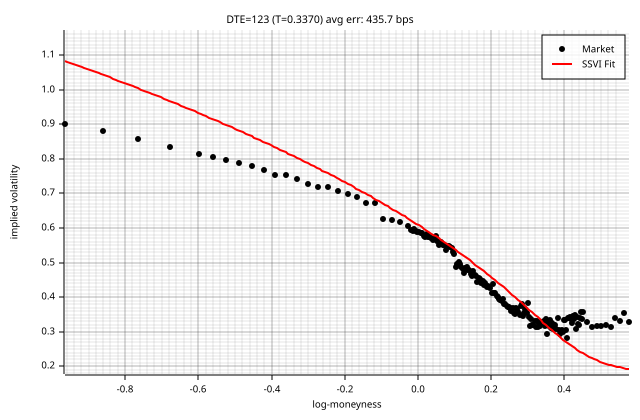

### DTE = 186 (T = 0.5096)

max err: 2409.0 bps | RMSE: 653.7 bps | eta=0.5718, gamma=0.7302, rho=-0.9614 | cal viol: 1

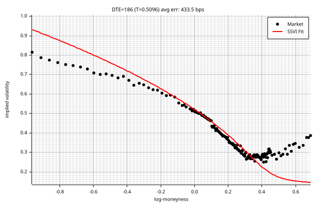

### DTE = 198 (T = 0.5425)

max err: 927.4 bps | RMSE: 289.4 bps | eta=0.5700, gamma=0.7684, rho=-0.9265 | cal viol: 5

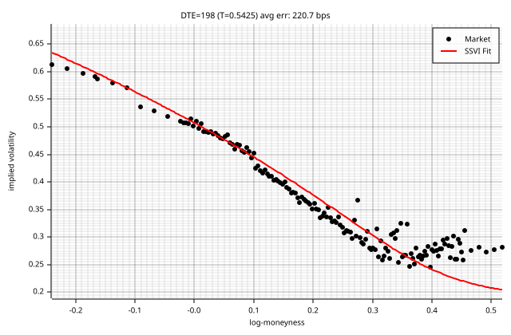

### DTE = 214 (T = 0.5863)

max err: 2928.5 bps | RMSE: 719.6 bps | eta=0.5774, gamma=0.7555, rho=-0.9322 | cal viol: 3

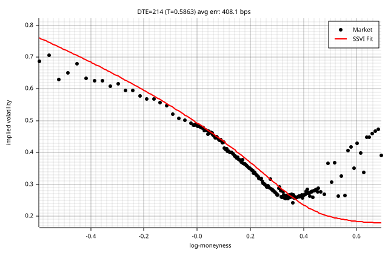

### DTE = 249 (T = 0.6822)

max err: 999.5 bps | RMSE: 339.5 bps | eta=0.5736, gamma=0.7692, rho=-0.9417 | cal viol: 1

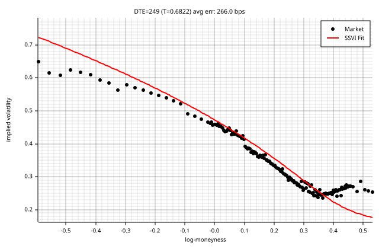

### DTE = 277 (T = 0.7589)

max err: 1919.0 bps | RMSE: 409.4 bps | eta=0.5983, gamma=0.7457, rho=-0.9436 | cal viol: 3

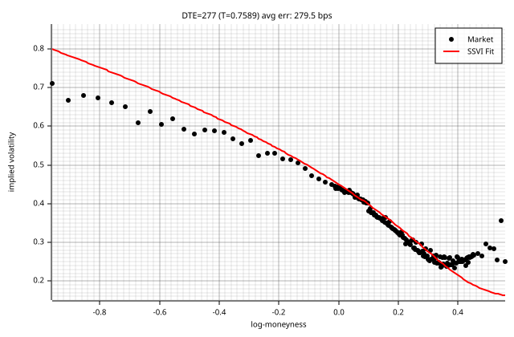

### DTE = 290 (T = 0.7945)

max err: 831.2 bps | RMSE: 289.0 bps | eta=0.5796, gamma=0.7686, rho=-0.9345 | cal viol: 12

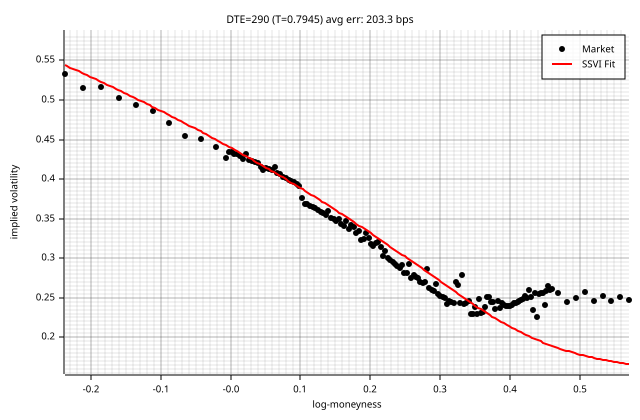

### DTE = 305 (T = 0.8356)

max err: 1241.4 bps | RMSE: 271.8 bps | eta=0.6154, gamma=0.7585, rho=-0.9034 | cal viol: 17

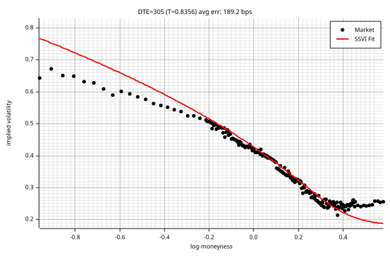

### DTE = 368 (T = 1.0082)

max err: 859.5 bps | RMSE: 226.1 bps | eta=0.5816, gamma=0.7769, rho=-0.9081 | cal viol: 1

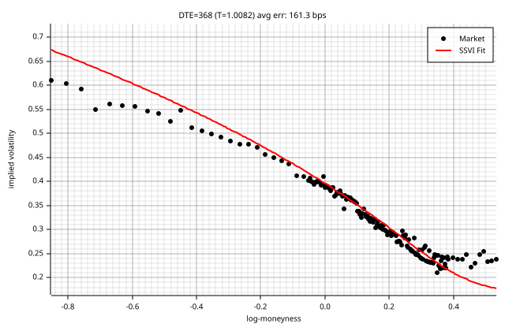

### DTE = 459 (T = 1.2575)

max err: 527.3 bps | RMSE: 185.5 bps | eta=0.6618, gamma=0.7328, rho=-0.8040 | cal viol: 2

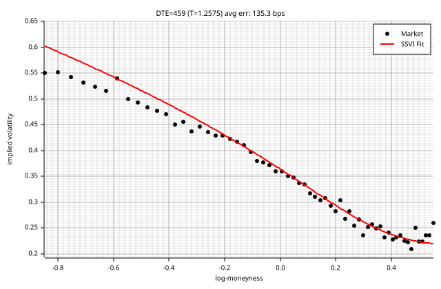

### DTE = 550 (T = 1.5068)

max err: 1980.7 bps | RMSE: 582.1 bps | eta=0.6637, gamma=0.6221, rho=-0.9990 | cal viol: 20

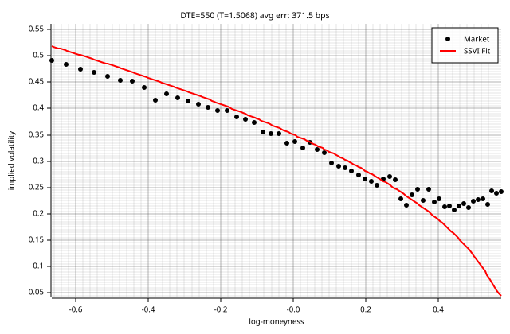

### DTE = 641 (T = 1.7562)

max err: 993.8 bps | RMSE: 260.0 bps | eta=0.6693, gamma=0.6421, rho=-0.8945 | cal viol: 1

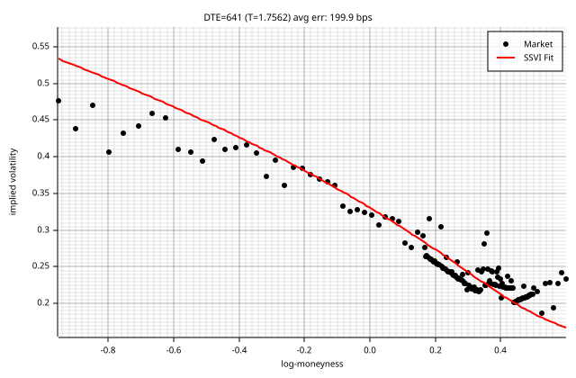

### DTE = 676 (T = 1.8521)

max err: 3154.1 bps | RMSE: 1006.9 bps | eta=0.5432, gamma=0.7345, rho=-0.9990 | cal viol: 81

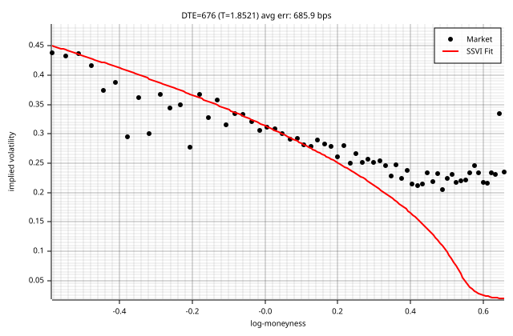

### DTE = 732 (T = 2.0055)

max err: 727.2 bps | RMSE: 228.5 bps | eta=0.7045, gamma=0.8515, rho=-0.6065 | cal viol: 4

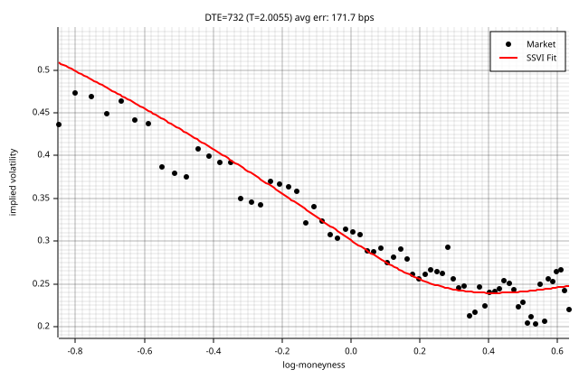

### DTE = 1005 (T = 2.7534)

max err: 406.8 bps | RMSE: 153.0 bps | eta=1.1078, gamma=0.4885, rho=-0.6487 | cal viol: 1

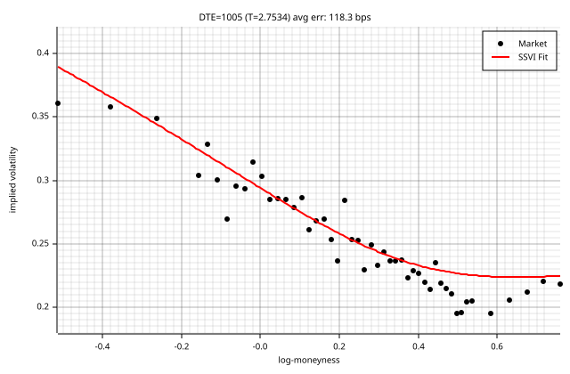

