# SSVI Direct Solver Fit: Kaggle SPY (2020-03-16)

4D Nelder-Mead direct solver with algebraic no-arb barrier.

- Objective: pure SSE on total variance
- No-arb barrier: eta*(1+|rho|) <= 2
- Calendar penalty: theta monotonicity via lambda_calendar
- Butterfly: post-hoc validation
- IV rule: P_IV (k < -0.1), mean(P_IV,C_IV) (-0.1..0.1), C_IV (k > 0.1)

## Calibration Summary

| DTE | T | max err (bps) | RMSE (bps) | avg err (bps) | eta | gamma | rho | phi | cal viol | converged |
|----:|------:|--------------:|-----------:|--------------:|------:|------:|------:|------:|---------:|:---------:|
| 2 | 0.0055 | 2499.5 | 1132.8 | 951.2 | 0.3212 | 0.6416 | -0.4807 | 7.209 | 0 | yes |
| 4 | 0.0110 | 4215.5 | 1089.0 | 808.1 | 0.8068 | 0.4454 | -0.5670 | 5.335 | 0 | yes |
| 7 | 0.0192 | 6894.1 | 890.8 | 596.9 | 0.3313 | 0.6693 | -0.6608 | 4.762 | 5 | yes |
| 9 | 0.0247 | 1663.5 | 673.3 | 519.9 | 0.6029 | 0.5359 | -0.7166 | 4.592 | 2 | yes |
| 11 | 0.0301 | 1574.9 | 746.7 | 630.5 | 0.3408 | 0.7067 | -0.6899 | 4.596 | 0 | yes |
| 14 | 0.0384 | 1356.3 | 639.7 | 522.0 | 0.3048 | 0.7285 | -0.7213 | 4.176 | 8 | yes |
| 15 | 0.0411 | 1141.1 | 526.7 | 437.2 | 0.8385 | 0.4970 | -0.7264 | 4.796 | 3 | yes |
| 16 | 0.0438 | 1323.9 | 614.7 | 513.3 | 0.8019 | 0.4871 | -0.7487 | 4.258 | 39 | yes |
| 18 | 0.0493 | 1192.7 | 602.8 | 520.7 | 1.0566 | 0.3742 | -0.7694 | 3.627 | 32 | yes |
| 21 | 0.0575 | 1099.1 | 560.8 | 478.2 | 0.7481 | 0.4545 | -0.7979 | 3.281 | 37 | yes |
| 23 | 0.0630 | 1025.8 | 535.1 | 456.9 | 0.6980 | 0.4598 | -0.8338 | 2.998 | 7 | yes |
| 24 | 0.0658 | 1003.9 | 526.5 | 448.1 | 0.3226 | 0.6906 | -0.8518 | 2.872 | 7 | yes |
| 28 | 0.0767 | 902.2 | 481.2 | 415.2 | 0.3781 | 0.6262 | -0.8775 | 2.663 | 28 | yes |
| 30 | 0.0822 | 866.2 | 397.1 | 340.3 | 0.2744 | 0.7209 | -0.9083 | 2.477 | 6 | yes |
| 32 | 0.0877 | 3336.2 | 553.1 | 424.7 | 0.5095 | 0.5591 | -0.7746 | 2.683 | 0 | yes |
| 35 | 0.0959 | 1245.2 | 459.6 | 348.9 | 0.8181 | 0.3871 | -0.8000 | 2.514 | 34 | yes |
| 39 | 0.1068 | 933.9 | 496.2 | 418.7 | 0.1421 | 0.9997 | -0.8495 | 2.472 | 7 | yes |
| 46 | 0.1260 | 1063.8 | 366.9 | 280.2 | 0.4362 | 0.5691 | -0.9515 | 1.980 | 5 | yes |
| 60 | 0.1644 | 1858.6 | 464.8 | 350.9 | 0.4275 | 0.6101 | -0.9407 | 1.954 | 0 | yes |
| 95 | 0.2603 | 1580.3 | 479.4 | 405.3 | 0.3336 | 0.7806 | -0.9161 | 2.004 | 0 | yes |
| 106 | 0.2904 | 756.6 | 262.3 | 213.2 | 0.3240 | 0.9473 | -0.8591 | 2.621 | 6 | yes |
| 123 | 0.3370 | 1325.6 | 321.7 | 258.3 | 0.7643 | 0.5581 | -0.8797 | 2.470 | 41 | yes |
| 186 | 0.5096 | 1473.1 | 382.1 | 305.8 | 1.0383 | 0.3968 | -0.8774 | 2.209 | 0 | yes |
| 198 | 0.5425 | 592.2 | 244.5 | 195.4 | 1.0640 | 0.4972 | -0.8472 | 2.694 | 7 | yes |
| 214 | 0.5863 | 1763.6 | 468.2 | 338.6 | 1.0120 | 0.5517 | -0.7930 | 2.887 | 13 | yes |
| 249 | 0.6822 | 718.2 | 236.1 | 191.2 | 0.4023 | 0.9667 | -0.8220 | 2.699 | 40 | yes |
| 277 | 0.7589 | 1211.5 | 250.3 | 181.1 | 1.0706 | 0.4771 | -0.8464 | 2.523 | 41 | yes |
| 290 | 0.7945 | 378.6 | 156.5 | 127.1 | 1.0295 | 0.5450 | -0.8411 | 2.727 | 8 | yes |
| 305 | 0.8356 | 1288.2 | 229.7 | 146.5 | 0.4055 | 1.0000 | -0.8420 | 2.724 | 81 | yes |
| 368 | 1.0082 | 854.3 | 181.2 | 122.8 | 0.6114 | 0.7956 | -0.8330 | 2.670 | 39 | yes |
| 459 | 1.2575 | 514.7 | 167.4 | 122.2 | 0.4318 | 0.9784 | -0.7613 | 2.599 | 34 | yes |
| 550 | 1.5068 | 290.9 | 114.1 | 93.1 | 0.8959 | 0.5879 | -0.7553 | 2.399 | 31 | yes |
| 641 | 1.7562 | 909.0 | 198.5 | 139.8 | 0.4560 | 0.9064 | -0.7692 | 2.150 | 34 | yes |
| 676 | 1.8521 | 1051.4 | 268.5 | 154.1 | 0.4776 | 0.9268 | -0.6663 | 2.321 | 15 | yes |
| 732 | 2.0055 | 395.3 | 173.7 | 138.0 | 1.0082 | 0.5218 | -0.6328 | 2.229 | 31 | yes |
| 1005 | 2.7534 | 351.7 | 122.6 | 93.7 | 0.9006 | 0.4515 | -0.7396 | 1.551 | 0 | yes |

## Fit Plots

### DTE = 2 (T = 0.0055)

max err: 2499.5 bps | RMSE: 1132.8 bps | eta=0.3212, gamma=0.6416, rho=-0.4807 | cal viol: 0

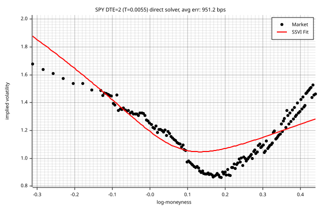

### DTE = 4 (T = 0.0110)

max err: 4215.5 bps | RMSE: 1089.0 bps | eta=0.8068, gamma=0.4454, rho=-0.5670 | cal viol: 0

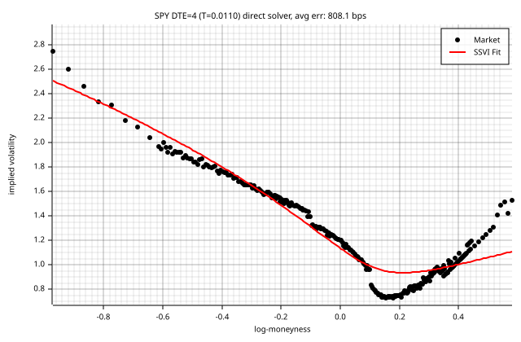

### DTE = 7 (T = 0.0192)

max err: 6894.1 bps | RMSE: 890.8 bps | eta=0.3313, gamma=0.6693, rho=-0.6608 | cal viol: 5

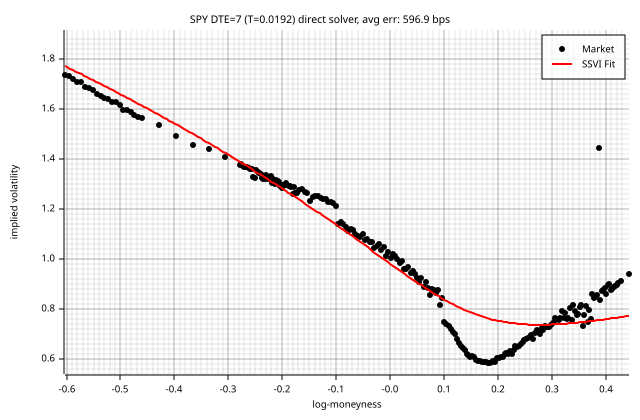

### DTE = 9 (T = 0.0247)

max err: 1663.5 bps | RMSE: 673.3 bps | eta=0.6029, gamma=0.5359, rho=-0.7166 | cal viol: 2

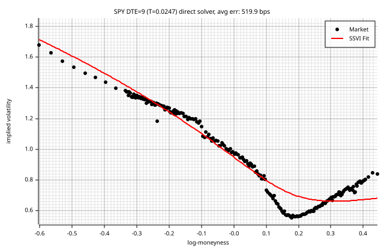

### DTE = 11 (T = 0.0301)

max err: 1574.9 bps | RMSE: 746.7 bps | eta=0.3408, gamma=0.7067, rho=-0.6899 | cal viol: 0

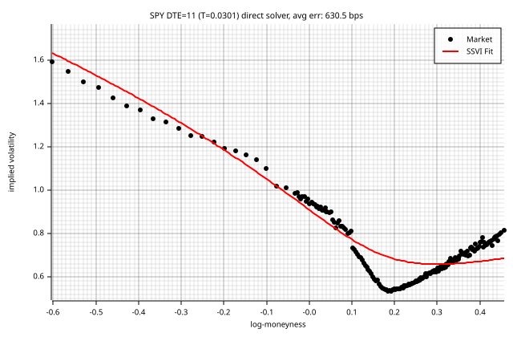

### DTE = 14 (T = 0.0384)

max err: 1356.3 bps | RMSE: 639.7 bps | eta=0.3048, gamma=0.7285, rho=-0.7213 | cal viol: 8

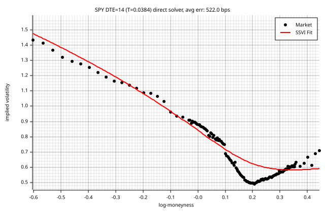

### DTE = 15 (T = 0.0411)

max err: 1141.1 bps | RMSE: 526.7 bps | eta=0.8385, gamma=0.4970, rho=-0.7264 | cal viol: 3

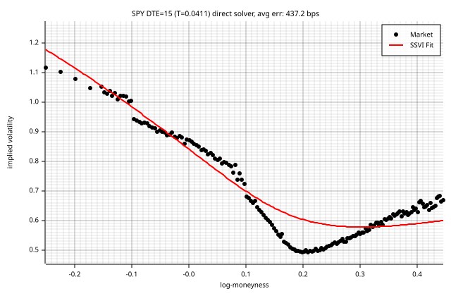

### DTE = 16 (T = 0.0438)

max err: 1323.9 bps | RMSE: 614.7 bps | eta=0.8019, gamma=0.4871, rho=-0.7487 | cal viol: 39

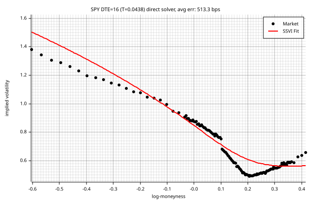

### DTE = 18 (T = 0.0493)

max err: 1192.7 bps | RMSE: 602.8 bps | eta=1.0566, gamma=0.3742, rho=-0.7694 | cal viol: 32

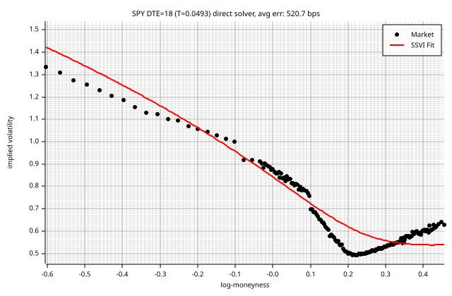

### DTE = 21 (T = 0.0575)

max err: 1099.1 bps | RMSE: 560.8 bps | eta=0.7481, gamma=0.4545, rho=-0.7979 | cal viol: 37

### DTE = 23 (T = 0.0630)

max err: 1025.8 bps | RMSE: 535.1 bps | eta=0.6980, gamma=0.4598, rho=-0.8338 | cal viol: 7

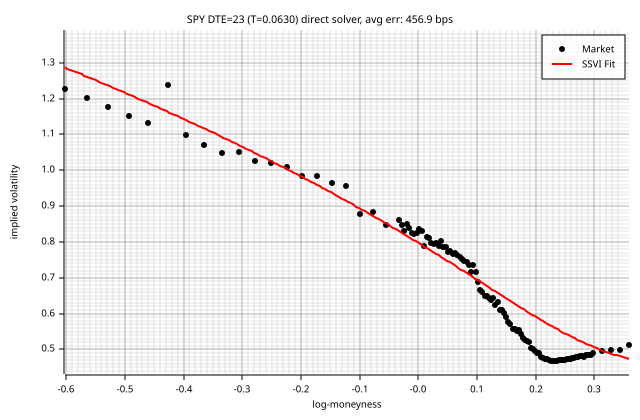

### DTE = 24 (T = 0.0658)

max err: 1003.9 bps | RMSE: 526.5 bps | eta=0.3226, gamma=0.6906, rho=-0.8518 | cal viol: 7

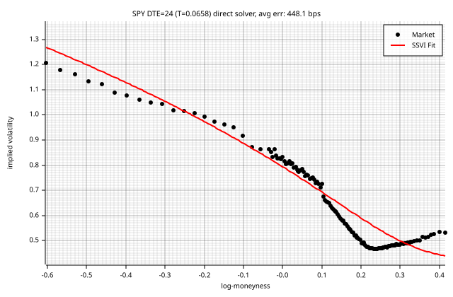

### DTE = 28 (T = 0.0767)

max err: 902.2 bps | RMSE: 481.2 bps | eta=0.3781, gamma=0.6262, rho=-0.8775 | cal viol: 28

### DTE = 30 (T = 0.0822)

max err: 866.2 bps | RMSE: 397.1 bps | eta=0.2744, gamma=0.7209, rho=-0.9083 | cal viol: 6

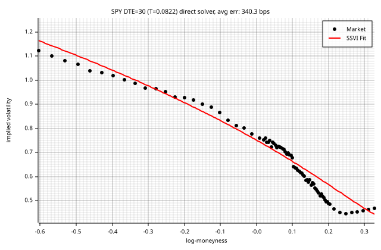

### DTE = 32 (T = 0.0877)

max err: 3336.2 bps | RMSE: 553.1 bps | eta=0.5095, gamma=0.5591, rho=-0.7746 | cal viol: 0

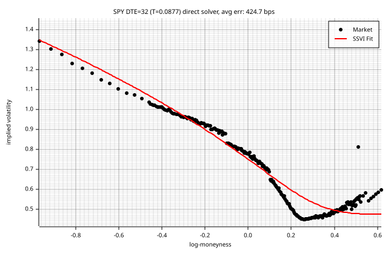

### DTE = 35 (T = 0.0959)

max err: 1245.2 bps | RMSE: 459.6 bps | eta=0.8181, gamma=0.3871, rho=-0.8000 | cal viol: 34

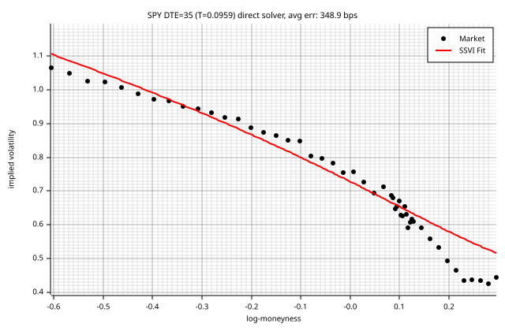

### DTE = 39 (T = 0.1068)

max err: 933.9 bps | RMSE: 496.2 bps | eta=0.1421, gamma=0.9997, rho=-0.8495 | cal viol: 7

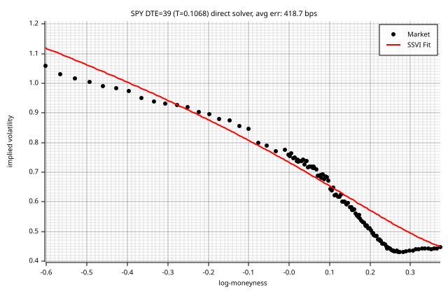

### DTE = 46 (T = 0.1260)

max err: 1063.8 bps | RMSE: 366.9 bps | eta=0.4362, gamma=0.5691, rho=-0.9515 | cal viol: 5

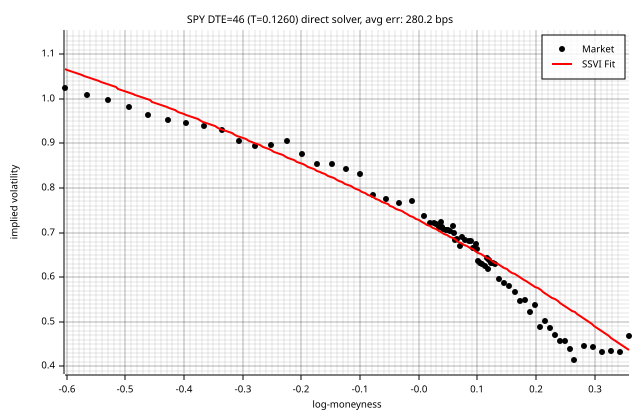

### DTE = 60 (T = 0.1644)

max err: 1858.6 bps | RMSE: 464.8 bps | eta=0.4275, gamma=0.6101, rho=-0.9407 | cal viol: 0

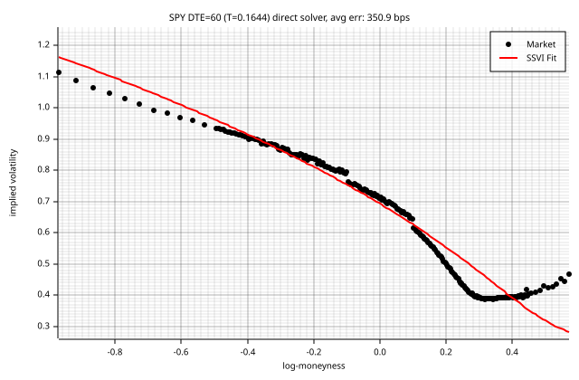

### DTE = 95 (T = 0.2603)

max err: 1580.3 bps | RMSE: 479.4 bps | eta=0.3336, gamma=0.7806, rho=-0.9161 | cal viol: 0

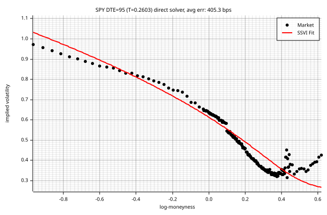

### DTE = 106 (T = 0.2904)

max err: 756.6 bps | RMSE: 262.3 bps | eta=0.3240, gamma=0.9473, rho=-0.8591 | cal viol: 6

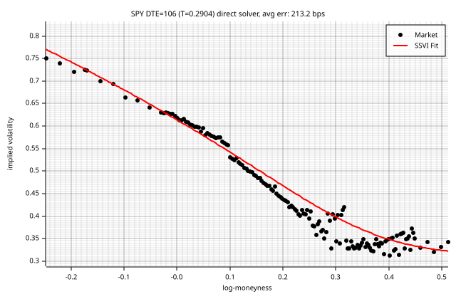

### DTE = 123 (T = 0.3370)

max err: 1325.6 bps | RMSE: 321.7 bps | eta=0.7643, gamma=0.5581, rho=-0.8797 | cal viol: 41

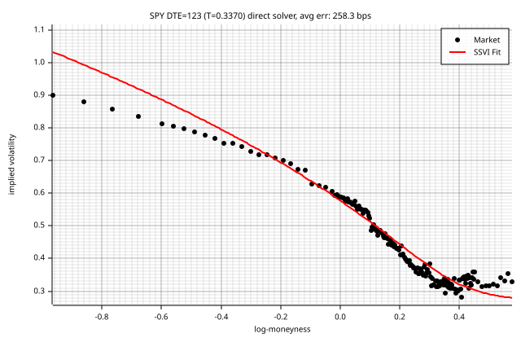

### DTE = 186 (T = 0.5096)

max err: 1473.1 bps | RMSE: 382.1 bps | eta=1.0383, gamma=0.3968, rho=-0.8774 | cal viol: 0

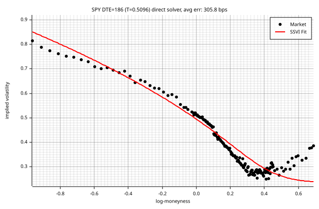

### DTE = 198 (T = 0.5425)

max err: 592.2 bps | RMSE: 244.5 bps | eta=1.0640, gamma=0.4972, rho=-0.8472 | cal viol: 7

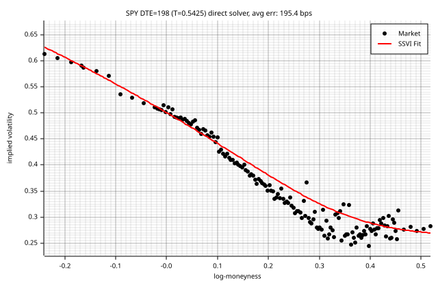

### DTE = 214 (T = 0.5863)

max err: 1763.6 bps | RMSE: 468.2 bps | eta=1.0120, gamma=0.5517, rho=-0.7930 | cal viol: 13

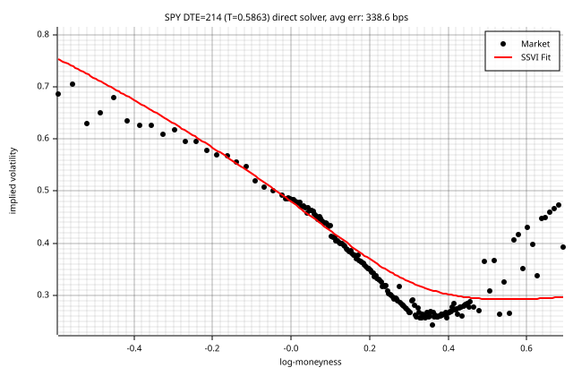

### DTE = 249 (T = 0.6822)

max err: 718.2 bps | RMSE: 236.1 bps | eta=0.4023, gamma=0.9667, rho=-0.8220 | cal viol: 40

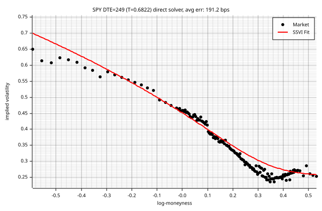

### DTE = 277 (T = 0.7589)

max err: 1211.5 bps | RMSE: 250.3 bps | eta=1.0706, gamma=0.4771, rho=-0.8464 | cal viol: 41

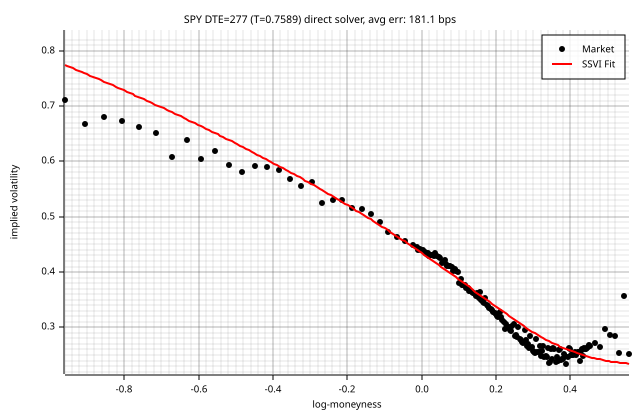

### DTE = 290 (T = 0.7945)

max err: 378.6 bps | RMSE: 156.5 bps | eta=1.0295, gamma=0.5450, rho=-0.8411 | cal viol: 8

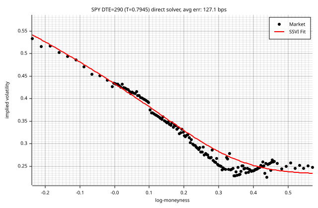

### DTE = 305 (T = 0.8356)

max err: 1288.2 bps | RMSE: 229.7 bps | eta=0.4055, gamma=1.0000, rho=-0.8420 | cal viol: 81

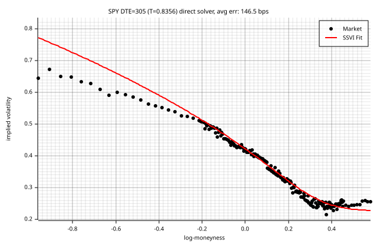

### DTE = 368 (T = 1.0082)

max err: 854.3 bps | RMSE: 181.2 bps | eta=0.6114, gamma=0.7956, rho=-0.8330 | cal viol: 39

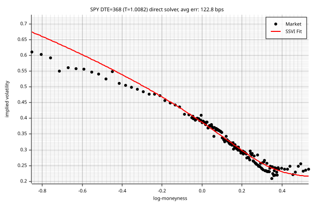

### DTE = 459 (T = 1.2575)

max err: 514.7 bps | RMSE: 167.4 bps | eta=0.4318, gamma=0.9784, rho=-0.7613 | cal viol: 34

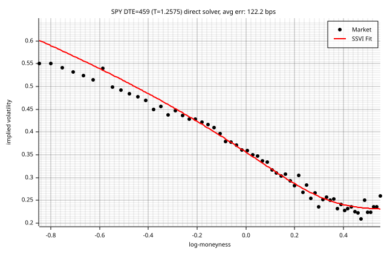

### DTE = 550 (T = 1.5068)

max err: 290.9 bps | RMSE: 114.1 bps | eta=0.8959, gamma=0.5879, rho=-0.7553 | cal viol: 31

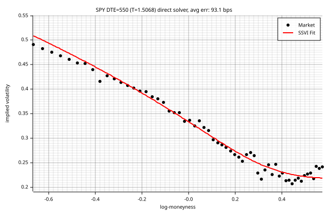

### DTE = 641 (T = 1.7562)

max err: 909.0 bps | RMSE: 198.5 bps | eta=0.4560, gamma=0.9064, rho=-0.7692 | cal viol: 34

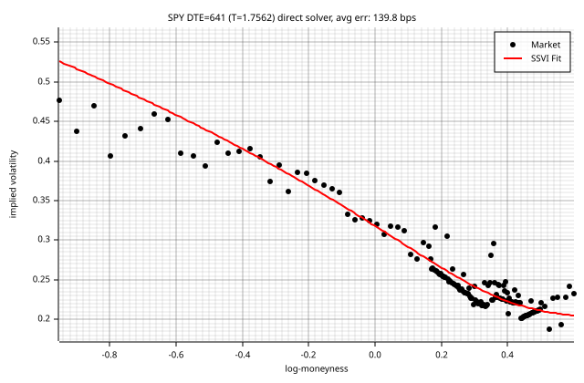

### DTE = 676 (T = 1.8521)

max err: 1051.4 bps | RMSE: 268.5 bps | eta=0.4776, gamma=0.9268, rho=-0.6663 | cal viol: 15

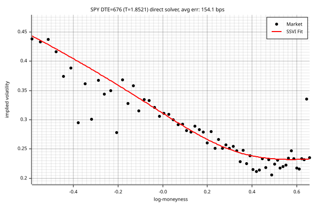

### DTE = 732 (T = 2.0055)

max err: 395.3 bps | RMSE: 173.7 bps | eta=1.0082, gamma=0.5218, rho=-0.6328 | cal viol: 31

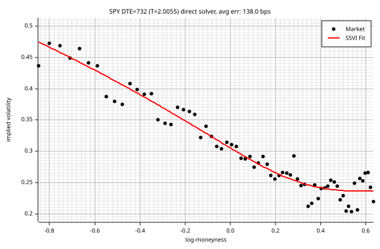

### DTE = 1005 (T = 2.7534)

max err: 351.7 bps | RMSE: 122.6 bps | eta=0.9006, gamma=0.4515, rho=-0.7396 | cal viol: 0

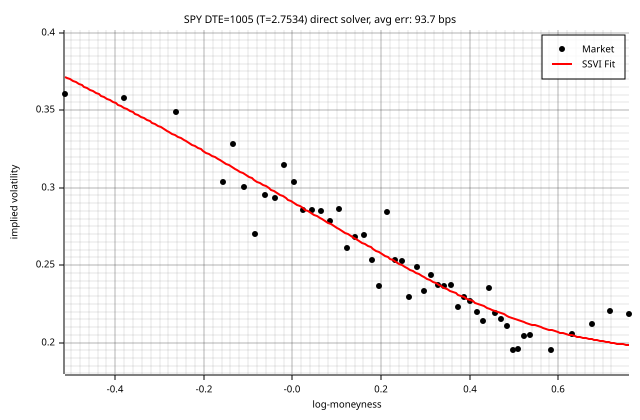

