# SSVI CBOE Fit: SPX (2026-03-06)

Surface calibration with calendar arbitrage penalty.

- k penalty range: -1.5 to 0.5, step 0.025
- lambda: 500
- IV rule: p_iv (k < -0.1), mean(p_iv,c_iv) (-0.1..0.1), c_iv (k > 0.1)

## Calibration Summary

| DTE | T | max err (bps) | RMSE (bps) | avg err (bps) | eta | gamma | rho | phi | cal viol | converged |
|----:|------:|--------------:|-----------:|--------------:|------:|------:|------:|------:|---------:|:---------:|
| 3 | 0.0082 | 4863.5 | 1078.5 | 631.8 | 0.5699 | 0.7389 | -0.5712 | 189.608 | 0 | yes |
| 4 | 0.0110 | 3462.7 | 1024.3 | 817.7 | 0.3299 | 0.8207 | -0.3300 | 152.282 | 4 | yes |
| 5 | 0.0137 | 2874.3 | 868.1 | 675.4 | 0.6514 | 0.7236 | -0.3773 | 108.129 | 3 | yes |
| 6 | 0.0164 | 2221.1 | 850.6 | 651.8 | 0.7884 | 0.6860 | -0.3790 | 85.727 | 5 | yes |
| 7 | 0.0192 | 2071.5 | 891.9 | 726.2 | 0.6446 | 0.7069 | -0.3809 | 70.760 | 8 | yes |
| 10 | 0.0274 | 1717.2 | 522.4 | 391.3 | 0.7377 | 0.6923 | -0.4393 | 64.474 | 4 | yes |
| 11 | 0.0301 | 1495.3 | 428.1 | 312.1 | 0.6074 | 0.7181 | -0.4403 | 58.757 | 5 | yes |
| 12 | 0.0329 | 1270.1 | 382.5 | 285.0 | 0.6902 | 0.6901 | -0.4421 | 50.203 | 3 | yes |
| 13 | 0.0356 | 1080.0 | 356.6 | 254.4 | 0.6895 | 0.6855 | -0.4433 | 45.910 | 4 | yes |
| 14 | 0.0384 | 2079.1 | 760.5 | 653.6 | 0.5703 | 0.7193 | -0.3860 | 44.119 | 14 | yes |
| 17 | 0.0466 | 818.0 | 390.2 | 289.7 | 0.7479 | 0.6696 | -0.3873 | 40.507 | 4 | yes |
| 18 | 0.0493 | 829.5 | 377.9 | 295.6 | 0.6499 | 0.6896 | -0.3885 | 38.009 | 4 | yes |
| 19 | 0.0521 | 974.3 | 438.7 | 307.5 | 0.6852 | 0.6935 | -0.4415 | 39.286 | 6 | yes |
| 20 | 0.0548 | 1141.6 | 441.0 | 307.2 | 0.6577 | 0.7092 | -0.4780 | 39.593 | 17 | yes |
| 21 | 0.0575 | 1063.4 | 482.6 | 364.3 | 0.8421 | 0.6634 | -0.4790 | 37.705 | 12 | yes |
| 24 | 0.0658 | 759.1 | 265.1 | 176.2 | 0.7445 | 0.6811 | -0.4800 | 35.373 | 4 | yes |
| 25 | 0.0685 | 1235.5 | 604.8 | 495.7 | 0.6826 | 0.6933 | -0.4811 | 33.541 | 21 | yes |
| 26 | 0.0712 | 773.5 | 265.2 | 135.6 | 0.6612 | 0.7102 | -0.5145 | 34.703 | 4 | yes |
| 27 | 0.0740 | 901.9 | 325.4 | 193.2 | 0.6549 | 0.7098 | -0.5152 | 33.440 | 5 | yes |
| 31 | 0.0849 | 325.3 | 127.7 | 89.1 | 0.8499 | 0.6683 | -0.5380 | 33.287 | 3 | yes |
| 35 | 0.0959 | 789.5 | 280.7 | 178.5 | 0.6358 | 0.7134 | -0.5404 | 29.007 | 4 | yes |
| 42 | 0.1151 | 984.5 | 399.7 | 314.5 | 0.5827 | 0.7230 | -0.5277 | 25.152 | 5 | yes |
| 49 | 0.1342 | 444.1 | 145.0 | 93.3 | 0.6244 | 0.7023 | -0.5305 | 22.333 | 2 | yes |
| 55 | 0.1507 | 783.6 | 244.3 | 165.3 | 0.6982 | 0.6732 | -0.5335 | 20.172 | 5 | yes |
| 70 | 0.1918 | 1385.7 | 294.6 | 201.3 | 0.5541 | 0.7328 | -0.4839 | 18.569 | 0 | yes |
| 84 | 0.2301 | 690.2 | 198.8 | 124.9 | 0.6967 | 0.6811 | -0.5034 | 16.601 | 2 | yes |
| 104 | 0.2849 | 1252.4 | 261.2 | 189.2 | 0.5877 | 0.7252 | -0.5508 | 15.061 | 2 | yes |
| 116 | 0.3178 | 701.0 | 214.9 | 150.4 | 0.7552 | 0.6616 | -0.5547 | 13.765 | 5 | yes |
| 133 | 0.3644 | 731.0 | 203.1 | 150.2 | 0.5930 | 0.7170 | -0.5781 | 12.597 | 2 | yes |
| 147 | 0.4027 | 264.2 | 70.2 | 37.2 | 0.4707 | 0.7044 | -0.9990 | 8.869 | 24 | yes |
| 168 | 0.4603 | 582.7 | 164.4 | 126.5 | 0.5797 | 0.7050 | -0.6050 | 10.022 | 0 | yes |
| 196 | 0.5370 | 448.8 | 161.9 | 129.0 | 0.5626 | 0.7083 | -0.6202 | 8.884 | 0 | yes |
| 208 | 0.5699 | 590.8 | 184.2 | 136.6 | 0.6254 | 0.7024 | -0.6497 | 9.272 | 7 | yes |
| 224 | 0.6137 | 397.7 | 189.9 | 152.0 | 0.5613 | 0.7353 | -0.5817 | 8.929 | 2 | yes |
| 259 | 0.7096 | 445.9 | 162.3 | 133.8 | 0.6350 | 0.6858 | -0.5931 | 7.570 | 2 | yes |
| 287 | 0.7863 | 790.7 | 193.5 | 158.3 | 0.5514 | 0.7553 | -0.5720 | 7.861 | 0 | yes |
| 300 | 0.8219 | 647.4 | 181.0 | 129.4 | 0.6345 | 0.7129 | -0.5744 | 7.643 | 5 | yes |
| 315 | 0.8630 | 433.4 | 177.3 | 149.5 | 0.6135 | 0.7266 | -0.5263 | 7.464 | 4 | yes |
| 350 | 0.9589 | 372.4 | 133.5 | 106.6 | 0.5721 | 0.7472 | -0.5475 | 6.977 | 0 | yes |
| 378 | 1.0356 | 323.1 | 141.3 | 118.7 | 0.5551 | 0.7467 | -0.5554 | 6.387 | 2 | yes |
| 468 | 1.2822 | 424.1 | 147.3 | 122.7 | 0.5893 | 0.7224 | -0.4837 | 5.439 | 1 | yes |
| 651 | 1.7836 | 928.9 | 180.5 | 146.0 | 0.6062 | 0.7878 | -0.4035 | 5.413 | 0 | yes |
| 1015 | 2.7808 | 704.5 | 313.7 | 261.1 | 0.6281 | 0.9622 | -0.3998 | 6.343 | 0 | yes |
| 1386 | 3.7973 | 470.1 | 216.6 | 178.0 | 0.9257 | 1.0000 | 0.0935 | 7.944 | 5 | yes |
| 1750 | 4.7945 | 443.4 | 239.8 | 208.4 | 1.2410 | 1.0000 | 0.3255 | 7.806 | 2 | yes |

## Fit Plots

### DTE = 3 (T = 0.0082)

max err: 4863.5 bps | RMSE: 1078.5 bps | eta=0.5699, gamma=0.7389, rho=-0.5712 | cal viol: 0

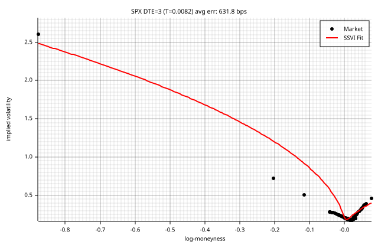

### DTE = 4 (T = 0.0110)

max err: 3462.7 bps | RMSE: 1024.3 bps | eta=0.3299, gamma=0.8207, rho=-0.3300 | cal viol: 4

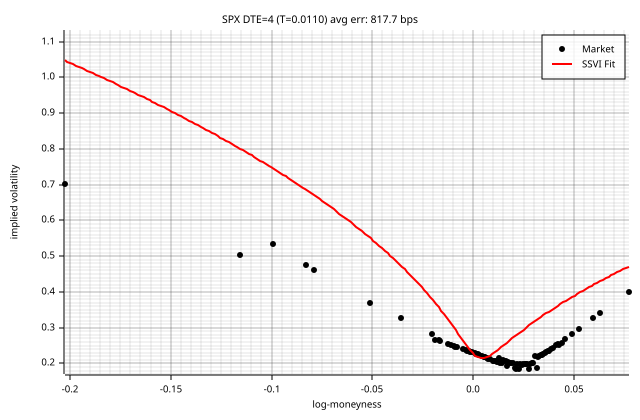

### DTE = 5 (T = 0.0137)

max err: 2874.3 bps | RMSE: 868.1 bps | eta=0.6514, gamma=0.7236, rho=-0.3773 | cal viol: 3

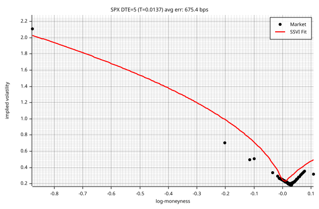

### DTE = 6 (T = 0.0164)

max err: 2221.1 bps | RMSE: 850.6 bps | eta=0.7884, gamma=0.6860, rho=-0.3790 | cal viol: 5

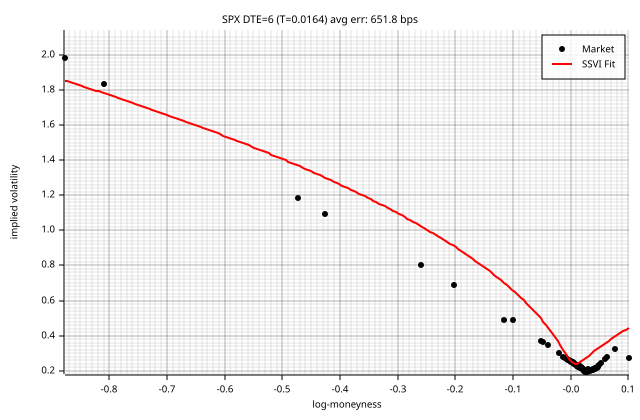

### DTE = 7 (T = 0.0192)

max err: 2071.5 bps | RMSE: 891.9 bps | eta=0.6446, gamma=0.7069, rho=-0.3809 | cal viol: 8

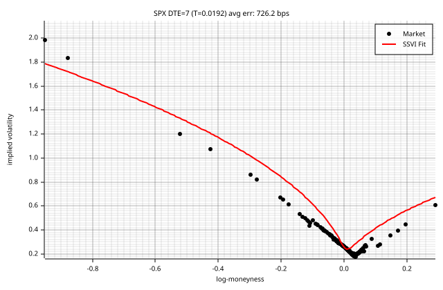

### DTE = 10 (T = 0.0274)

max err: 1717.2 bps | RMSE: 522.4 bps | eta=0.7377, gamma=0.6923, rho=-0.4393 | cal viol: 4

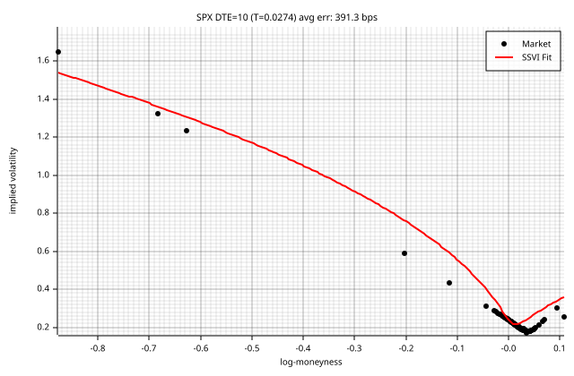

### DTE = 11 (T = 0.0301)

max err: 1495.3 bps | RMSE: 428.1 bps | eta=0.6074, gamma=0.7181, rho=-0.4403 | cal viol: 5

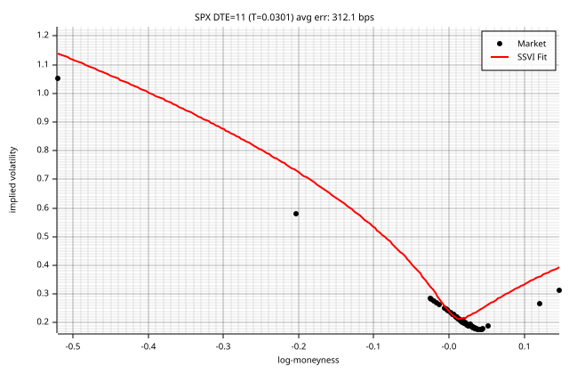

### DTE = 12 (T = 0.0329)

max err: 1270.1 bps | RMSE: 382.5 bps | eta=0.6902, gamma=0.6901, rho=-0.4421 | cal viol: 3

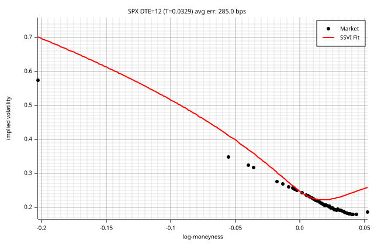

### DTE = 13 (T = 0.0356)

max err: 1080.0 bps | RMSE: 356.6 bps | eta=0.6895, gamma=0.6855, rho=-0.4433 | cal viol: 4

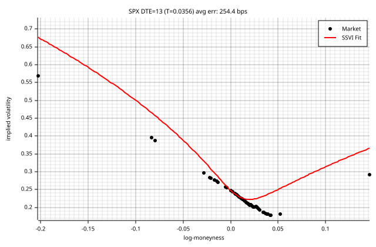

### DTE = 14 (T = 0.0384)

max err: 2079.1 bps | RMSE: 760.5 bps | eta=0.5703, gamma=0.7193, rho=-0.3860 | cal viol: 14

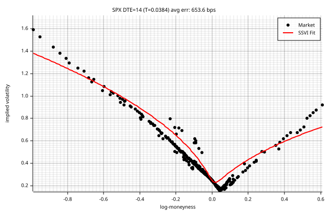

### DTE = 17 (T = 0.0466)

max err: 818.0 bps | RMSE: 390.2 bps | eta=0.7479, gamma=0.6696, rho=-0.3873 | cal viol: 4

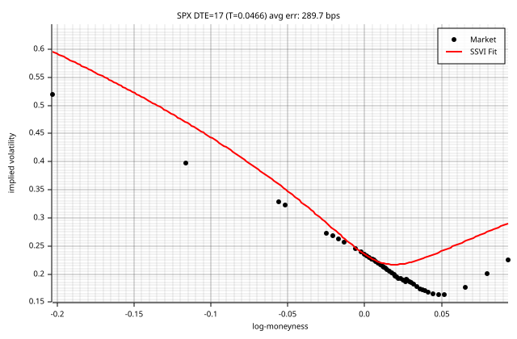

### DTE = 18 (T = 0.0493)

max err: 829.5 bps | RMSE: 377.9 bps | eta=0.6499, gamma=0.6896, rho=-0.3885 | cal viol: 4

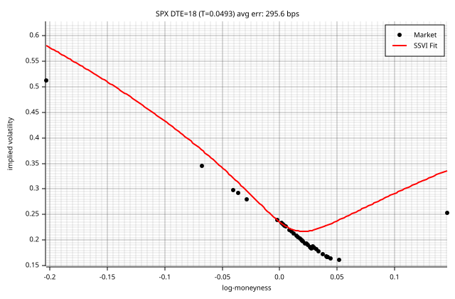

### DTE = 19 (T = 0.0521)

max err: 974.3 bps | RMSE: 438.7 bps | eta=0.6852, gamma=0.6935, rho=-0.4415 | cal viol: 6

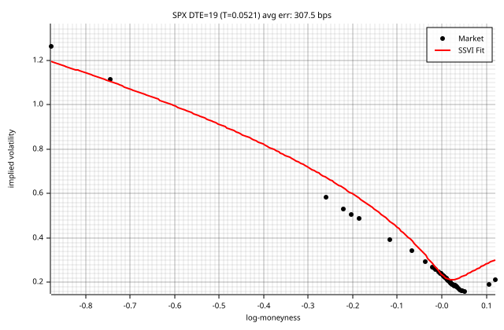

### DTE = 20 (T = 0.0548)

max err: 1141.6 bps | RMSE: 441.0 bps | eta=0.6577, gamma=0.7092, rho=-0.4780 | cal viol: 17

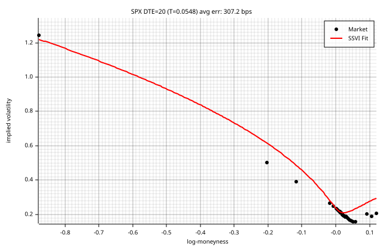

### DTE = 21 (T = 0.0575)

max err: 1063.4 bps | RMSE: 482.6 bps | eta=0.8421, gamma=0.6634, rho=-0.4790 | cal viol: 12

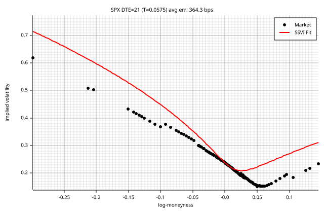

### DTE = 24 (T = 0.0658)

max err: 759.1 bps | RMSE: 265.1 bps | eta=0.7445, gamma=0.6811, rho=-0.4800 | cal viol: 4

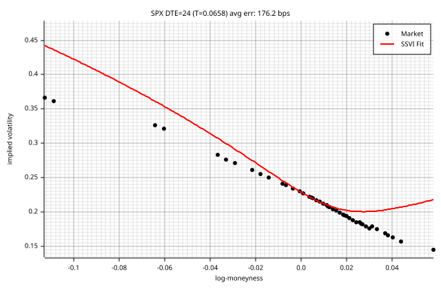

### DTE = 25 (T = 0.0685)

max err: 1235.5 bps | RMSE: 604.8 bps | eta=0.6826, gamma=0.6933, rho=-0.4811 | cal viol: 21

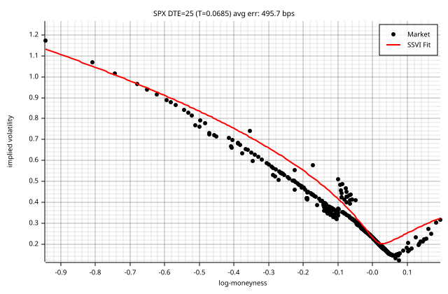

### DTE = 26 (T = 0.0712)

max err: 773.5 bps | RMSE: 265.2 bps | eta=0.6612, gamma=0.7102, rho=-0.5145 | cal viol: 4

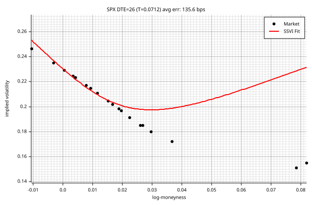

### DTE = 27 (T = 0.0740)

max err: 901.9 bps | RMSE: 325.4 bps | eta=0.6549, gamma=0.7098, rho=-0.5152 | cal viol: 5

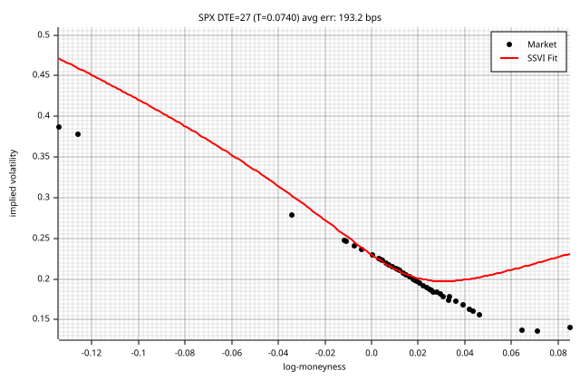

### DTE = 31 (T = 0.0849)

max err: 325.3 bps | RMSE: 127.7 bps | eta=0.8499, gamma=0.6683, rho=-0.5380 | cal viol: 3

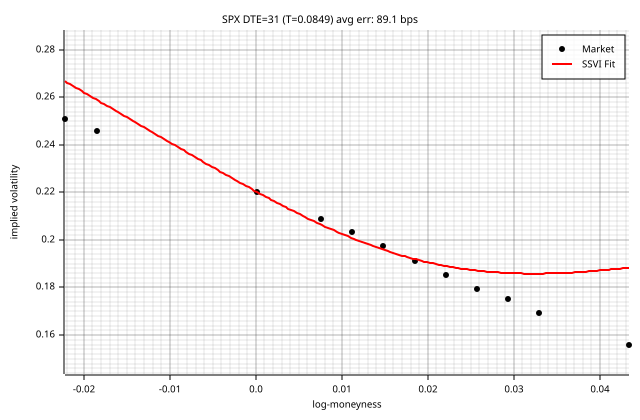

### DTE = 35 (T = 0.0959)

max err: 789.5 bps | RMSE: 280.7 bps | eta=0.6358, gamma=0.7134, rho=-0.5404 | cal viol: 4

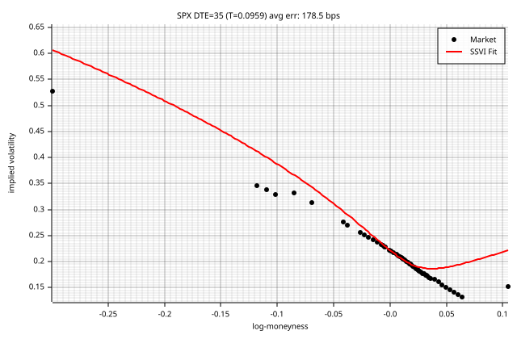

### DTE = 42 (T = 0.1151)

max err: 984.5 bps | RMSE: 399.7 bps | eta=0.5827, gamma=0.7230, rho=-0.5277 | cal viol: 5

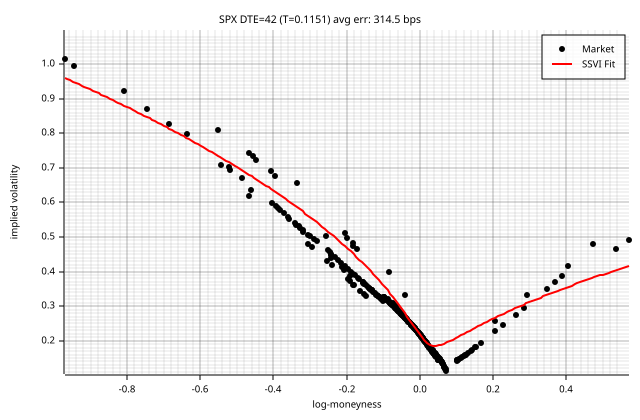

### DTE = 49 (T = 0.1342)

max err: 444.1 bps | RMSE: 145.0 bps | eta=0.6244, gamma=0.7023, rho=-0.5305 | cal viol: 2

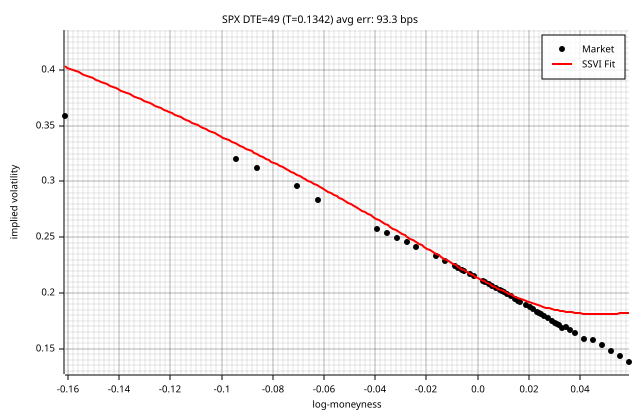

### DTE = 55 (T = 0.1507)

max err: 783.6 bps | RMSE: 244.3 bps | eta=0.6982, gamma=0.6732, rho=-0.5335 | cal viol: 5

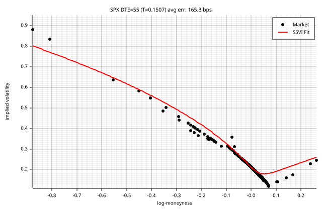

### DTE = 70 (T = 0.1918)

max err: 1385.7 bps | RMSE: 294.6 bps | eta=0.5541, gamma=0.7328, rho=-0.4839 | cal viol: 0

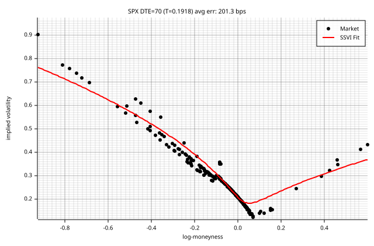

### DTE = 84 (T = 0.2301)

max err: 690.2 bps | RMSE: 198.8 bps | eta=0.6967, gamma=0.6811, rho=-0.5034 | cal viol: 2

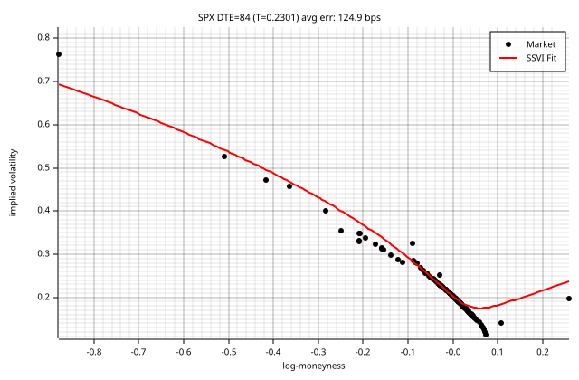

### DTE = 104 (T = 0.2849)

max err: 1252.4 bps | RMSE: 261.2 bps | eta=0.5877, gamma=0.7252, rho=-0.5508 | cal viol: 2

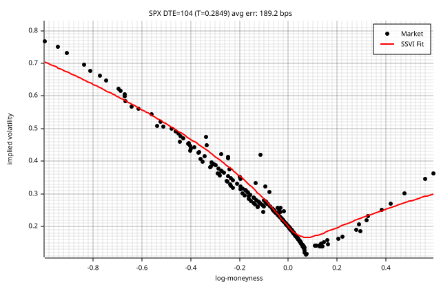

### DTE = 116 (T = 0.3178)

max err: 701.0 bps | RMSE: 214.9 bps | eta=0.7552, gamma=0.6616, rho=-0.5547 | cal viol: 5

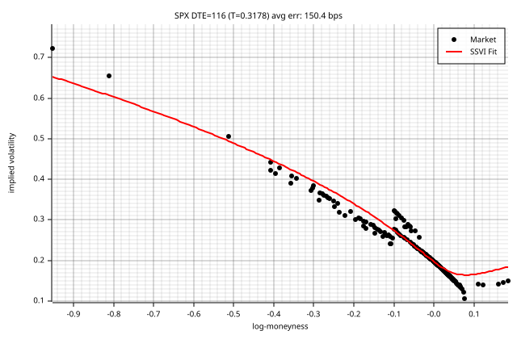

### DTE = 133 (T = 0.3644)

max err: 731.0 bps | RMSE: 203.1 bps | eta=0.5930, gamma=0.7170, rho=-0.5781 | cal viol: 2

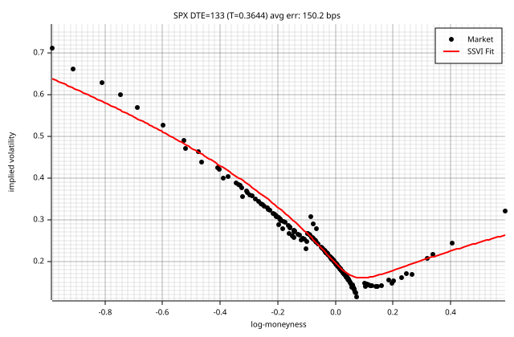

### DTE = 147 (T = 0.4027)

max err: 264.2 bps | RMSE: 70.2 bps | eta=0.4707, gamma=0.7044, rho=-0.9990 | cal viol: 24

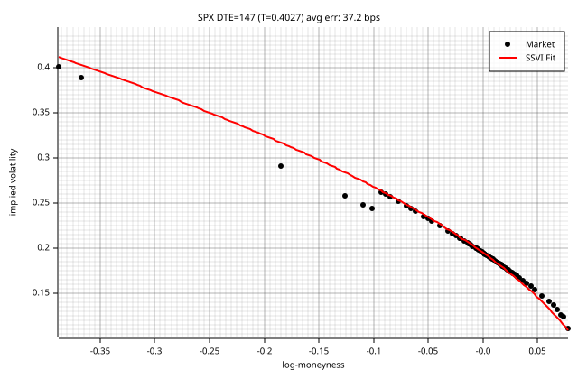

### DTE = 168 (T = 0.4603)

max err: 582.7 bps | RMSE: 164.4 bps | eta=0.5797, gamma=0.7050, rho=-0.6050 | cal viol: 0

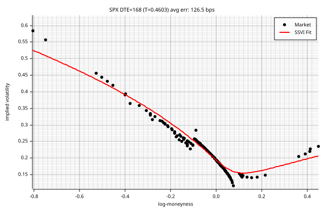

### DTE = 196 (T = 0.5370)

max err: 448.8 bps | RMSE: 161.9 bps | eta=0.5626, gamma=0.7083, rho=-0.6202 | cal viol: 0

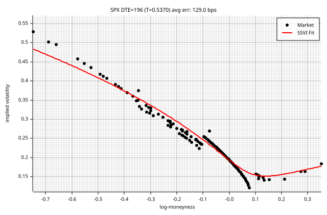

### DTE = 208 (T = 0.5699)

max err: 590.8 bps | RMSE: 184.2 bps | eta=0.6254, gamma=0.7024, rho=-0.6497 | cal viol: 7

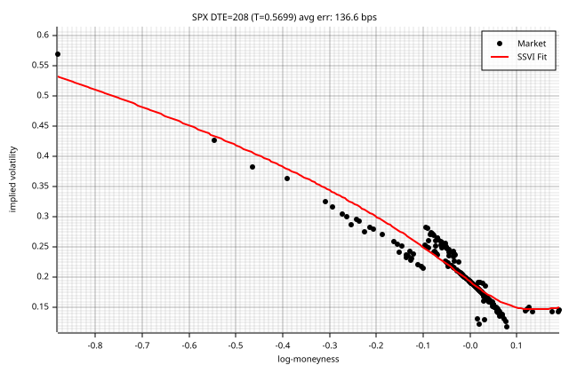

### DTE = 224 (T = 0.6137)

max err: 397.7 bps | RMSE: 189.9 bps | eta=0.5613, gamma=0.7353, rho=-0.5817 | cal viol: 2

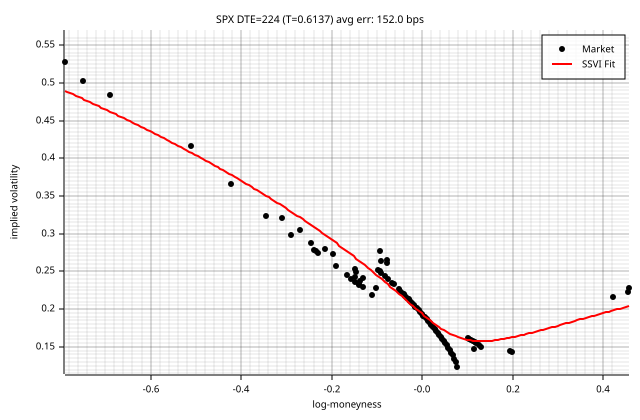

### DTE = 259 (T = 0.7096)

max err: 445.9 bps | RMSE: 162.3 bps | eta=0.6350, gamma=0.6858, rho=-0.5931 | cal viol: 2

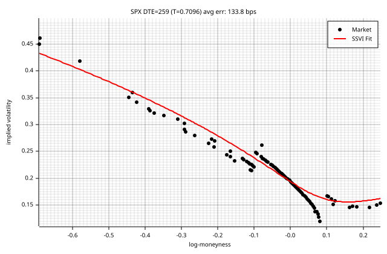

### DTE = 287 (T = 0.7863)

max err: 790.7 bps | RMSE: 193.5 bps | eta=0.5514, gamma=0.7553, rho=-0.5720 | cal viol: 0

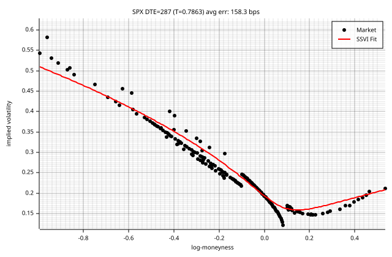

### DTE = 300 (T = 0.8219)

max err: 647.4 bps | RMSE: 181.0 bps | eta=0.6345, gamma=0.7129, rho=-0.5744 | cal viol: 5

### DTE = 315 (T = 0.8630)

max err: 433.4 bps | RMSE: 177.3 bps | eta=0.6135, gamma=0.7266, rho=-0.5263 | cal viol: 4

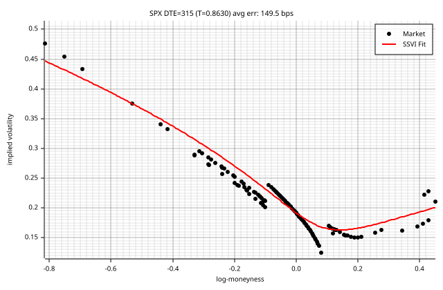

### DTE = 350 (T = 0.9589)

max err: 372.4 bps | RMSE: 133.5 bps | eta=0.5721, gamma=0.7472, rho=-0.5475 | cal viol: 0

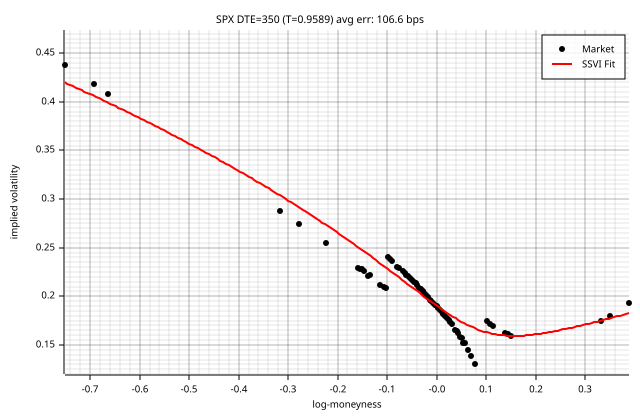

### DTE = 378 (T = 1.0356)

max err: 323.1 bps | RMSE: 141.3 bps | eta=0.5551, gamma=0.7467, rho=-0.5554 | cal viol: 2

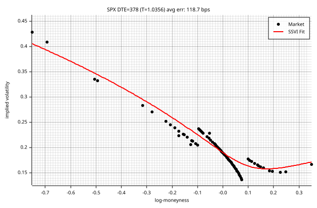

### DTE = 468 (T = 1.2822)

max err: 424.1 bps | RMSE: 147.3 bps | eta=0.5893, gamma=0.7224, rho=-0.4837 | cal viol: 1

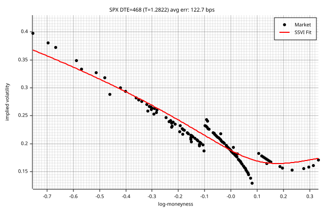

### DTE = 651 (T = 1.7836)

max err: 928.9 bps | RMSE: 180.5 bps | eta=0.6062, gamma=0.7878, rho=-0.4035 | cal viol: 0

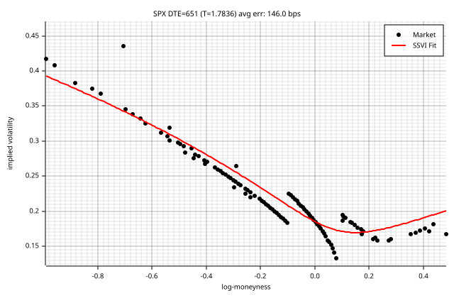

### DTE = 1015 (T = 2.7808)

max err: 704.5 bps | RMSE: 313.7 bps | eta=0.6281, gamma=0.9622, rho=-0.3998 | cal viol: 0

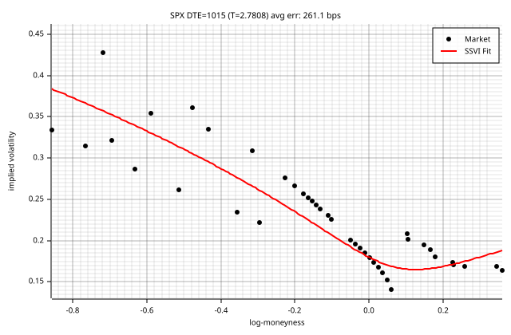

### DTE = 1386 (T = 3.7973)

max err: 470.1 bps | RMSE: 216.6 bps | eta=0.9257, gamma=1.0000, rho=0.0935 | cal viol: 5

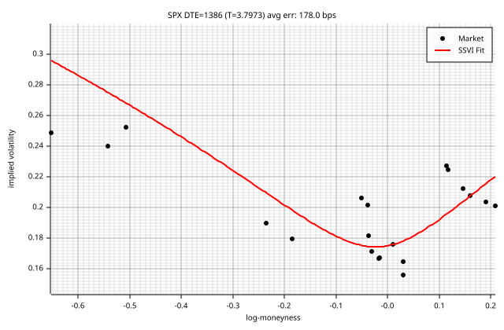

### DTE = 1750 (T = 4.7945)

max err: 443.4 bps | RMSE: 239.8 bps | eta=1.2410, gamma=1.0000, rho=0.3255 | cal viol: 2

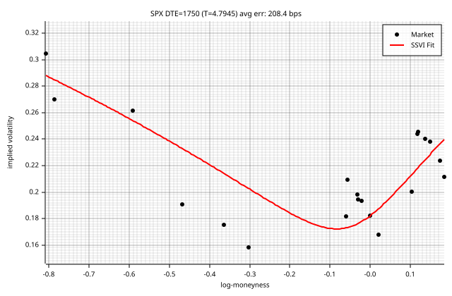

