# SSVI Direct Solver Fit: SPX (2026-03-06)

4D Nelder-Mead direct solver with algebraic no-arb barrier.

- Objective: pure SSE on total variance
- No-arb barrier: eta*(1+|rho|) <= 2
- Calendar penalty: theta monotonicity via lambda_calendar
- Butterfly: post-hoc validation
- IV rule: p_iv (k < -0.1), mean(p_iv,c_iv) (-0.1..0.1), c_iv (k > 0.1)

## Calibration Summary

| DTE | T | max err (bps) | RMSE (bps) | avg err (bps) | eta | gamma | rho | phi | cal viol | converged |
|----:|------:|--------------:|-----------:|--------------:|------:|------:|------:|------:|---------:|:---------:|
| 3 | 0.0082 | 4804.7 | 1039.5 | 642.0 | 0.4764 | 0.8667 | -0.5468 | 75535.922 | 0 | yes |
| 4 | 0.0110 | 3382.6 | 902.9 | 603.9 | 0.1408 | 0.9565 | -0.5138 | 77177.966 | 60 | yes |
| 5 | 0.0137 | 2784.9 | 709.9 | 492.0 | 0.9510 | 0.6976 | -0.5508 | 265.681 | 5 | yes |
| 6 | 0.0164 | 2110.5 | 767.3 | 574.1 | 0.8854 | 0.6980 | -0.5323 | 206.583 | 33 | yes |
| 7 | 0.0192 | 1919.3 | 816.5 | 634.6 | 0.2266 | 0.8779 | -0.5250 | 275.365 | 14 | yes |
| 10 | 0.0274 | 1676.7 | 391.6 | 287.9 | 0.1560 | 0.9218 | -0.5763 | 75.847 | 5 | yes |
| 11 | 0.0301 | 1479.5 | 293.3 | 202.6 | 0.8399 | 0.6579 | -0.5780 | 59.232 | 36 | yes |
| 12 | 0.0329 | 1235.1 | 265.0 | 190.9 | 0.0945 | 0.9970 | -0.5576 | 53.530 | 31 | yes |
| 13 | 0.0356 | 1039.0 | 264.5 | 203.3 | 1.1265 | 0.6025 | -0.5501 | 49.317 | 31 | yes |
| 14 | 0.0384 | 1975.9 | 684.6 | 588.1 | 0.7033 | 0.7182 | -0.3791 | 83.845 | 11 | yes |
| 17 | 0.0466 | 727.6 | 340.5 | 275.1 | 0.4955 | 0.7534 | -0.3835 | 54.299 | 36 | yes |
| 18 | 0.0493 | 793.5 | 309.8 | 241.9 | 0.8603 | 0.6614 | -0.3846 | 51.121 | 39 | yes |
| 19 | 0.0521 | 948.3 | 414.9 | 314.0 | 0.2030 | 0.9103 | -0.4419 | 52.839 | 12 | yes |
| 20 | 0.0548 | 1068.1 | 409.1 | 313.8 | 0.9783 | 0.6593 | -0.4708 | 53.332 | 19 | yes |
| 21 | 0.0575 | 976.3 | 431.4 | 354.7 | 0.1419 | 0.9775 | -0.4712 | 54.311 | 55 | yes |
| 24 | 0.0658 | 678.8 | 236.6 | 181.4 | 0.3794 | 0.8074 | -0.4738 | 42.926 | 35 | yes |
| 25 | 0.0685 | 1144.2 | 552.2 | 462.6 | 0.2478 | 0.8824 | -0.4730 | 47.281 | 64 | yes |
| 26 | 0.0712 | 707.3 | 241.8 | 136.8 | 0.8190 | 0.7071 | -0.5972 | 42.186 | 7 | yes |
| 27 | 0.0740 | 1355.1 | 379.1 | 222.6 | 0.9046 | 0.6899 | -0.5971 | 42.617 | 36 | yes |
| 31 | 0.0849 | 271.0 | 139.4 | 120.1 | 0.1628 | 0.9999 | -0.5682 | 41.820 | 29 | yes |
| 35 | 0.0959 | 1286.4 | 361.0 | 269.1 | 1.1836 | 0.6429 | -0.5681 | 41.984 | 68 | yes |
| 42 | 0.1151 | 1230.4 | 516.8 | 414.1 | 1.2301 | 0.6429 | -0.5499 | 45.746 | 62 | yes |
| 49 | 0.1342 | 706.4 | 165.4 | 121.2 | 0.9661 | 0.6565 | -0.5526 | 29.180 | 29 | yes |
| 55 | 0.1507 | 918.0 | 314.0 | 232.7 | 0.2147 | 0.9456 | -0.5527 | 29.071 | 70 | yes |
| 70 | 0.1918 | 1093.8 | 301.4 | 233.6 | 1.2915 | 0.5924 | -0.4695 | 24.563 | 33 | yes |
| 84 | 0.2301 | 603.2 | 195.5 | 139.2 | 0.4494 | 0.7921 | -0.4809 | 19.309 | 7 | yes |
| 104 | 0.2849 | 1300.3 | 256.6 | 204.3 | 0.9837 | 0.6332 | -0.5267 | 18.152 | 10 | yes |
| 116 | 0.3178 | 626.9 | 216.4 | 154.9 | 0.5477 | 0.7463 | -0.5360 | 14.990 | 37 | yes |
| 133 | 0.3644 | 609.5 | 194.5 | 161.6 | 0.9949 | 0.6209 | -0.5621 | 15.097 | 14 | yes |
| 147 | 0.4027 | 463.4 | 111.0 | 74.0 | 0.2893 | 0.8924 | -0.5714 | 12.472 | 35 | yes |
| 168 | 0.4603 | 459.1 | 150.4 | 124.2 | 0.6729 | 0.6956 | -0.5801 | 12.006 | 0 | yes |
| 196 | 0.5370 | 396.9 | 152.3 | 129.4 | 0.2451 | 0.9401 | -0.6015 | 10.518 | 5 | yes |
| 208 | 0.5699 | 586.9 | 185.8 | 136.6 | 1.1114 | 0.5633 | -0.6401 | 9.631 | 9 | yes |
| 224 | 0.6137 | 380.9 | 180.3 | 149.0 | 0.3754 | 0.8567 | -0.5720 | 10.049 | 9 | yes |
| 259 | 0.7096 | 372.0 | 149.4 | 129.6 | 0.2148 | 0.9934 | -0.5841 | 8.484 | 36 | yes |
| 287 | 0.7863 | 713.3 | 182.1 | 160.5 | 0.3896 | 0.8766 | -0.5504 | 9.646 | 0 | yes |
| 300 | 0.8219 | 637.5 | 175.5 | 129.7 | 0.7861 | 0.6695 | -0.5620 | 8.394 | 37 | yes |
| 315 | 0.8630 | 336.2 | 159.5 | 142.0 | 0.9620 | 0.6200 | -0.5265 | 8.576 | 19 | yes |
| 350 | 0.9589 | 325.2 | 126.9 | 106.5 | 0.4549 | 0.8312 | -0.5409 | 7.658 | 0 | yes |
| 378 | 1.0356 | 271.9 | 134.2 | 117.7 | 0.8167 | 0.6499 | -0.5433 | 7.046 | 29 | yes |
| 468 | 1.2822 | 376.4 | 142.4 | 121.8 | 0.2589 | 0.9968 | -0.4881 | 5.896 | 0 | yes |
| 651 | 1.7836 | 900.0 | 175.2 | 144.1 | 1.2203 | 0.5674 | -0.4010 | 6.047 | 0 | yes |
| 1015 | 2.7808 | 776.4 | 298.3 | 246.3 | 0.6007 | 0.9022 | -0.4947 | 4.535 | 0 | yes |
| 1386 | 3.7973 | 433.1 | 218.1 | 194.2 | 1.0109 | 0.9128 | 0.0686 | 6.359 | 6 | yes |
| 1750 | 4.7945 | 457.4 | 230.3 | 190.4 | 1.2035 | 0.9945 | 0.3431 | 6.624 | 32 | yes |

## Fit Plots

### DTE = 3 (T = 0.0082)

max err: 4804.7 bps | RMSE: 1039.5 bps | eta=0.4764, gamma=0.8667, rho=-0.5468 | cal viol: 0

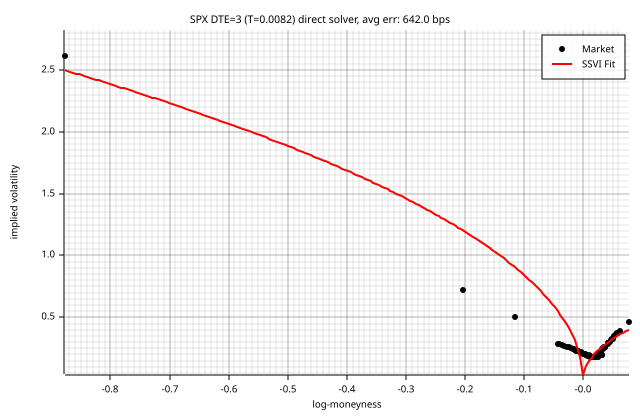

### DTE = 4 (T = 0.0110)

max err: 3382.6 bps | RMSE: 902.9 bps | eta=0.1408, gamma=0.9565, rho=-0.5138 | cal viol: 60

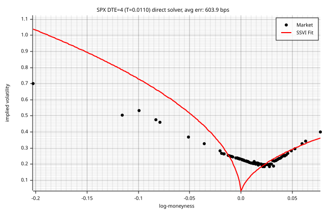

### DTE = 5 (T = 0.0137)

max err: 2784.9 bps | RMSE: 709.9 bps | eta=0.9510, gamma=0.6976, rho=-0.5508 | cal viol: 5

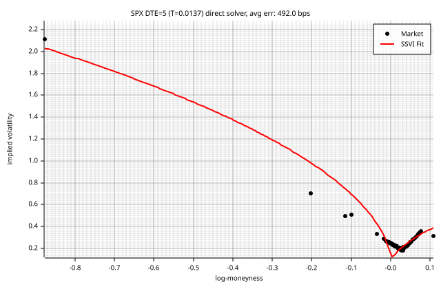

### DTE = 6 (T = 0.0164)

max err: 2110.5 bps | RMSE: 767.3 bps | eta=0.8854, gamma=0.6980, rho=-0.5323 | cal viol: 33

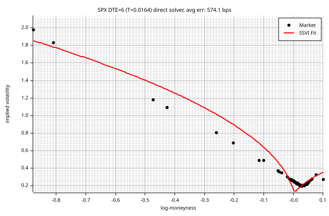

### DTE = 7 (T = 0.0192)

max err: 1919.3 bps | RMSE: 816.5 bps | eta=0.2266, gamma=0.8779, rho=-0.5250 | cal viol: 14

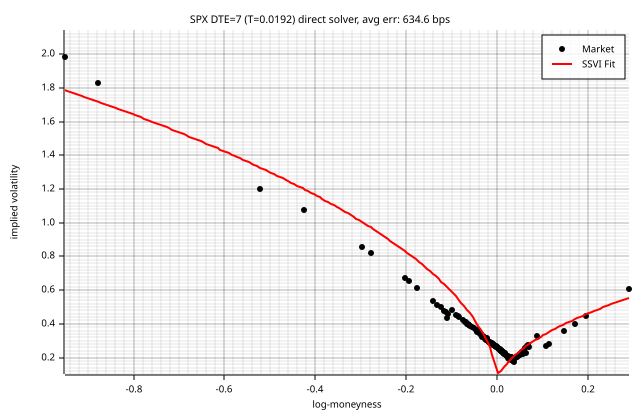

### DTE = 10 (T = 0.0274)

max err: 1676.7 bps | RMSE: 391.6 bps | eta=0.1560, gamma=0.9218, rho=-0.5763 | cal viol: 5

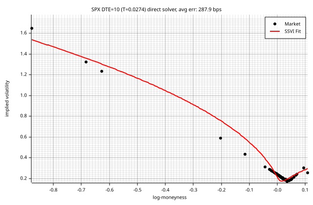

### DTE = 11 (T = 0.0301)

max err: 1479.5 bps | RMSE: 293.3 bps | eta=0.8399, gamma=0.6579, rho=-0.5780 | cal viol: 36

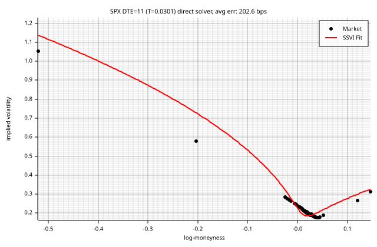

### DTE = 12 (T = 0.0329)

max err: 1235.1 bps | RMSE: 265.0 bps | eta=0.0945, gamma=0.9970, rho=-0.5576 | cal viol: 31

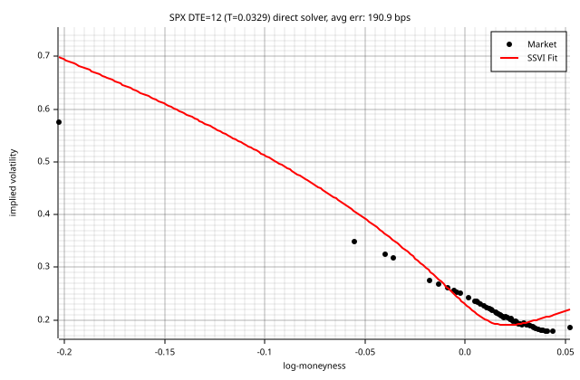

### DTE = 13 (T = 0.0356)

max err: 1039.0 bps | RMSE: 264.5 bps | eta=1.1265, gamma=0.6025, rho=-0.5501 | cal viol: 31

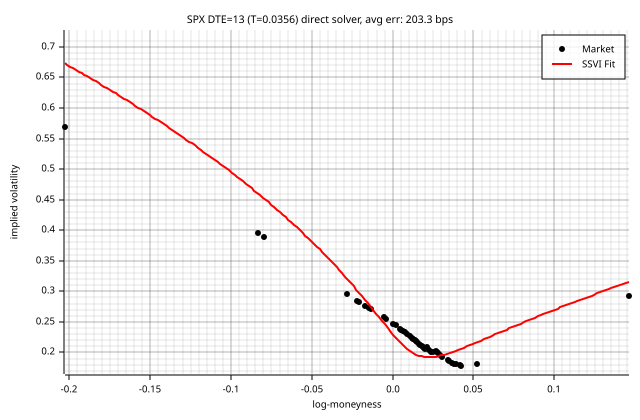

### DTE = 14 (T = 0.0384)

max err: 1975.9 bps | RMSE: 684.6 bps | eta=0.7033, gamma=0.7182, rho=-0.3791 | cal viol: 11

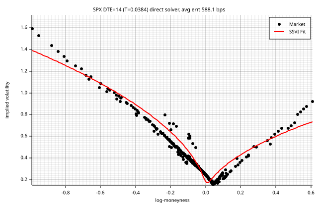

### DTE = 17 (T = 0.0466)

max err: 727.6 bps | RMSE: 340.5 bps | eta=0.4955, gamma=0.7534, rho=-0.3835 | cal viol: 36

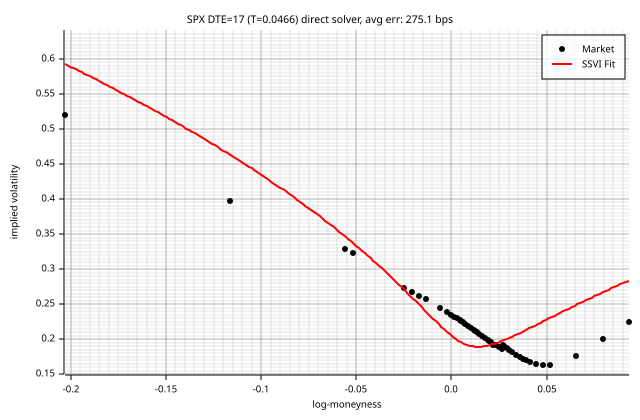

### DTE = 18 (T = 0.0493)

max err: 793.5 bps | RMSE: 309.8 bps | eta=0.8603, gamma=0.6614, rho=-0.3846 | cal viol: 39

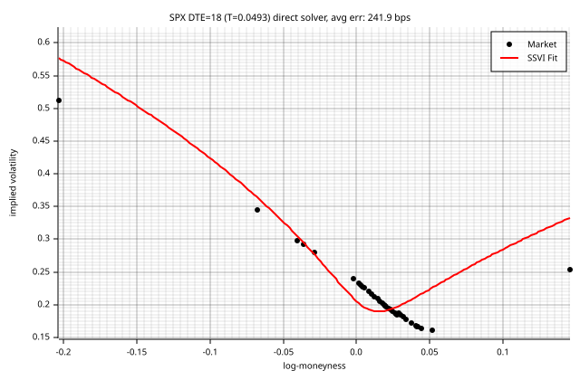

### DTE = 19 (T = 0.0521)

max err: 948.3 bps | RMSE: 414.9 bps | eta=0.2030, gamma=0.9103, rho=-0.4419 | cal viol: 12

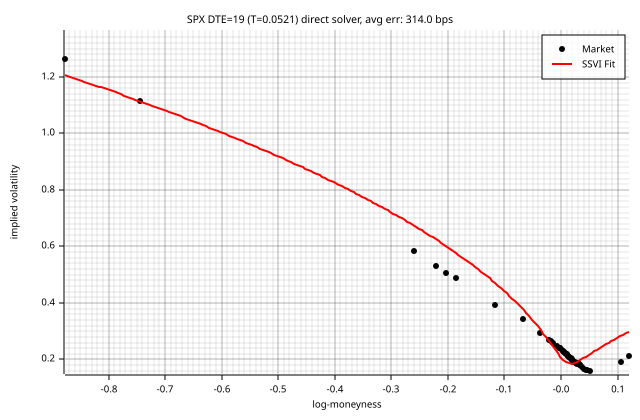

### DTE = 20 (T = 0.0548)

max err: 1068.1 bps | RMSE: 409.1 bps | eta=0.9783, gamma=0.6593, rho=-0.4708 | cal viol: 19

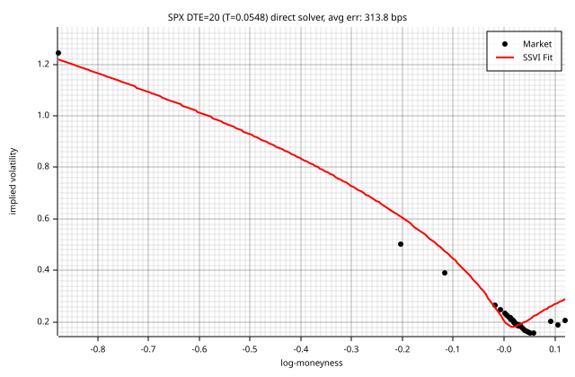

### DTE = 21 (T = 0.0575)

max err: 976.3 bps | RMSE: 431.4 bps | eta=0.1419, gamma=0.9775, rho=-0.4712 | cal viol: 55

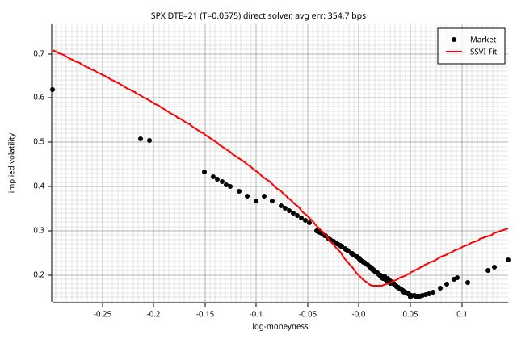

### DTE = 24 (T = 0.0658)

max err: 678.8 bps | RMSE: 236.6 bps | eta=0.3794, gamma=0.8074, rho=-0.4738 | cal viol: 35

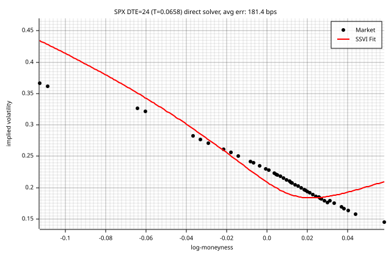

### DTE = 25 (T = 0.0685)

max err: 1144.2 bps | RMSE: 552.2 bps | eta=0.2478, gamma=0.8824, rho=-0.4730 | cal viol: 64

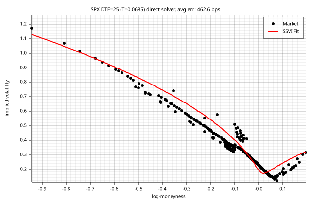

### DTE = 26 (T = 0.0712)

max err: 707.3 bps | RMSE: 241.8 bps | eta=0.8190, gamma=0.7071, rho=-0.5972 | cal viol: 7

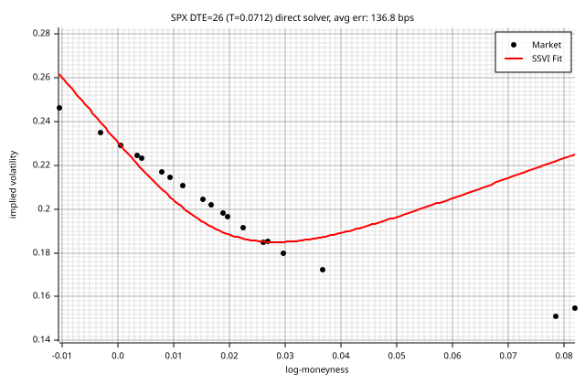

### DTE = 27 (T = 0.0740)

max err: 1355.1 bps | RMSE: 379.1 bps | eta=0.9046, gamma=0.6899, rho=-0.5971 | cal viol: 36

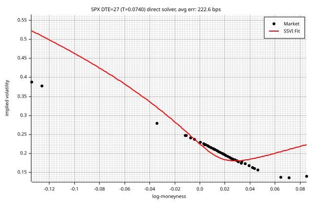

### DTE = 31 (T = 0.0849)

max err: 271.0 bps | RMSE: 139.4 bps | eta=0.1628, gamma=0.9999, rho=-0.5682 | cal viol: 29

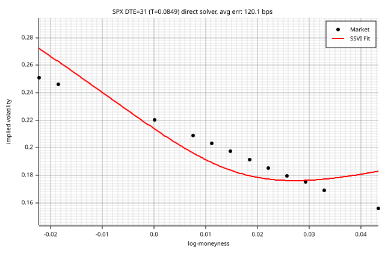

### DTE = 35 (T = 0.0959)

max err: 1286.4 bps | RMSE: 361.0 bps | eta=1.1836, gamma=0.6429, rho=-0.5681 | cal viol: 68

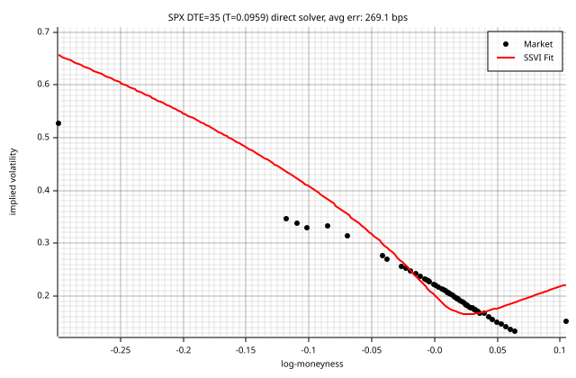

### DTE = 42 (T = 0.1151)

max err: 1230.4 bps | RMSE: 516.8 bps | eta=1.2301, gamma=0.6429, rho=-0.5499 | cal viol: 62

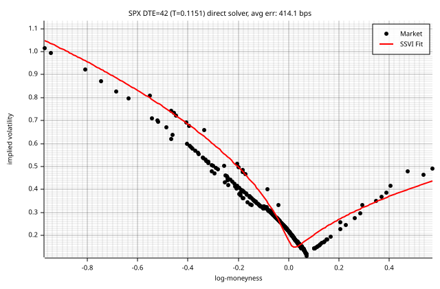

### DTE = 49 (T = 0.1342)

max err: 706.4 bps | RMSE: 165.4 bps | eta=0.9661, gamma=0.6565, rho=-0.5526 | cal viol: 29

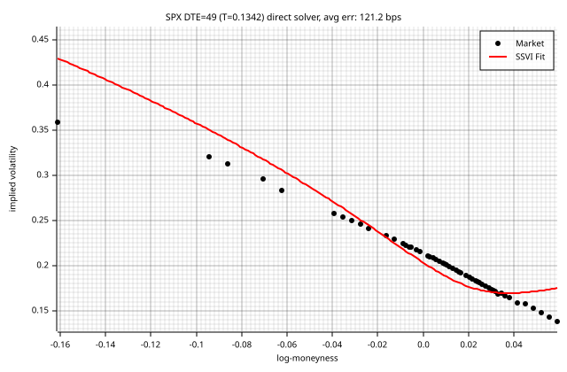

### DTE = 55 (T = 0.1507)

max err: 918.0 bps | RMSE: 314.0 bps | eta=0.2147, gamma=0.9456, rho=-0.5527 | cal viol: 70

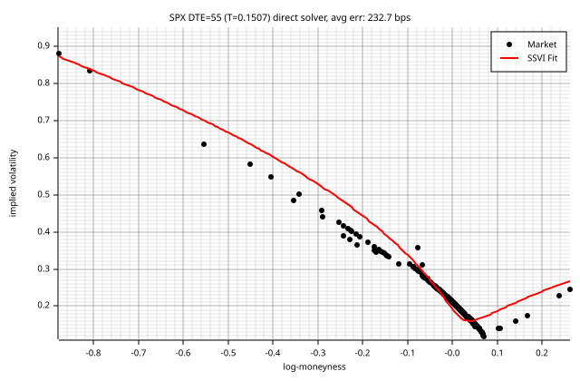

### DTE = 70 (T = 0.1918)

max err: 1093.8 bps | RMSE: 301.4 bps | eta=1.2915, gamma=0.5924, rho=-0.4695 | cal viol: 33

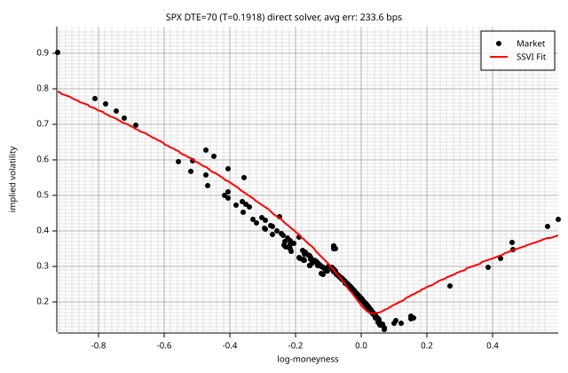

### DTE = 84 (T = 0.2301)

max err: 603.2 bps | RMSE: 195.5 bps | eta=0.4494, gamma=0.7921, rho=-0.4809 | cal viol: 7

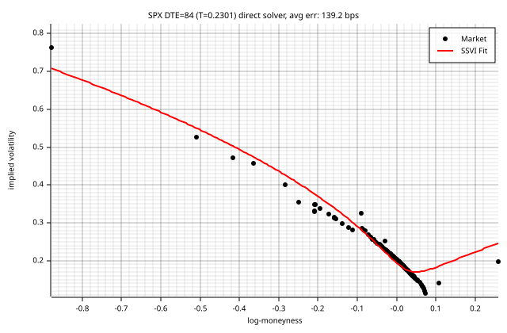

### DTE = 104 (T = 0.2849)

max err: 1300.3 bps | RMSE: 256.6 bps | eta=0.9837, gamma=0.6332, rho=-0.5267 | cal viol: 10

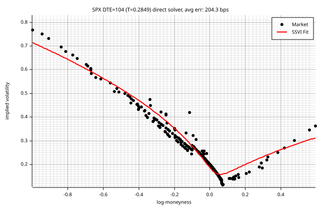

### DTE = 116 (T = 0.3178)

max err: 626.9 bps | RMSE: 216.4 bps | eta=0.5477, gamma=0.7463, rho=-0.5360 | cal viol: 37

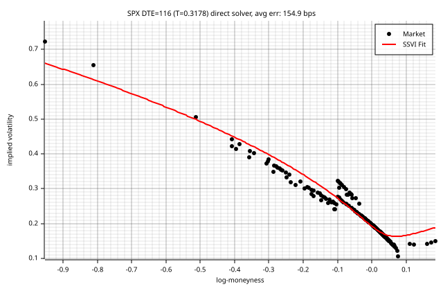

### DTE = 133 (T = 0.3644)

max err: 609.5 bps | RMSE: 194.5 bps | eta=0.9949, gamma=0.6209, rho=-0.5621 | cal viol: 14

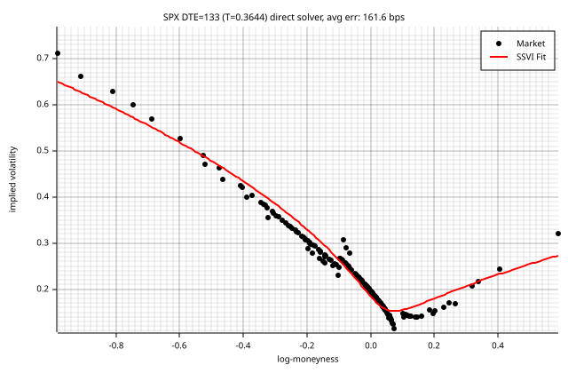

### DTE = 147 (T = 0.4027)

max err: 463.4 bps | RMSE: 111.0 bps | eta=0.2893, gamma=0.8924, rho=-0.5714 | cal viol: 35

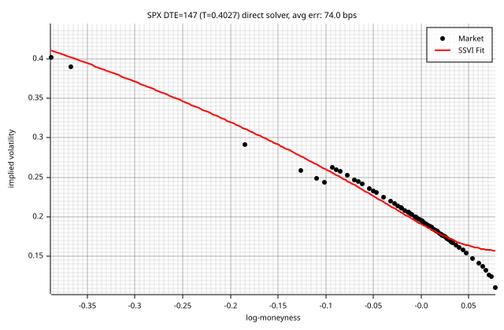

### DTE = 168 (T = 0.4603)

max err: 459.1 bps | RMSE: 150.4 bps | eta=0.6729, gamma=0.6956, rho=-0.5801 | cal viol: 0

### DTE = 196 (T = 0.5370)

max err: 396.9 bps | RMSE: 152.3 bps | eta=0.2451, gamma=0.9401, rho=-0.6015 | cal viol: 5

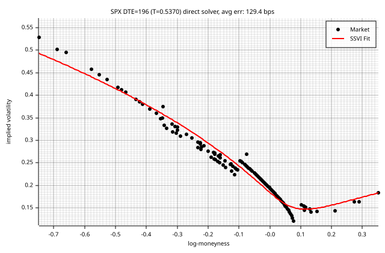

### DTE = 208 (T = 0.5699)

max err: 586.9 bps | RMSE: 185.8 bps | eta=1.1114, gamma=0.5633, rho=-0.6401 | cal viol: 9

### DTE = 224 (T = 0.6137)

max err: 380.9 bps | RMSE: 180.3 bps | eta=0.3754, gamma=0.8567, rho=-0.5720 | cal viol: 9

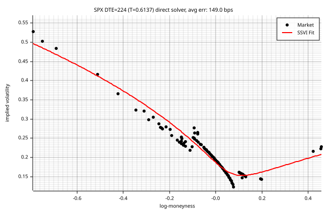

### DTE = 259 (T = 0.7096)

max err: 372.0 bps | RMSE: 149.4 bps | eta=0.2148, gamma=0.9934, rho=-0.5841 | cal viol: 36

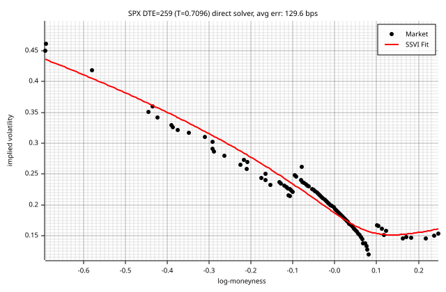

### DTE = 287 (T = 0.7863)

max err: 713.3 bps | RMSE: 182.1 bps | eta=0.3896, gamma=0.8766, rho=-0.5504 | cal viol: 0

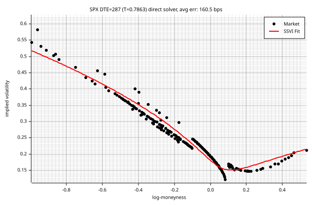

### DTE = 300 (T = 0.8219)

max err: 637.5 bps | RMSE: 175.5 bps | eta=0.7861, gamma=0.6695, rho=-0.5620 | cal viol: 37

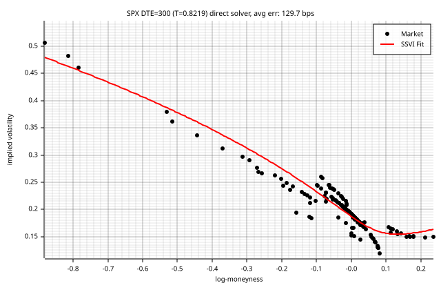

### DTE = 315 (T = 0.8630)

max err: 336.2 bps | RMSE: 159.5 bps | eta=0.9620, gamma=0.6200, rho=-0.5265 | cal viol: 19

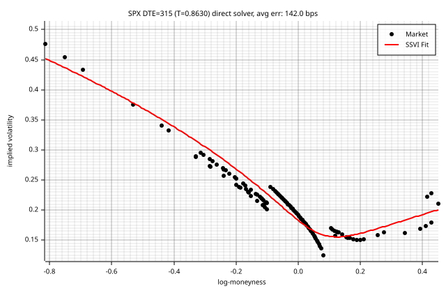

### DTE = 350 (T = 0.9589)

max err: 325.2 bps | RMSE: 126.9 bps | eta=0.4549, gamma=0.8312, rho=-0.5409 | cal viol: 0

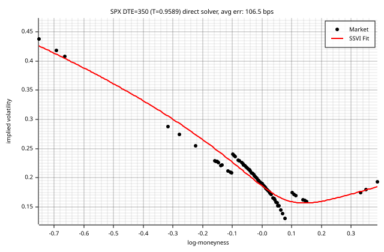

### DTE = 378 (T = 1.0356)

max err: 271.9 bps | RMSE: 134.2 bps | eta=0.8167, gamma=0.6499, rho=-0.5433 | cal viol: 29

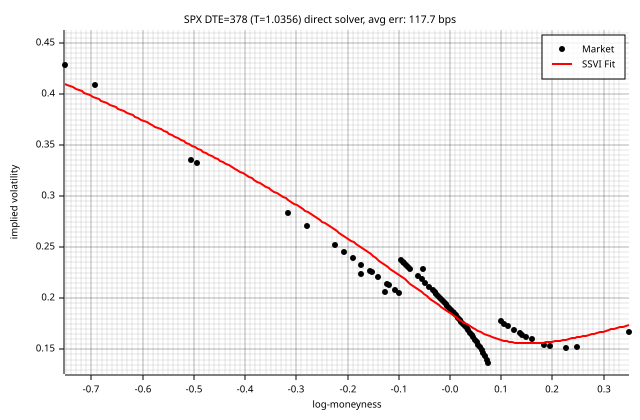

### DTE = 468 (T = 1.2822)

max err: 376.4 bps | RMSE: 142.4 bps | eta=0.2589, gamma=0.9968, rho=-0.4881 | cal viol: 0

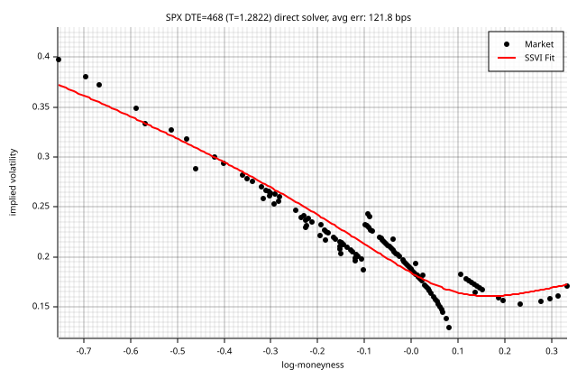

### DTE = 651 (T = 1.7836)

max err: 900.0 bps | RMSE: 175.2 bps | eta=1.2203, gamma=0.5674, rho=-0.4010 | cal viol: 0

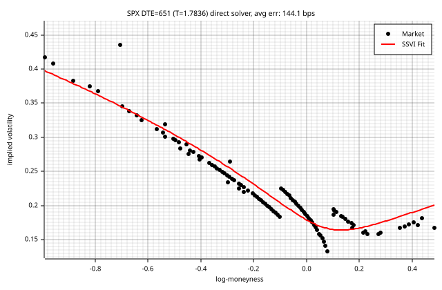

### DTE = 1015 (T = 2.7808)

max err: 776.4 bps | RMSE: 298.3 bps | eta=0.6007, gamma=0.9022, rho=-0.4947 | cal viol: 0

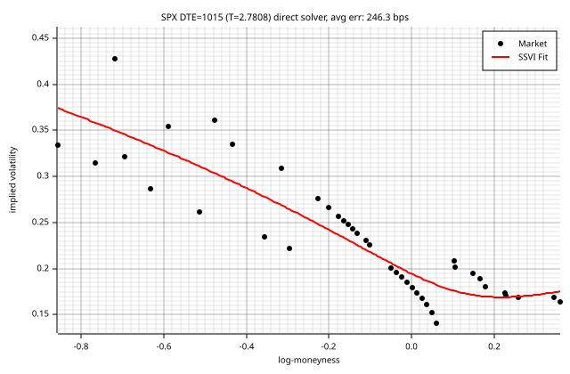

### DTE = 1386 (T = 3.7973)

max err: 433.1 bps | RMSE: 218.1 bps | eta=1.0109, gamma=0.9128, rho=0.0686 | cal viol: 6

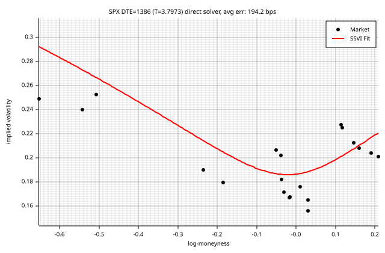

### DTE = 1750 (T = 4.7945)

max err: 457.4 bps | RMSE: 230.3 bps | eta=1.2035, gamma=0.9945, rho=0.3431 | cal viol: 32

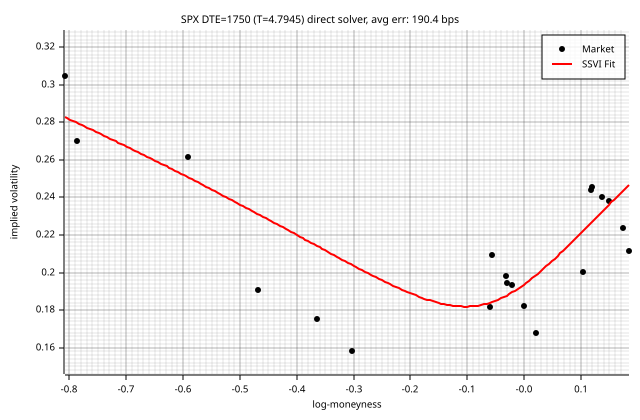

