# SSVI CBOE Fit: SPX (2026-03-07)

Surface calibration with calendar arbitrage penalty.

- k penalty range: -1.5 to 0.5, step 0.025
- lambda: 500
- IV rule: p_iv (k < -0.1), mean(p_iv,c_iv) (-0.1..0.1), c_iv (k > 0.1)

## Calibration Summary

| DTE | T | max err (bps) | RMSE (bps) | avg err (bps) | eta | gamma | rho | phi | cal viol | converged |
|----:|------:|--------------:|-----------:|--------------:|------:|------:|------:|------:|---------:|:---------:|
| 2 | 0.0055 | 12028.9 | 1342.1 | 460.9 | 0.5899 | 0.6367 | -0.0745 | 176.167 | 0 | yes |
| 3 | 0.0082 | 600.8 | 229.7 | 190.7 | 0.5622 | 0.6273 | -0.2838 | 81.904 | 0 | yes |
| 4 | 0.0110 | 7104.4 | 819.9 | 278.7 | 0.4986 | 0.6458 | -0.3969 | 65.290 | 2 | yes |
| 5 | 0.0137 | 5937.4 | 887.8 | 330.7 | 0.5318 | 0.6435 | -0.4808 | 57.348 | 3 | yes |
| 6 | 0.0164 | 6098.3 | 724.9 | 299.5 | 0.5713 | 0.6343 | -0.5127 | 52.481 | 5 | yes |
| 9 | 0.0247 | 4870.3 | 686.1 | 231.8 | 0.5677 | 0.6282 | -0.5676 | 38.466 | 2 | yes |
| 10 | 0.0274 | 1483.8 | 223.0 | 104.9 | 0.3933 | 0.6864 | -0.6043 | 34.634 | 2 | yes |
| 11 | 0.0301 | 142.7 | 96.9 | 85.5 | 0.5441 | 0.6406 | -0.6323 | 32.848 | 4 | yes |
| 12 | 0.0329 | 552.1 | 136.8 | 109.5 | 0.5759 | 0.6310 | -0.6445 | 30.848 | 3 | yes |
| 13 | 0.0356 | 4540.2 | 866.4 | 466.5 | 0.5493 | 0.6614 | -0.6158 | 37.651 | 3 | yes |
| 16 | 0.0438 | 363.7 | 250.5 | 227.6 | 0.5736 | 0.6593 | -0.6425 | 35.992 | 6 | yes |
| 17 | 0.0466 | 376.8 | 239.9 | 216.3 | 0.6330 | 0.6457 | -0.6596 | 34.421 | 5 | yes |
| 18 | 0.0493 | 2246.9 | 449.8 | 278.5 | 0.6050 | 0.6495 | -0.6606 | 32.405 | 6 | yes |
| 19 | 0.0521 | 2325.0 | 453.5 | 278.8 | 0.6210 | 0.6424 | -0.6615 | 30.968 | 6 | yes |
| 20 | 0.0548 | 405.8 | 257.5 | 226.5 | 0.5741 | 0.6638 | -0.6771 | 32.696 | 21 | yes |
| 23 | 0.0630 | 219.6 | 134.8 | 125.3 | 0.5639 | 0.6525 | -0.6819 | 25.660 | 2 | yes |
| 24 | 0.0658 | 1917.8 | 421.2 | 280.4 | 0.5819 | 0.6525 | -0.6908 | 26.505 | 21 | yes |
| 25 | 0.0685 | 113.7 | 35.3 | 20.7 | 0.6186 | 0.6399 | -0.7170 | 22.446 | 1 | yes |
| 26 | 0.0712 | 417.1 | 131.5 | 106.1 | 0.6648 | 0.6372 | -0.7261 | 24.166 | 10 | yes |
| 30 | 0.0822 | 52.9 | 43.3 | 40.7 | 0.6293 | 0.6419 | -0.7299 | 22.083 | 1 | yes |
| 34 | 0.0932 | 214.2 | 88.8 | 77.2 | 0.6431 | 0.6319 | -0.7315 | 20.272 | 3 | yes |
| 41 | 0.1123 | 2254.2 | 425.7 | 240.3 | 0.5685 | 0.6720 | -0.7128 | 21.396 | 0 | yes |
| 48 | 0.1315 | 199.6 | 54.8 | 46.9 | 0.6047 | 0.6504 | -0.7267 | 17.436 | 1 | yes |
| 54 | 0.1479 | 1436.6 | 192.0 | 98.4 | 0.5835 | 0.6503 | -0.7291 | 15.856 | 4 | yes |
| 69 | 0.1890 | 2163.9 | 387.8 | 189.8 | 0.5949 | 0.6446 | -0.7506 | 13.835 | 3 | yes |
| 83 | 0.2274 | 1170.4 | 149.0 | 77.3 | 0.6311 | 0.6342 | -0.7714 | 12.555 | 2 | yes |
| 103 | 0.2822 | 1574.3 | 312.8 | 188.3 | 0.5692 | 0.6771 | -0.7311 | 12.458 | 0 | yes |
| 115 | 0.3151 | 1018.9 | 190.5 | 119.7 | 0.4497 | 0.7299 | -0.7440 | 11.636 | 5 | yes |
| 132 | 0.3616 | 1321.3 | 239.4 | 144.3 | 0.5642 | 0.6773 | -0.7291 | 10.836 | 0 | yes |
| 146 | 0.4000 | 146.0 | 49.3 | 31.8 | 0.5228 | 0.6426 | -0.9990 | 7.721 | 21 | yes |
| 167 | 0.4575 | 770.6 | 189.6 | 134.5 | 0.5314 | 0.7024 | -0.6949 | 9.921 | 0 | yes |
| 195 | 0.5342 | 608.4 | 174.7 | 136.8 | 0.5337 | 0.7000 | -0.7052 | 8.912 | 0 | yes |
| 207 | 0.5671 | 518.5 | 180.8 | 132.9 | 0.5595 | 0.7265 | -0.7480 | 9.520 | 6 | yes |
| 223 | 0.6110 | 492.0 | 196.9 | 166.6 | 0.6435 | 0.7029 | -0.6639 | 9.819 | 12 | yes |
| 258 | 0.7068 | 396.3 | 149.9 | 132.6 | 0.6014 | 0.7138 | -0.6312 | 8.716 | 2 | yes |
| 286 | 0.7836 | 1000.0 | 195.6 | 143.1 | 0.5295 | 0.7459 | -0.6149 | 8.163 | 0 | yes |
| 299 | 0.8192 | 585.3 | 187.4 | 163.2 | 0.5938 | 0.7396 | -0.6295 | 8.811 | 6 | yes |
| 314 | 0.8603 | 381.5 | 156.4 | 139.9 | 0.5739 | 0.7622 | -0.5430 | 9.009 | 14 | yes |
| 349 | 0.9562 | 283.8 | 149.1 | 137.0 | 0.5199 | 0.8022 | -0.5790 | 8.617 | 1 | yes |
| 377 | 1.0329 | 304.1 | 149.8 | 134.3 | 0.5522 | 0.7838 | -0.5547 | 8.089 | 1 | yes |
| 467 | 1.2795 | 389.4 | 158.5 | 132.2 | 0.5778 | 0.7620 | -0.5186 | 6.877 | 1 | yes |
| 650 | 1.7808 | 959.0 | 187.4 | 135.1 | 0.5769 | 0.8368 | -0.3752 | 7.115 | 0 | yes |
| 1014 | 2.7781 | 1211.5 | 457.1 | 303.0 | 0.8454 | 1.0000 | -0.4277 | 10.984 | 0 | yes |
| 1385 | 3.7945 | 1077.7 | 428.0 | 328.5 | 1.3248 | 1.0000 | -0.0075 | 14.983 | 2 | yes |
| 1749 | 4.7918 | 854.4 | 444.0 | 373.0 | 1.6633 | 1.0000 | 0.2024 | 13.270 | 1 | yes |

## Fit Plots

### DTE = 2 (T = 0.0055)

max err: 12028.9 bps | RMSE: 1342.1 bps | eta=0.5899, gamma=0.6367, rho=-0.0745 | cal viol: 0

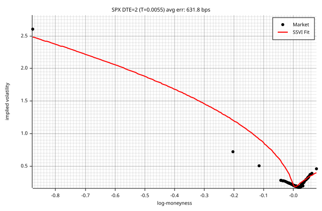

### DTE = 3 (T = 0.0082)

max err: 600.8 bps | RMSE: 229.7 bps | eta=0.5622, gamma=0.6273, rho=-0.2838 | cal viol: 0

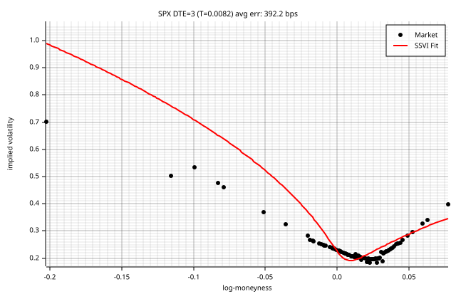

### DTE = 4 (T = 0.0110)

max err: 7104.4 bps | RMSE: 819.9 bps | eta=0.4986, gamma=0.6458, rho=-0.3969 | cal viol: 2

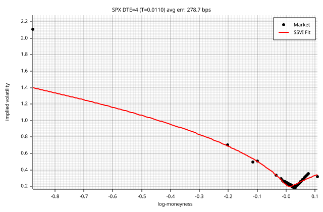

### DTE = 5 (T = 0.0137)

max err: 5937.4 bps | RMSE: 887.8 bps | eta=0.5318, gamma=0.6435, rho=-0.4808 | cal viol: 3

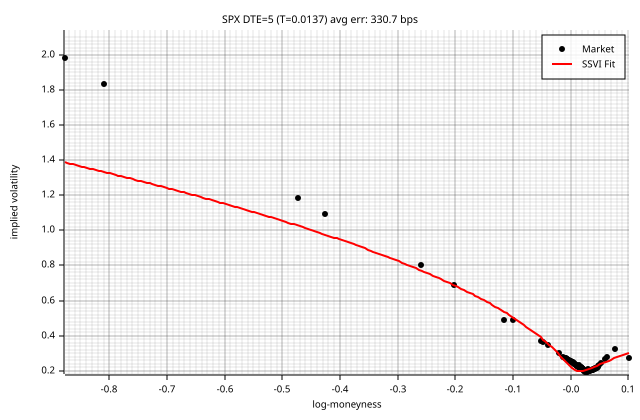

### DTE = 6 (T = 0.0164)

max err: 6098.3 bps | RMSE: 724.9 bps | eta=0.5713, gamma=0.6343, rho=-0.5127 | cal viol: 5

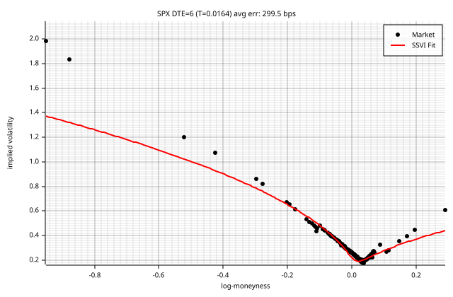

### DTE = 9 (T = 0.0247)

max err: 4870.3 bps | RMSE: 686.1 bps | eta=0.5677, gamma=0.6282, rho=-0.5676 | cal viol: 2

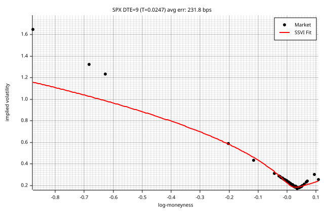

### DTE = 10 (T = 0.0274)

max err: 1483.8 bps | RMSE: 223.0 bps | eta=0.3933, gamma=0.6864, rho=-0.6043 | cal viol: 2

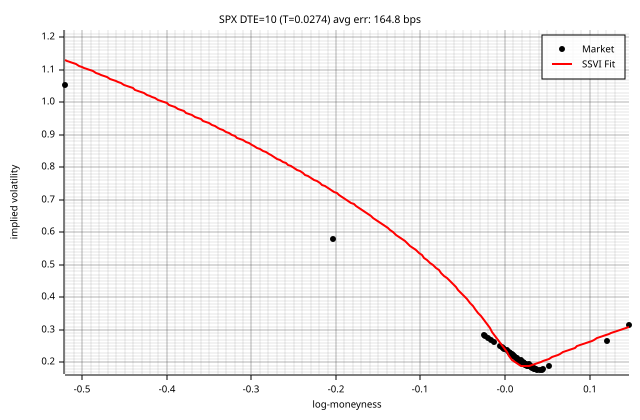

### DTE = 11 (T = 0.0301)

max err: 142.7 bps | RMSE: 96.9 bps | eta=0.5441, gamma=0.6406, rho=-0.6323 | cal viol: 4

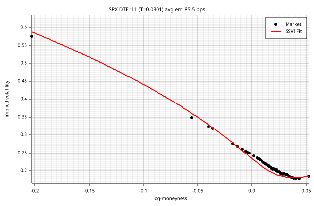

### DTE = 12 (T = 0.0329)

max err: 552.1 bps | RMSE: 136.8 bps | eta=0.5759, gamma=0.6310, rho=-0.6445 | cal viol: 3

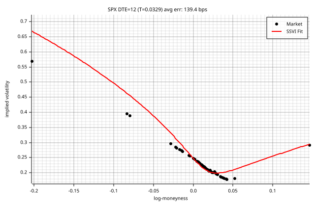

### DTE = 13 (T = 0.0356)

max err: 4540.2 bps | RMSE: 866.4 bps | eta=0.5493, gamma=0.6614, rho=-0.6158 | cal viol: 3

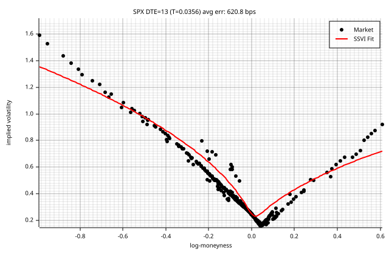

### DTE = 16 (T = 0.0438)

max err: 363.7 bps | RMSE: 250.5 bps | eta=0.5736, gamma=0.6593, rho=-0.6425 | cal viol: 6

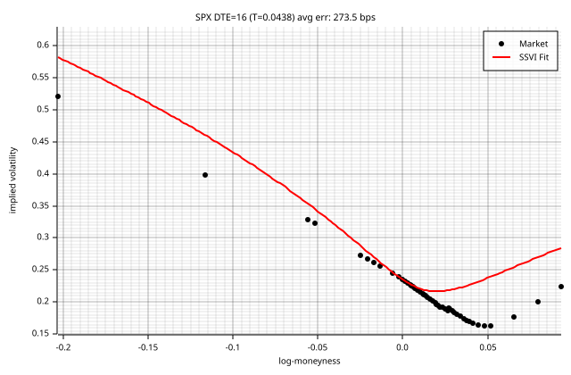

### DTE = 17 (T = 0.0466)

max err: 376.8 bps | RMSE: 239.9 bps | eta=0.6330, gamma=0.6457, rho=-0.6596 | cal viol: 5

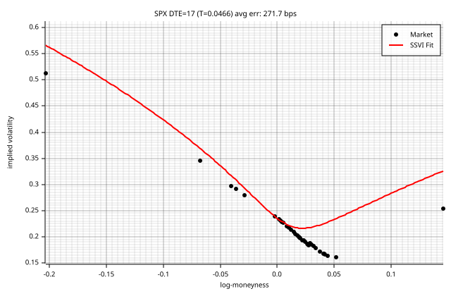

### DTE = 18 (T = 0.0493)

max err: 2246.9 bps | RMSE: 449.8 bps | eta=0.6050, gamma=0.6495, rho=-0.6606 | cal viol: 6

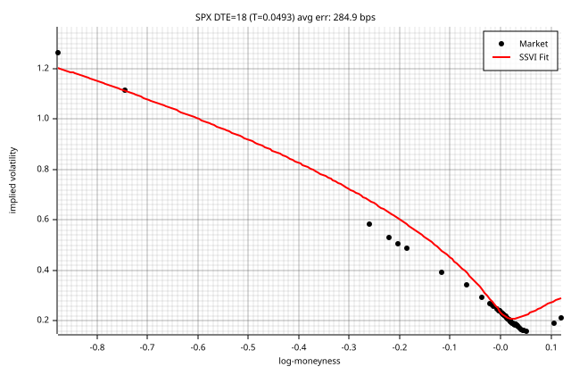

### DTE = 19 (T = 0.0521)

max err: 2325.0 bps | RMSE: 453.5 bps | eta=0.6210, gamma=0.6424, rho=-0.6615 | cal viol: 6

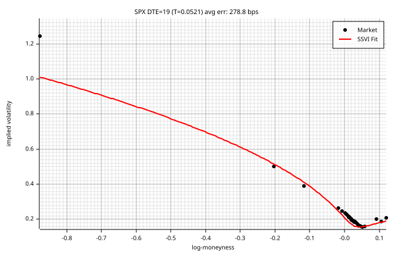

### DTE = 20 (T = 0.0548)

max err: 405.8 bps | RMSE: 257.5 bps | eta=0.5741, gamma=0.6638, rho=-0.6771 | cal viol: 21

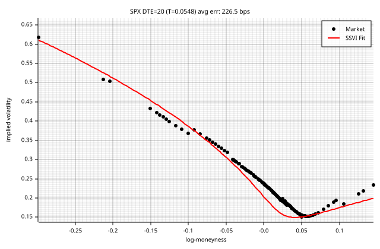

### DTE = 23 (T = 0.0630)

max err: 219.6 bps | RMSE: 134.8 bps | eta=0.5639, gamma=0.6525, rho=-0.6819 | cal viol: 2

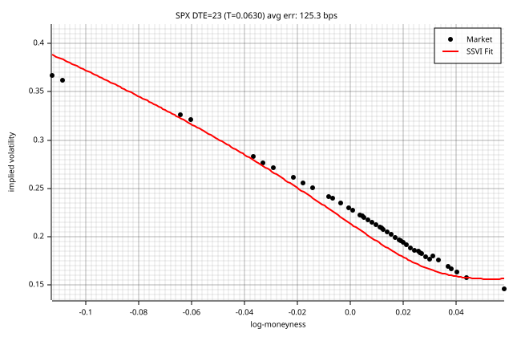

### DTE = 24 (T = 0.0658)

max err: 1917.8 bps | RMSE: 421.2 bps | eta=0.5819, gamma=0.6525, rho=-0.6908 | cal viol: 21

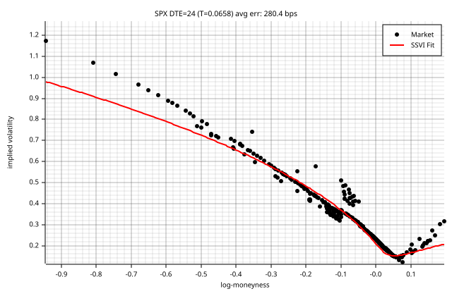

### DTE = 25 (T = 0.0685)

max err: 113.7 bps | RMSE: 35.3 bps | eta=0.6186, gamma=0.6399, rho=-0.7170 | cal viol: 1

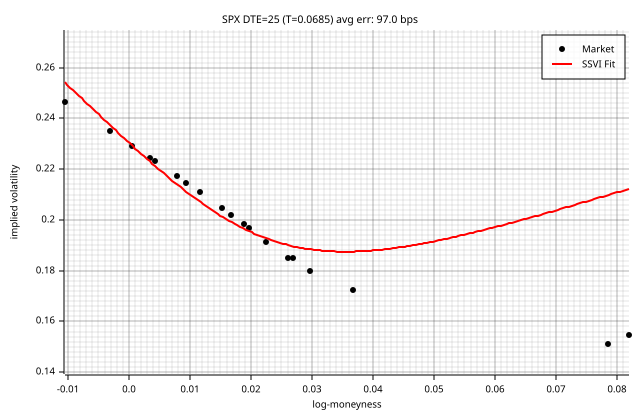

### DTE = 26 (T = 0.0712)

max err: 417.1 bps | RMSE: 131.5 bps | eta=0.6648, gamma=0.6372, rho=-0.7261 | cal viol: 10

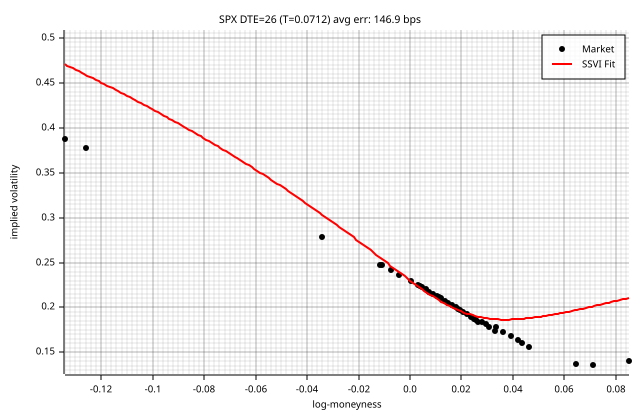

### DTE = 30 (T = 0.0822)

max err: 52.9 bps | RMSE: 43.3 bps | eta=0.6293, gamma=0.6419, rho=-0.7299 | cal viol: 1

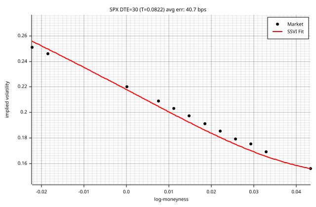

### DTE = 34 (T = 0.0932)

max err: 214.2 bps | RMSE: 88.8 bps | eta=0.6431, gamma=0.6319, rho=-0.7315 | cal viol: 3

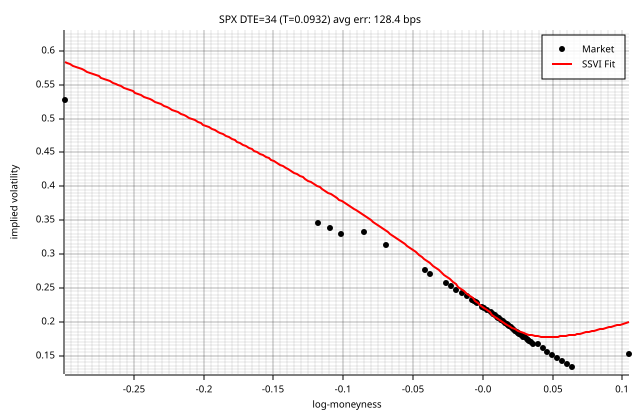

### DTE = 41 (T = 0.1123)

max err: 2254.2 bps | RMSE: 425.7 bps | eta=0.5685, gamma=0.6720, rho=-0.7128 | cal viol: 0

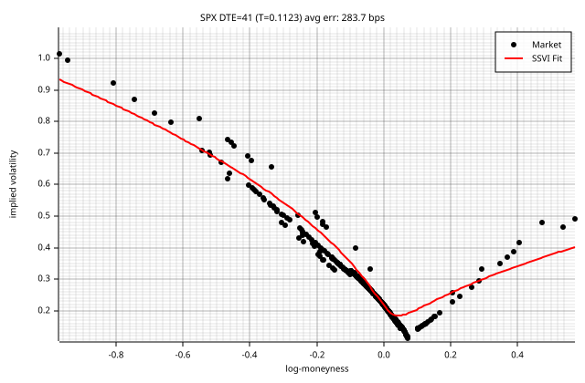

### DTE = 48 (T = 0.1315)

max err: 199.6 bps | RMSE: 54.8 bps | eta=0.6047, gamma=0.6504, rho=-0.7267 | cal viol: 1

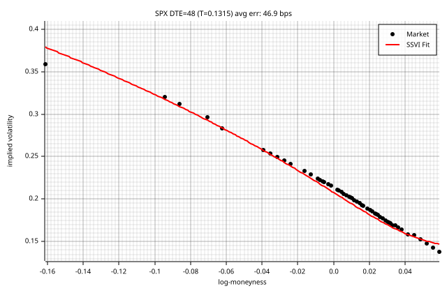

### DTE = 54 (T = 0.1479)

max err: 1436.6 bps | RMSE: 192.0 bps | eta=0.5835, gamma=0.6503, rho=-0.7291 | cal viol: 4

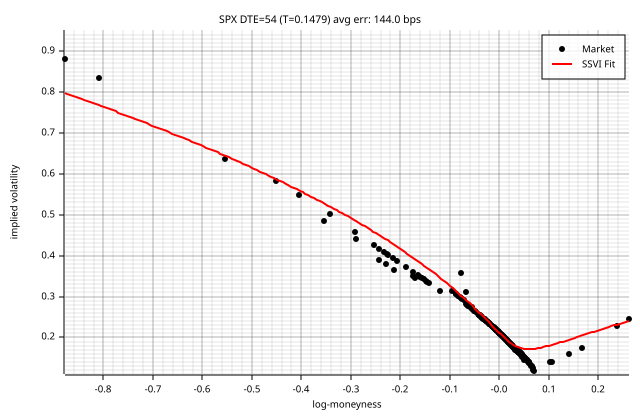

### DTE = 69 (T = 0.1890)

max err: 2163.9 bps | RMSE: 387.8 bps | eta=0.5949, gamma=0.6446, rho=-0.7506 | cal viol: 3

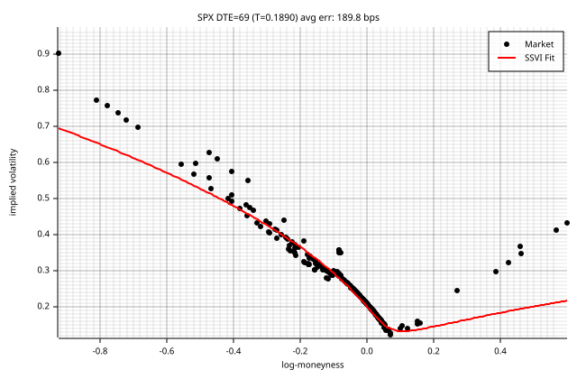

### DTE = 83 (T = 0.2274)

max err: 1170.4 bps | RMSE: 149.0 bps | eta=0.6311, gamma=0.6342, rho=-0.7714 | cal viol: 2

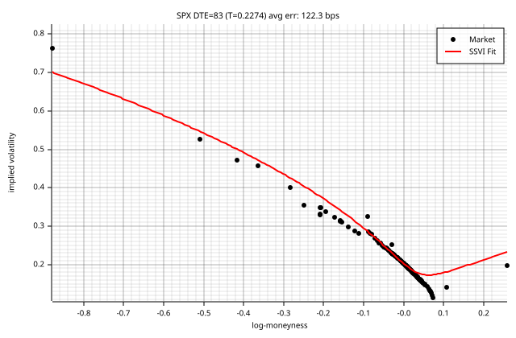

### DTE = 103 (T = 0.2822)

max err: 1574.3 bps | RMSE: 312.8 bps | eta=0.5692, gamma=0.6771, rho=-0.7311 | cal viol: 0

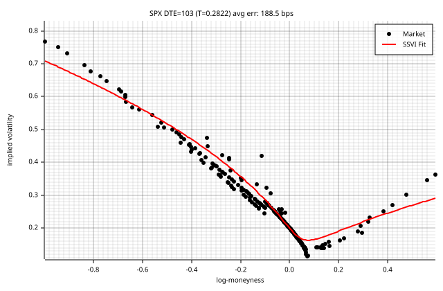

### DTE = 115 (T = 0.3151)

max err: 1018.9 bps | RMSE: 190.5 bps | eta=0.4497, gamma=0.7299, rho=-0.7440 | cal viol: 5

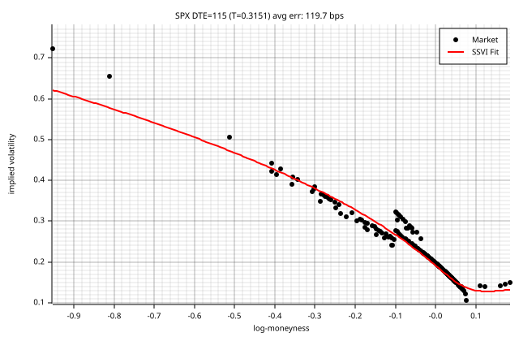

### DTE = 132 (T = 0.3616)

max err: 1321.3 bps | RMSE: 239.4 bps | eta=0.5642, gamma=0.6773, rho=-0.7291 | cal viol: 0

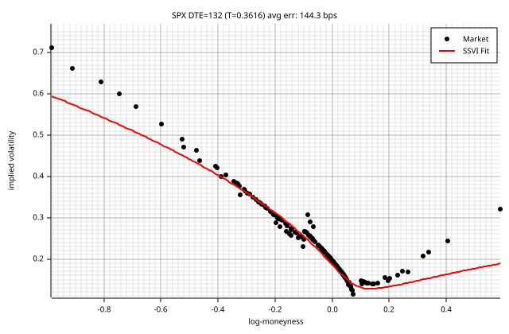

### DTE = 146 (T = 0.4000)

max err: 146.0 bps | RMSE: 49.3 bps | eta=0.5228, gamma=0.6426, rho=-0.9990 | cal viol: 21

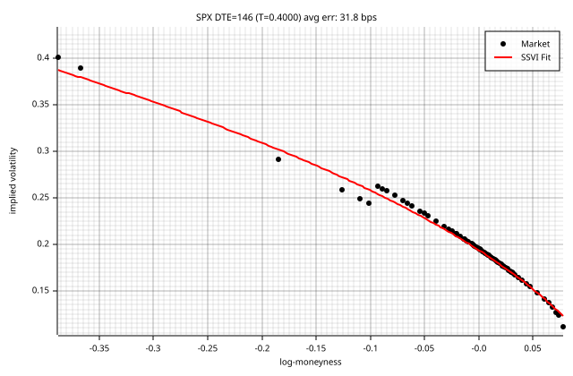

### DTE = 167 (T = 0.4575)

max err: 770.6 bps | RMSE: 189.6 bps | eta=0.5314, gamma=0.7024, rho=-0.6949 | cal viol: 0

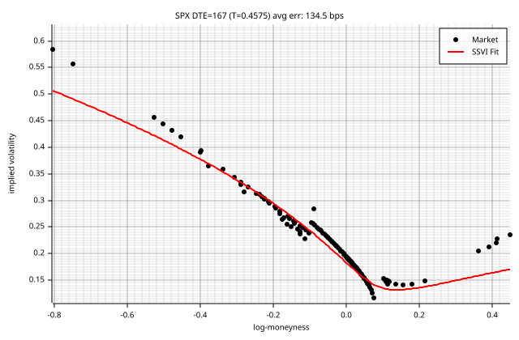

### DTE = 195 (T = 0.5342)

max err: 608.4 bps | RMSE: 174.7 bps | eta=0.5337, gamma=0.7000, rho=-0.7052 | cal viol: 0

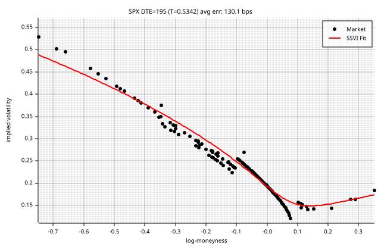

### DTE = 207 (T = 0.5671)

max err: 518.5 bps | RMSE: 180.8 bps | eta=0.5595, gamma=0.7265, rho=-0.7480 | cal viol: 6

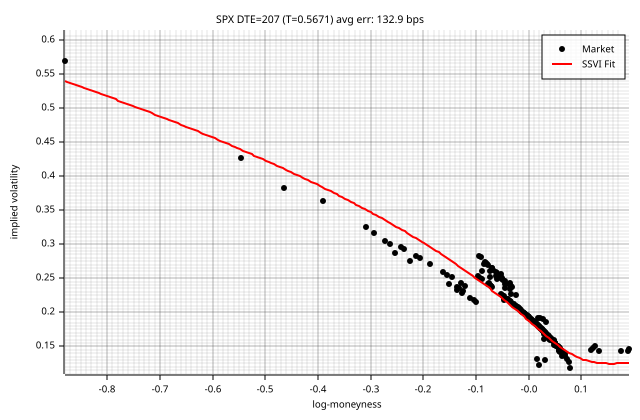

### DTE = 223 (T = 0.6110)

max err: 492.0 bps | RMSE: 196.9 bps | eta=0.6435, gamma=0.7029, rho=-0.6639 | cal viol: 12

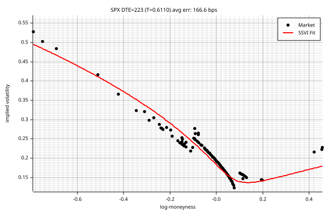

### DTE = 258 (T = 0.7068)

max err: 396.3 bps | RMSE: 149.9 bps | eta=0.6014, gamma=0.7138, rho=-0.6312 | cal viol: 2

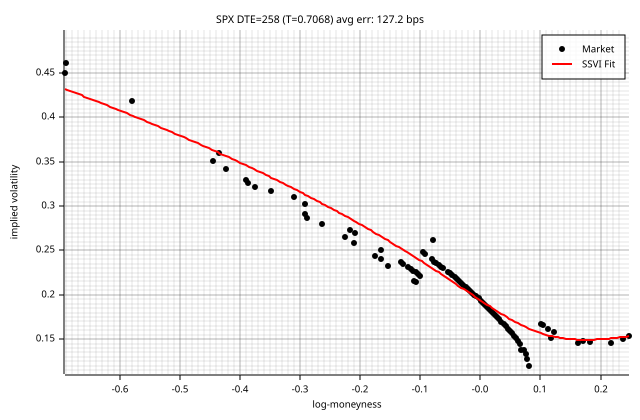

### DTE = 286 (T = 0.7836)

max err: 1000.0 bps | RMSE: 195.6 bps | eta=0.5295, gamma=0.7459, rho=-0.6149 | cal viol: 0

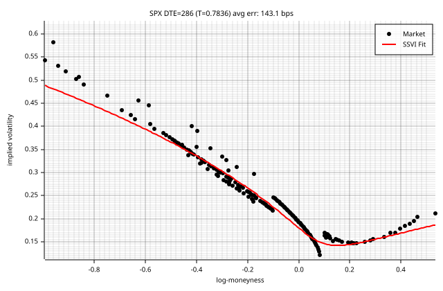

### DTE = 299 (T = 0.8192)

max err: 585.3 bps | RMSE: 187.4 bps | eta=0.5938, gamma=0.7396, rho=-0.6295 | cal viol: 6

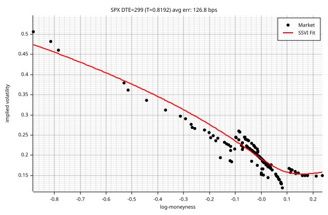

### DTE = 314 (T = 0.8603)

max err: 381.5 bps | RMSE: 156.4 bps | eta=0.5739, gamma=0.7622, rho=-0.5430 | cal viol: 14

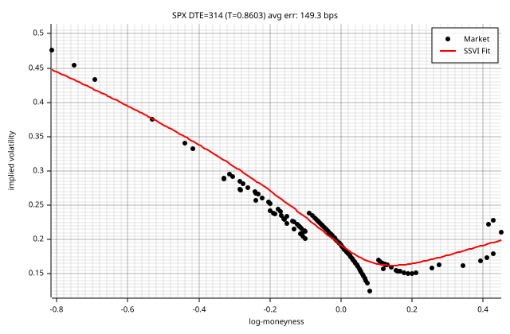

### DTE = 349 (T = 0.9562)

max err: 283.8 bps | RMSE: 149.1 bps | eta=0.5199, gamma=0.8022, rho=-0.5790 | cal viol: 1

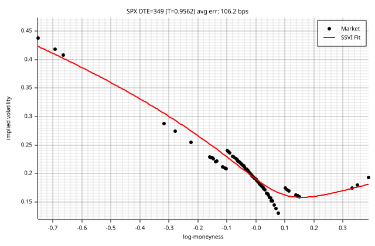

### DTE = 377 (T = 1.0329)

max err: 304.1 bps | RMSE: 149.8 bps | eta=0.5522, gamma=0.7838, rho=-0.5547 | cal viol: 1

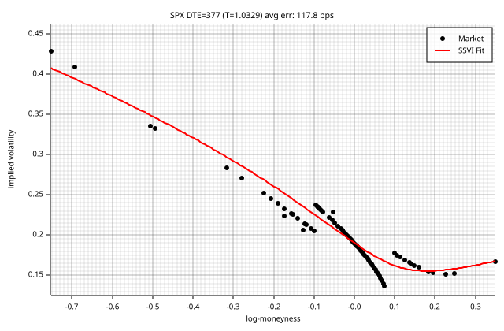

### DTE = 467 (T = 1.2795)

max err: 389.4 bps | RMSE: 158.5 bps | eta=0.5778, gamma=0.7620, rho=-0.5186 | cal viol: 1

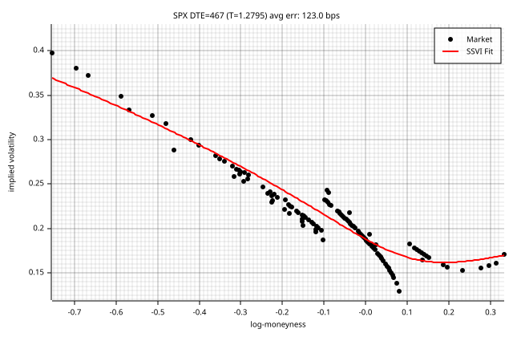

### DTE = 650 (T = 1.7808)

max err: 959.0 bps | RMSE: 187.4 bps | eta=0.5769, gamma=0.8368, rho=-0.3752 | cal viol: 0

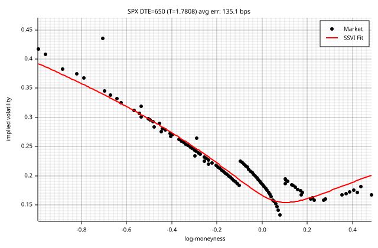

### DTE = 1014 (T = 2.7781)

max err: 1211.5 bps | RMSE: 457.1 bps | eta=0.8454, gamma=1.0000, rho=-0.4277 | cal viol: 0

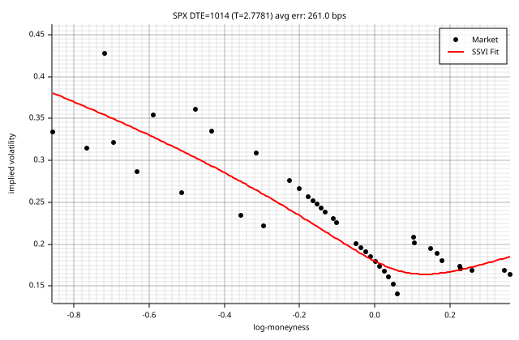

### DTE = 1385 (T = 3.7945)

max err: 1077.7 bps | RMSE: 428.0 bps | eta=1.3248, gamma=1.0000, rho=-0.0075 | cal viol: 2

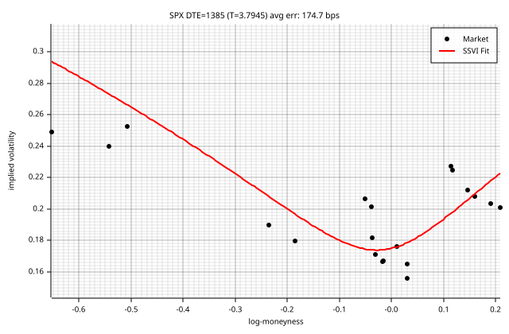

### DTE = 1749 (T = 4.7918)

max err: 854.4 bps | RMSE: 444.0 bps | eta=1.6633, gamma=1.0000, rho=0.2024 | cal viol: 1

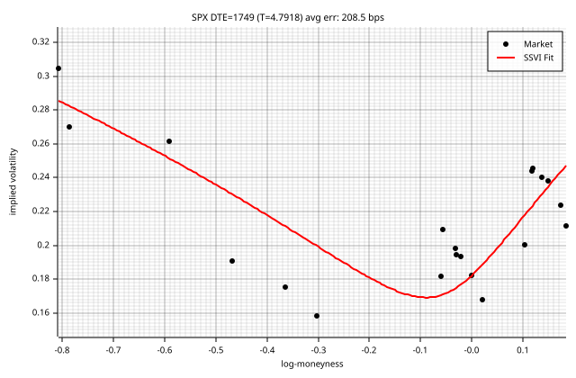

