# SSVI Direct Solver Fit: SPX (2026-03-07)

4D Nelder-Mead direct solver with algebraic no-arb barrier.

- Objective: pure SSE on total variance
- No-arb barrier: eta*(1+|rho|) <= 2
- Calendar penalty: theta monotonicity via lambda_calendar
- Butterfly: post-hoc validation
- IV rule: p_iv (k < -0.1), mean(p_iv,c_iv) (-0.1..0.1), c_iv (k > 0.1)

## Calibration Summary

| DTE | T | max err (bps) | RMSE (bps) | avg err (bps) | eta | gamma | rho | phi | cal viol | converged |
|----:|------:|--------------:|-----------:|--------------:|------:|------:|------:|------:|---------:|:---------:|
| 2 | 0.0055 | 4804.7 | 1039.4 | 641.9 | 0.5164 | 0.8315 | -0.5469 | 50355.375 | 0 | yes |
| 3 | 0.0082 | 2788.2 | 830.2 | 573.3 | 0.0530 | 1.0000 | -0.4692 | 53013.094 | 60 | yes |
| 4 | 0.0110 | 2785.3 | 709.0 | 490.8 | 0.3955 | 0.7843 | -0.5521 | 263.577 | 0 | yes |
| 5 | 0.0137 | 2017.2 | 729.7 | 547.4 | 1.2929 | 0.6264 | -0.5300 | 179.685 | 0 | yes |
| 6 | 0.0164 | 2119.4 | 817.7 | 637.3 | 0.0742 | 0.9950 | -0.5151 | 310.541 | 4 | yes |
| 9 | 0.0247 | 1676.7 | 391.6 | 287.8 | 0.0893 | 0.9894 | -0.5764 | 75.829 | 0 | yes |
| 10 | 0.0274 | 1446.1 | 285.0 | 197.3 | 1.2596 | 0.5848 | -0.5782 | 58.378 | 36 | yes |
| 11 | 0.0301 | 1177.5 | 253.4 | 182.8 | 0.3875 | 0.7613 | -0.5594 | 52.072 | 31 | yes |
| 12 | 0.0329 | 962.5 | 247.5 | 190.8 | 0.1773 | 0.8816 | -0.5501 | 47.605 | 31 | yes |
| 13 | 0.0356 | 2063.5 | 675.6 | 579.1 | 0.7145 | 0.7094 | -0.3713 | 88.122 | 8 | yes |
| 16 | 0.0438 | 718.9 | 332.9 | 269.7 | 1.0070 | 0.6297 | -0.3765 | 52.821 | 35 | yes |
| 17 | 0.0466 | 777.1 | 301.6 | 234.9 | 0.4367 | 0.7598 | -0.3776 | 49.572 | 39 | yes |
| 18 | 0.0493 | 950.3 | 410.8 | 308.6 | 0.2046 | 0.9001 | -0.4479 | 51.953 | 10 | yes |
| 19 | 0.0521 | 1070.5 | 402.8 | 308.1 | 1.3516 | 0.5994 | -0.4777 | 52.489 | 19 | yes |
| 20 | 0.0548 | 970.9 | 424.2 | 348.9 | 0.3022 | 0.8451 | -0.4781 | 53.446 | 55 | yes |
| 23 | 0.0630 | 666.3 | 230.5 | 176.2 | 0.6477 | 0.7082 | -0.4807 | 42.037 | 35 | yes |
| 24 | 0.0658 | 1115.4 | 537.7 | 449.0 | 0.6538 | 0.7113 | -0.4801 | 45.987 | 63 | yes |
| 25 | 0.0685 | 682.9 | 233.1 | 131.4 | 0.8831 | 0.6845 | -0.6004 | 41.167 | 7 | yes |
| 26 | 0.0712 | 1306.2 | 365.8 | 215.1 | 1.0252 | 0.6586 | -0.6003 | 41.556 | 36 | yes |
| 30 | 0.0822 | 258.5 | 132.0 | 113.4 | 1.0944 | 0.6472 | -0.5716 | 40.400 | 29 | yes |
| 34 | 0.0932 | 1191.6 | 341.2 | 258.0 | 0.1527 | 1.0000 | -0.5715 | 40.487 | 66 | yes |
| 41 | 0.1123 | 1138.6 | 477.0 | 386.9 | 0.4307 | 0.8194 | -0.5434 | 43.425 | 62 | yes |
| 48 | 0.1315 | 638.1 | 151.4 | 110.1 | 0.1702 | 0.9791 | -0.5496 | 27.877 | 34 | yes |
| 54 | 0.1479 | 832.2 | 282.8 | 211.2 | 1.0327 | 0.6318 | -0.5502 | 27.421 | 57 | yes |
| 69 | 0.1890 | 1227.3 | 287.5 | 219.2 | 0.6272 | 0.7264 | -0.4696 | 23.059 | 0 | yes |
| 83 | 0.2274 | 586.7 | 191.1 | 135.3 | 0.9495 | 0.6309 | -0.4929 | 19.052 | 7 | yes |
| 103 | 0.2822 | 1297.6 | 254.0 | 201.2 | 1.1311 | 0.5995 | -0.5387 | 17.946 | 9 | yes |
| 115 | 0.3151 | 633.3 | 213.8 | 152.0 | 1.2917 | 0.5499 | -0.5479 | 14.810 | 37 | yes |
| 132 | 0.3616 | 613.6 | 192.5 | 159.0 | 0.1845 | 1.0000 | -0.5739 | 14.926 | 13 | yes |
| 146 | 0.4000 | 451.5 | 108.1 | 71.9 | 0.2506 | 0.9224 | -0.5831 | 12.328 | 35 | yes |
| 167 | 0.4575 | 459.1 | 150.4 | 124.2 | 0.5372 | 0.7486 | -0.5801 | 12.006 | 0 | yes |
| 195 | 0.5342 | 396.9 | 152.3 | 129.4 | 0.6382 | 0.7009 | -0.6017 | 10.515 | 5 | yes |
| 207 | 0.5671 | 586.9 | 185.8 | 136.6 | 1.0758 | 0.5709 | -0.6404 | 9.627 | 9 | yes |
| 223 | 0.6110 | 381.3 | 180.2 | 149.0 | 1.0249 | 0.5959 | -0.5719 | 10.049 | 9 | yes |
| 258 | 0.7068 | 372.5 | 149.3 | 129.4 | 0.2089 | 0.9995 | -0.5841 | 8.473 | 36 | yes |
| 286 | 0.7836 | 713.3 | 182.1 | 160.5 | 1.2832 | 0.5530 | -0.5504 | 9.646 | 0 | yes |
| 299 | 0.8192 | 637.4 | 175.5 | 129.7 | 0.8769 | 0.6383 | -0.5620 | 8.392 | 37 | yes |
| 314 | 0.8603 | 336.2 | 159.4 | 142.0 | 0.4317 | 0.8433 | -0.5264 | 8.574 | 19 | yes |
| 349 | 0.9562 | 325.2 | 126.9 | 106.5 | 0.4466 | 0.8358 | -0.5409 | 7.658 | 0 | yes |
| 377 | 1.0329 | 272.0 | 134.2 | 117.7 | 0.2995 | 0.9467 | -0.5433 | 7.043 | 29 | yes |
| 467 | 1.2795 | 376.4 | 142.4 | 121.8 | 0.4779 | 0.8034 | -0.4881 | 5.896 | 0 | yes |
| 650 | 1.7808 | 900.0 | 175.2 | 144.1 | 0.5140 | 0.8632 | -0.4010 | 6.047 | 0 | yes |
| 1014 | 2.7781 | 776.4 | 298.3 | 246.3 | 1.3195 | 0.5673 | -0.4947 | 4.535 | 0 | yes |
| 1385 | 3.7945 | 432.7 | 218.0 | 194.1 | 1.3791 | 0.7681 | 0.0688 | 6.359 | 6 | yes |
| 1749 | 4.7918 | 457.1 | 230.3 | 190.3 | 1.3292 | 0.9412 | 0.3433 | 6.622 | 32 | yes |

## Fit Plots

### DTE = 2 (T = 0.0055)

max err: 4804.7 bps | RMSE: 1039.4 bps | eta=0.5164, gamma=0.8315, rho=-0.5469 | cal viol: 0

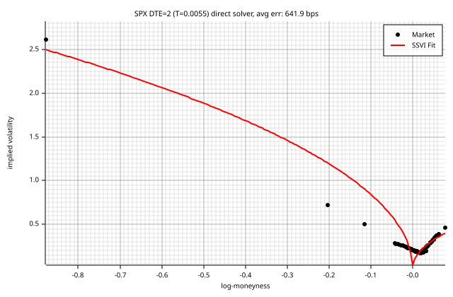

### DTE = 3 (T = 0.0082)

max err: 2788.2 bps | RMSE: 830.2 bps | eta=0.0530, gamma=1.0000, rho=-0.4692 | cal viol: 60

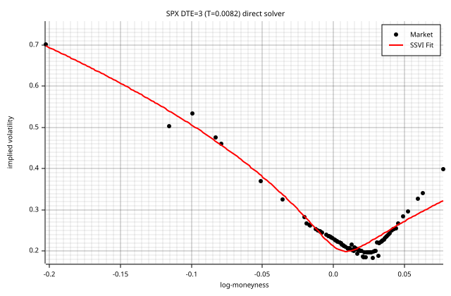

### DTE = 4 (T = 0.0110)

max err: 2785.3 bps | RMSE: 709.0 bps | eta=0.3955, gamma=0.7843, rho=-0.5521 | cal viol: 0

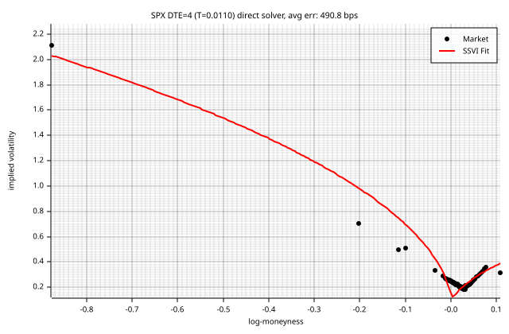

### DTE = 5 (T = 0.0137)

max err: 2017.2 bps | RMSE: 729.7 bps | eta=1.2929, gamma=0.6264, rho=-0.5300 | cal viol: 0

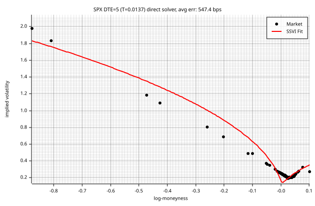

### DTE = 6 (T = 0.0164)

max err: 2119.4 bps | RMSE: 817.7 bps | eta=0.0742, gamma=0.9950, rho=-0.5151 | cal viol: 4

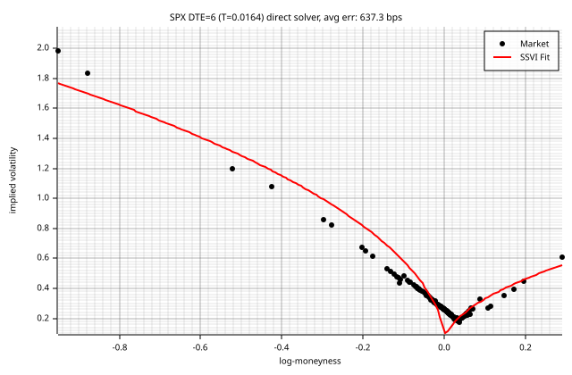

### DTE = 9 (T = 0.0247)

max err: 1676.7 bps | RMSE: 391.6 bps | eta=0.0893, gamma=0.9894, rho=-0.5764 | cal viol: 0

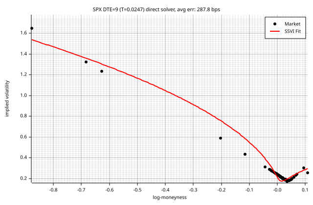

### DTE = 10 (T = 0.0274)

max err: 1446.1 bps | RMSE: 285.0 bps | eta=1.2596, gamma=0.5848, rho=-0.5782 | cal viol: 36

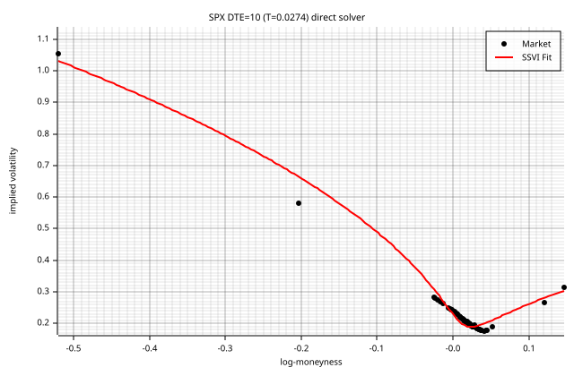

### DTE = 11 (T = 0.0301)

max err: 1177.5 bps | RMSE: 253.4 bps | eta=0.3875, gamma=0.7613, rho=-0.5594 | cal viol: 31

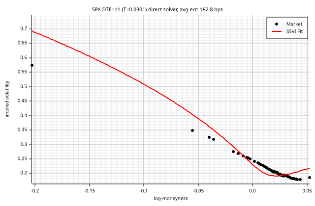

### DTE = 12 (T = 0.0329)

max err: 962.5 bps | RMSE: 247.5 bps | eta=0.1773, gamma=0.8816, rho=-0.5501 | cal viol: 31

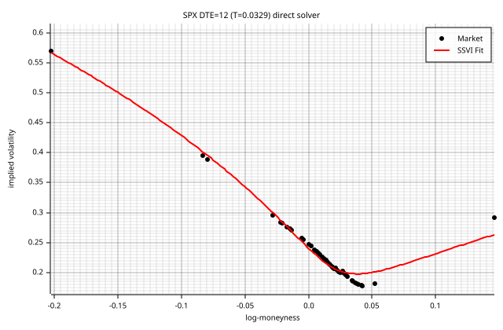

### DTE = 13 (T = 0.0356)

max err: 2063.5 bps | RMSE: 675.6 bps | eta=0.7145, gamma=0.7094, rho=-0.3713 | cal viol: 8

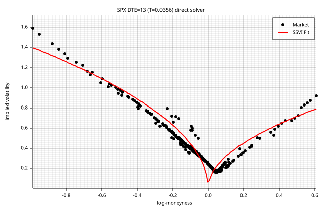

### DTE = 16 (T = 0.0438)

max err: 718.9 bps | RMSE: 332.9 bps | eta=1.0070, gamma=0.6297, rho=-0.3765 | cal viol: 35

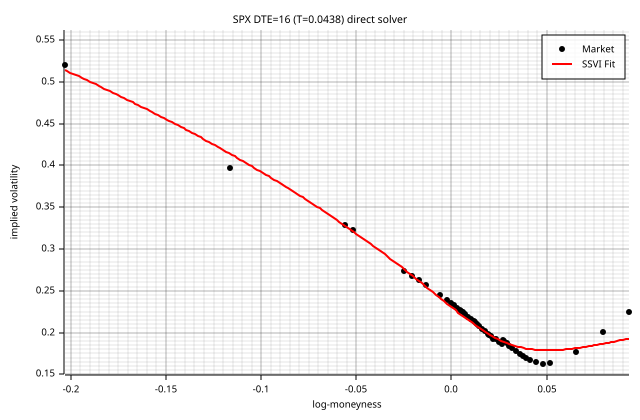

### DTE = 17 (T = 0.0466)

max err: 777.1 bps | RMSE: 301.6 bps | eta=0.4367, gamma=0.7598, rho=-0.3776 | cal viol: 39

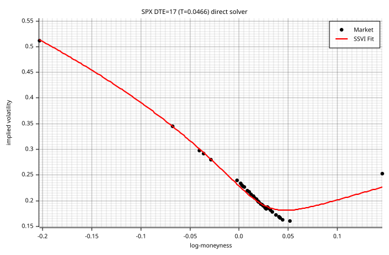

### DTE = 18 (T = 0.0493)

max err: 950.3 bps | RMSE: 410.8 bps | eta=0.2046, gamma=0.9001, rho=-0.4479 | cal viol: 10

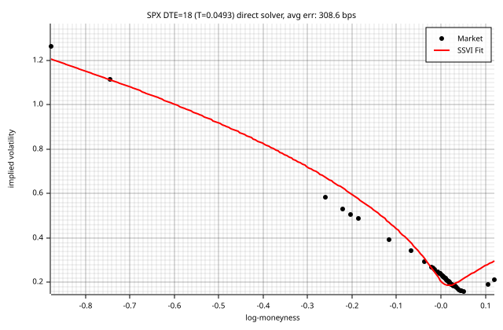

### DTE = 19 (T = 0.0521)

max err: 1070.5 bps | RMSE: 402.8 bps | eta=1.3516, gamma=0.5994, rho=-0.4777 | cal viol: 19

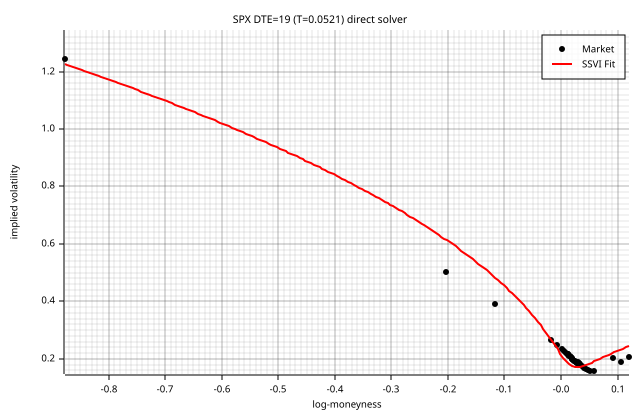

### DTE = 20 (T = 0.0548)

max err: 970.9 bps | RMSE: 424.2 bps | eta=0.3022, gamma=0.8451, rho=-0.4781 | cal viol: 55

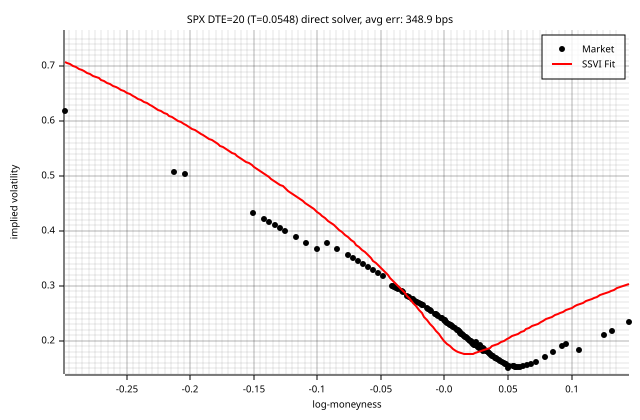

### DTE = 23 (T = 0.0630)

max err: 666.3 bps | RMSE: 230.5 bps | eta=0.6477, gamma=0.7082, rho=-0.4807 | cal viol: 35

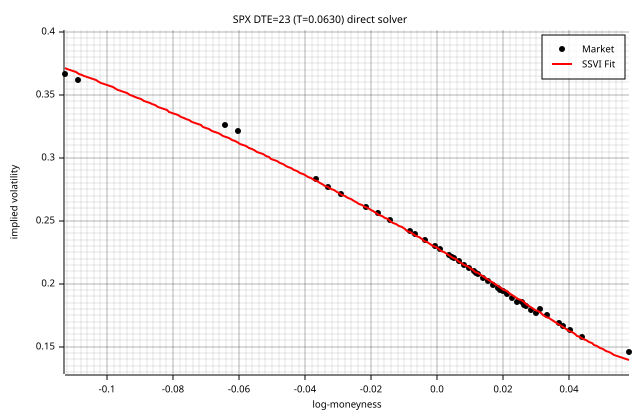

### DTE = 24 (T = 0.0658)

max err: 1115.4 bps | RMSE: 537.7 bps | eta=0.6538, gamma=0.7113, rho=-0.4801 | cal viol: 63

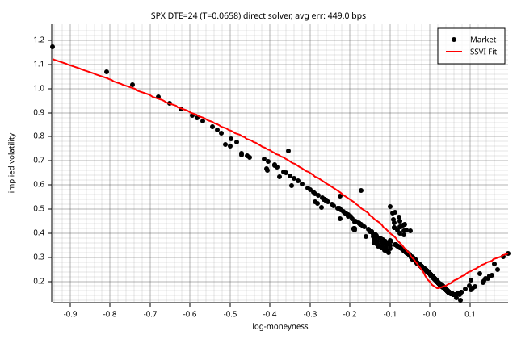

### DTE = 25 (T = 0.0685)

max err: 682.9 bps | RMSE: 233.1 bps | eta=0.8831, gamma=0.6845, rho=-0.6004 | cal viol: 7

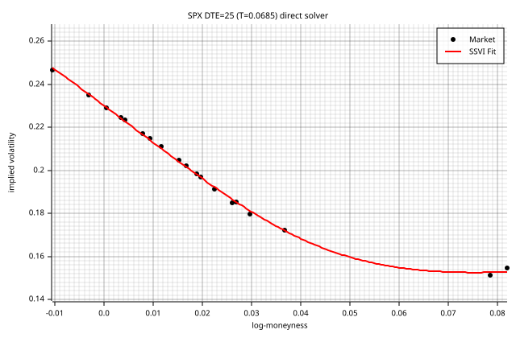

### DTE = 26 (T = 0.0712)

max err: 1306.2 bps | RMSE: 365.8 bps | eta=1.0252, gamma=0.6586, rho=-0.6003 | cal viol: 36

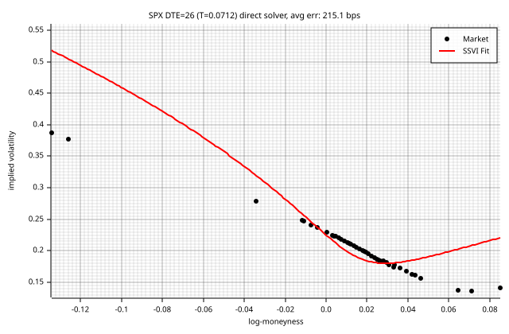

### DTE = 30 (T = 0.0822)

max err: 258.5 bps | RMSE: 132.0 bps | eta=1.0944, gamma=0.6472, rho=-0.5716 | cal viol: 29

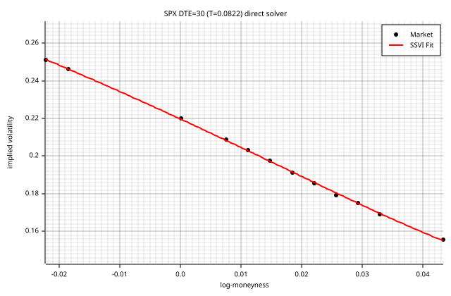

### DTE = 34 (T = 0.0932)

max err: 1191.6 bps | RMSE: 341.2 bps | eta=0.1527, gamma=1.0000, rho=-0.5715 | cal viol: 66

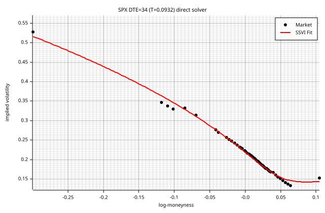

### DTE = 41 (T = 0.1123)

max err: 1138.6 bps | RMSE: 477.0 bps | eta=0.4307, gamma=0.8194, rho=-0.5434 | cal viol: 62

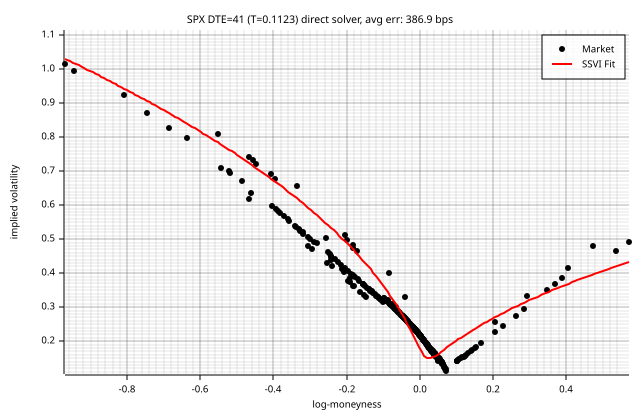

### DTE = 48 (T = 0.1315)

max err: 638.1 bps | RMSE: 151.4 bps | eta=0.1702, gamma=0.9791, rho=-0.5496 | cal viol: 34

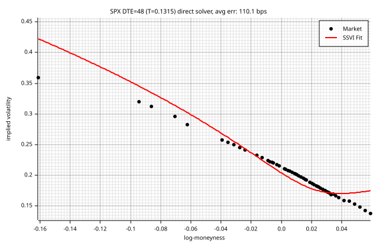

### DTE = 54 (T = 0.1479)

max err: 832.2 bps | RMSE: 282.8 bps | eta=1.0327, gamma=0.6318, rho=-0.5502 | cal viol: 57

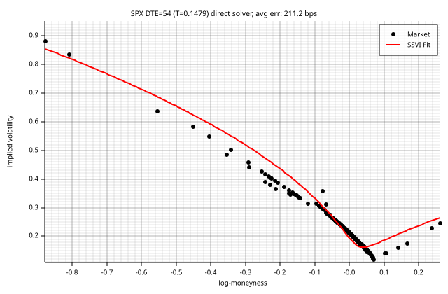

### DTE = 69 (T = 0.1890)

max err: 1227.3 bps | RMSE: 287.5 bps | eta=0.6272, gamma=0.7264, rho=-0.4696 | cal viol: 0

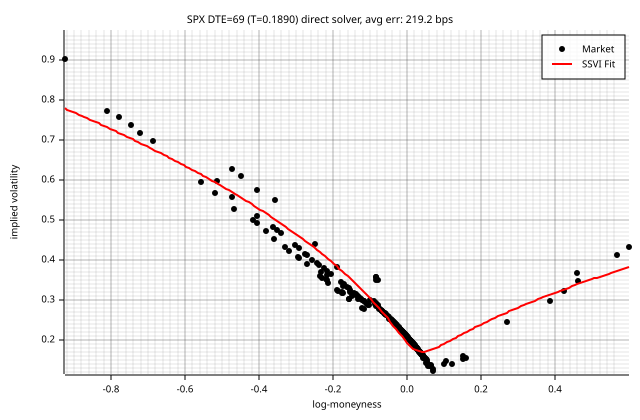

### DTE = 83 (T = 0.2274)

max err: 586.7 bps | RMSE: 191.1 bps | eta=0.9495, gamma=0.6309, rho=-0.4929 | cal viol: 7

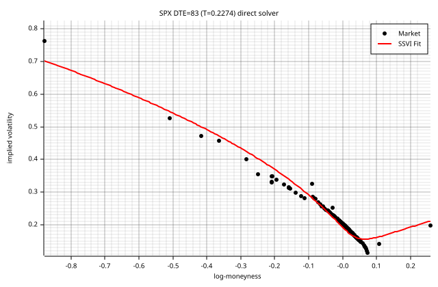

### DTE = 103 (T = 0.2822)

max err: 1297.6 bps | RMSE: 254.0 bps | eta=1.1311, gamma=0.5995, rho=-0.5387 | cal viol: 9

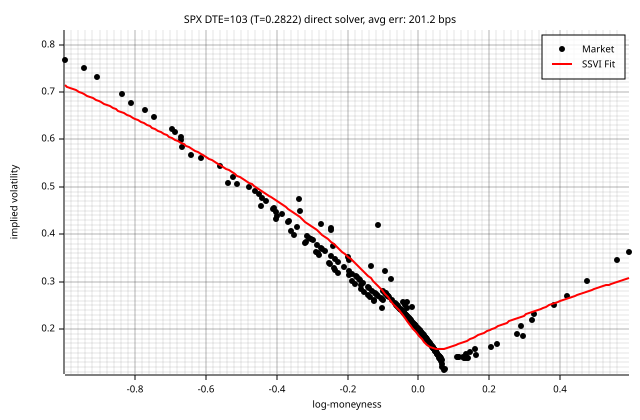

### DTE = 115 (T = 0.3151)

max err: 633.3 bps | RMSE: 213.8 bps | eta=1.2917, gamma=0.5499, rho=-0.5479 | cal viol: 37

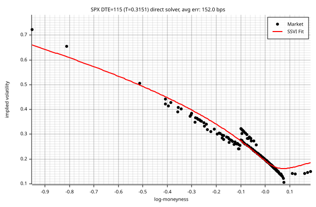

### DTE = 132 (T = 0.3616)

max err: 613.6 bps | RMSE: 192.5 bps | eta=0.1845, gamma=1.0000, rho=-0.5739 | cal viol: 13

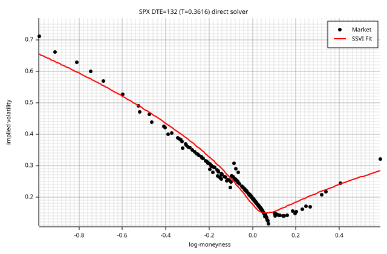

### DTE = 146 (T = 0.4000)

max err: 451.5 bps | RMSE: 108.1 bps | eta=0.2506, gamma=0.9224, rho=-0.5831 | cal viol: 35

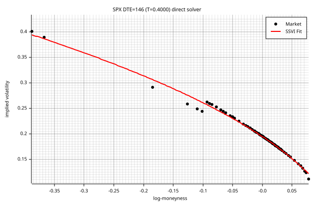

### DTE = 167 (T = 0.4575)

max err: 459.1 bps | RMSE: 150.4 bps | eta=0.5372, gamma=0.7486, rho=-0.5801 | cal viol: 0

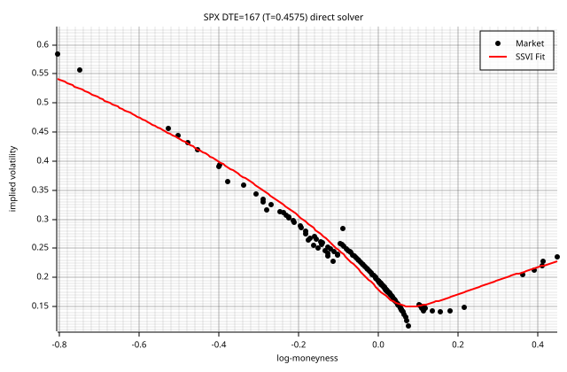

### DTE = 195 (T = 0.5342)

max err: 396.9 bps | RMSE: 152.3 bps | eta=0.6382, gamma=0.7009, rho=-0.6017 | cal viol: 5

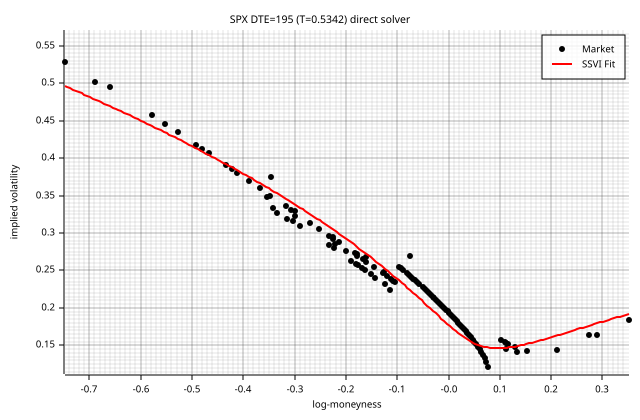

### DTE = 207 (T = 0.5671)

max err: 586.9 bps | RMSE: 185.8 bps | eta=1.0758, gamma=0.5709, rho=-0.6404 | cal viol: 9

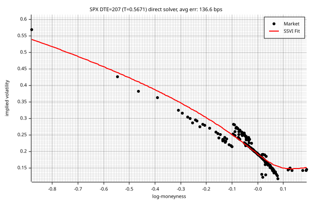

### DTE = 223 (T = 0.6110)

max err: 381.3 bps | RMSE: 180.2 bps | eta=1.0249, gamma=0.5959, rho=-0.5719 | cal viol: 9

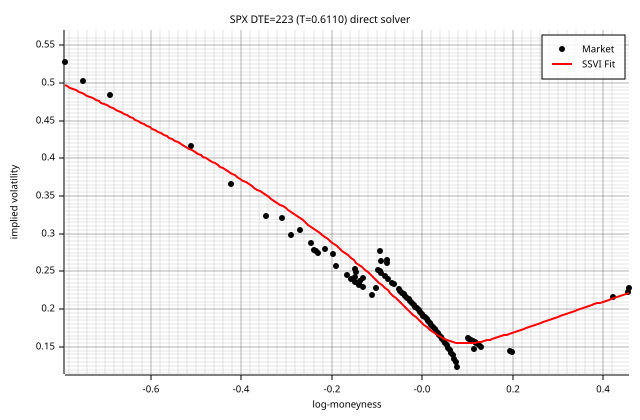

### DTE = 258 (T = 0.7068)

max err: 372.5 bps | RMSE: 149.3 bps | eta=0.2089, gamma=0.9995, rho=-0.5841 | cal viol: 36

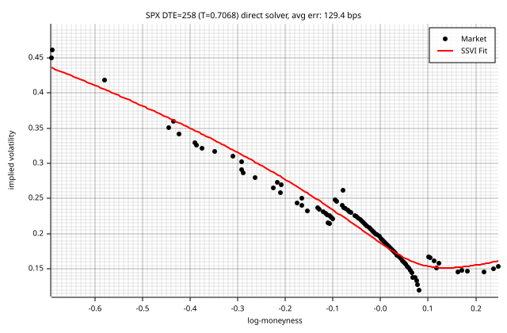

### DTE = 286 (T = 0.7836)

max err: 713.3 bps | RMSE: 182.1 bps | eta=1.2832, gamma=0.5530, rho=-0.5504 | cal viol: 0

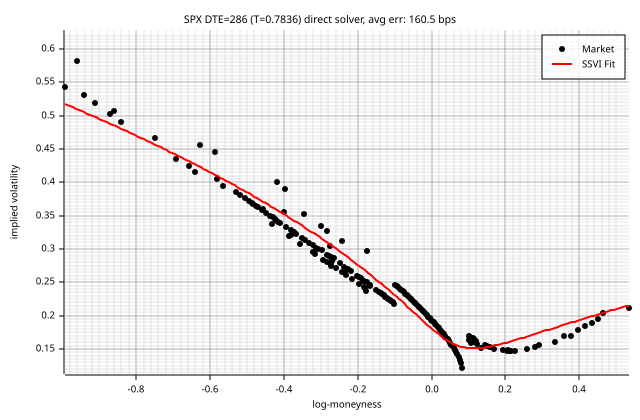

### DTE = 299 (T = 0.8192)

max err: 637.4 bps | RMSE: 175.5 bps | eta=0.8769, gamma=0.6383, rho=-0.5620 | cal viol: 37

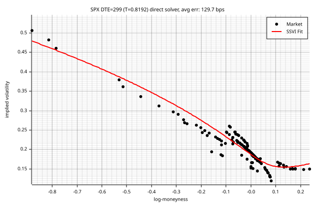

### DTE = 314 (T = 0.8603)

max err: 336.2 bps | RMSE: 159.4 bps | eta=0.4317, gamma=0.8433, rho=-0.5264 | cal viol: 19

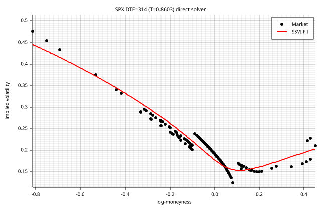

### DTE = 349 (T = 0.9562)

max err: 325.2 bps | RMSE: 126.9 bps | eta=0.4466, gamma=0.8358, rho=-0.5409 | cal viol: 0

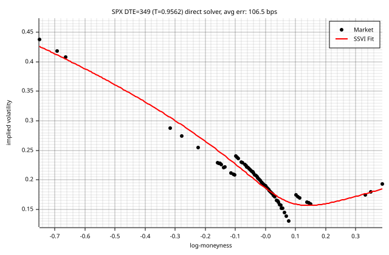

### DTE = 377 (T = 1.0329)

max err: 272.0 bps | RMSE: 134.2 bps | eta=0.2995, gamma=0.9467, rho=-0.5433 | cal viol: 29

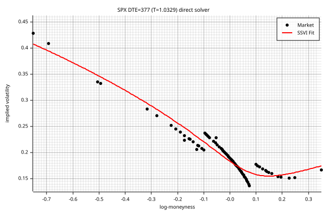

### DTE = 467 (T = 1.2795)

max err: 376.4 bps | RMSE: 142.4 bps | eta=0.4779, gamma=0.8034, rho=-0.4881 | cal viol: 0

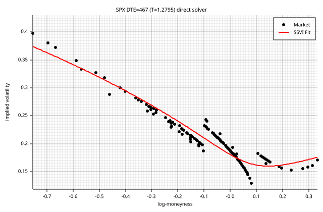

### DTE = 650 (T = 1.7808)

max err: 900.0 bps | RMSE: 175.2 bps | eta=0.5140, gamma=0.8632, rho=-0.4010 | cal viol: 0

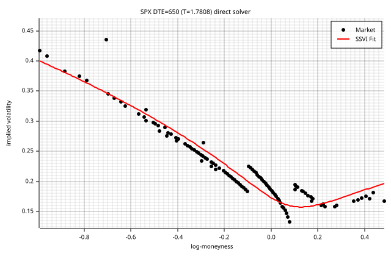

### DTE = 1014 (T = 2.7781)

max err: 776.4 bps | RMSE: 298.3 bps | eta=1.3195, gamma=0.5673, rho=-0.4947 | cal viol: 0

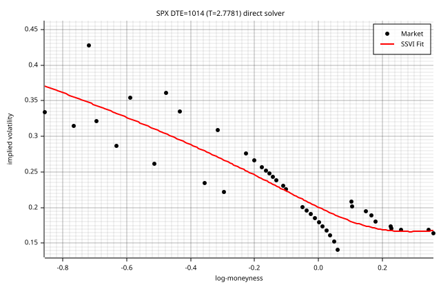

### DTE = 1385 (T = 3.7945)

max err: 432.7 bps | RMSE: 218.0 bps | eta=1.3791, gamma=0.7681, rho=0.0688 | cal viol: 6

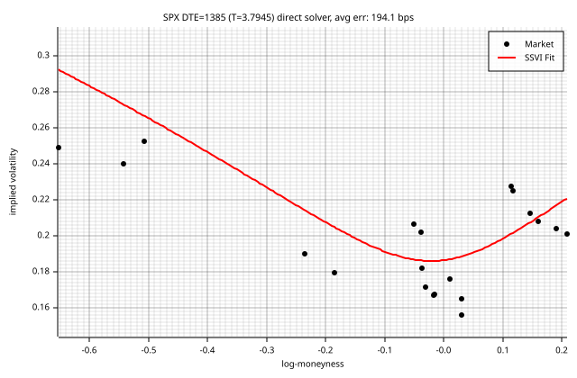

### DTE = 1749 (T = 4.7918)

max err: 457.1 bps | RMSE: 230.3 bps | eta=1.3292, gamma=0.9412, rho=0.3433 | cal viol: 32

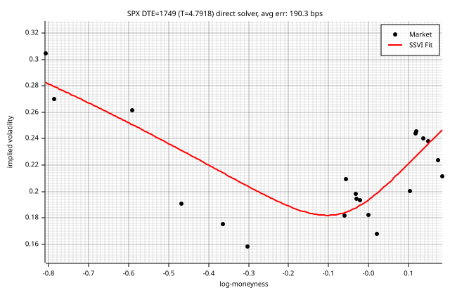

