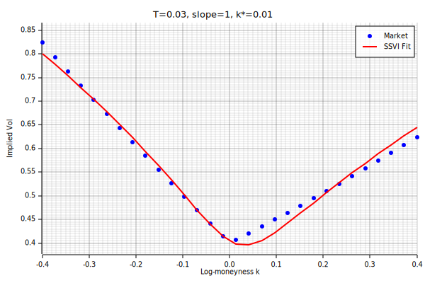
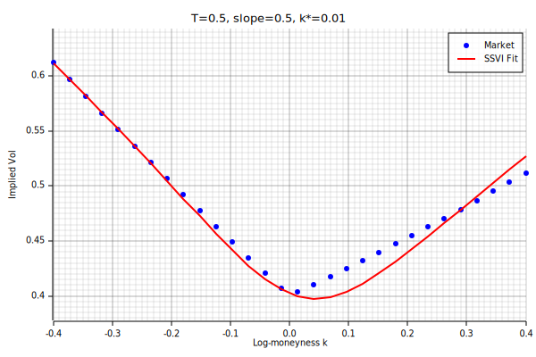
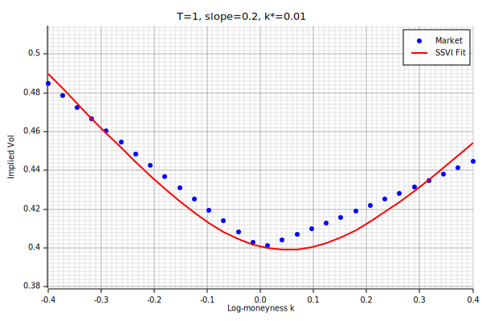
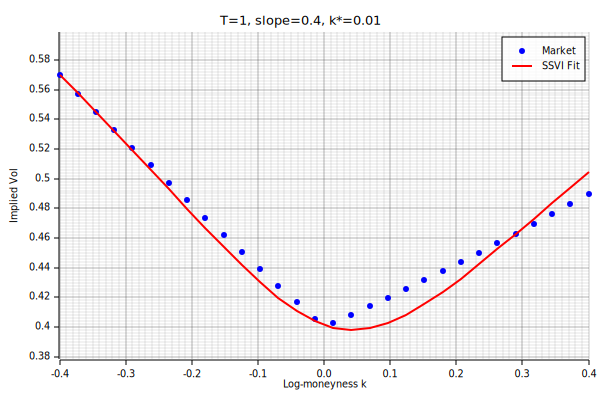

# SSVI Slice Fit Quality Report

ATM vol = 0.4  |  k range = [-0.4, 0.4]  |  k\* = 0.01

## 1. Expiry (T) vs Skew Slope

| T | Slope | max IV err (bps) | RMSE IV (bps) | eta | gamma | rho | phi | eta*(1+\|rho\|) | converged |
|---:|------:|----------------:|--------------:|----:|------:|----:|----:|---------------:|:---------:|
| 0.03 | 0.5 | 211.6 | 99.4 | 0.547 | 0.483 | -0.157 | 7.15 | 0.633 | yes |
| 0.03 | 1 | 317.6 | 142.2 | 1.046 | 0.478 | -0.234 | 13.19 | 1.290 | yes |
| 0.1 | 0.5 | 211.6 | 99.4 | 0.612 | 0.598 | -0.157 | 7.15 | 0.708 | yes |
| 0.1 | 1 | 301.4 | 139.6 | 1.638 | 0.509 | -0.221 | 13.13 | 2.000 | yes |
| 0.25 | 0.5 | 211.6 | 99.4 | 1.075 | 0.596 | -0.157 | 7.15 | 1.244 | yes |
| 0.25 | 1 | 664.5 | 366.1 | 1.826 | 0.628 | -0.095 | 13.46 | 2.000 | yes |
| 0.5 | 0.5 | 211.6 | 99.4 | 1.658 | 0.594 | -0.157 | 7.15 | 1.918 | yes |
| 0.5 | 1 | 988.7 | 585.1 | 1.097 | 1.000 | -0.007 | 13.70 | 1.105 | yes |
| 1 | 0.2 | 103.3 | 60.3 | 1.120 | 0.677 | -0.092 | 3.68 | 1.223 | yes |
| 1 | 0.4 | 175.6 | 90.5 | 1.767 | 0.694 | -0.132 | 5.98 | 2.000 | yes |

## 2. Fit Plots (all combinations)

**T=0.03, slope=0.5** — max err: 212 bps, eta=0.547, rho=-0.157, eta*(1+|rho|)=0.633

**T=0.03, slope=1** — max err: 318 bps, eta=1.046, rho=-0.234, eta*(1+|rho|)=1.290

**T=0.1, slope=0.5** — max err: 212 bps, eta=0.612, rho=-0.157, eta*(1+|rho|)=0.708

**T=0.1, slope=1** — max err: 301 bps, eta=1.638, rho=-0.221, eta*(1+|rho|)=2.000

**T=0.25, slope=0.5** — max err: 212 bps, eta=1.075, rho=-0.157, eta*(1+|rho|)=1.244

**T=0.25, slope=1** — max err: 664 bps, eta=1.826, rho=-0.095, eta*(1+|rho|)=2.000

**T=0.5, slope=0.5** — max err: 212 bps, eta=1.658, rho=-0.157, eta*(1+|rho|)=1.918

**T=0.5, slope=1** — max err: 989 bps, eta=1.097, rho=-0.007, eta*(1+|rho|)=1.105

**T=1, slope=0.2** — max err: 103 bps, eta=1.120, rho=-0.092, eta*(1+|rho|)=1.223

**T=1, slope=0.4** — max err: 176 bps, eta=1.767, rho=-0.132, eta*(1+|rho|)=2.000

## 3. No-Arbitrage Constraint Saturation

The SSVI no-arb condition `eta * (1 + |rho|) <= 2` limits how much skew the model can produce.
When this value approaches 2.0, the optimizer is constrained and fit quality degrades.

| T | Slope | eta | rho | eta*(1+\|rho\|) | saturated | max err (bps) |
|---:|------:|----:|----:|---------------:|:---------:|--------------:|
| 0.03 | 0.5 | 0.547 | -0.157 | 0.633 | no | 212 |
| 0.03 | 1 | 1.046 | -0.234 | 1.290 | no | 318 |
| 0.1 | 0.5 | 0.612 | -0.157 | 0.708 | no | 212 |
| 0.1 | 1 | 1.638 | -0.221 | 2.000 | **YES** | 301 |
| 0.25 | 0.5 | 1.075 | -0.157 | 1.244 | no | 212 |
| 0.25 | 1 | 1.826 | -0.095 | 2.000 | **YES** | 664 |
| 0.5 | 0.5 | 1.658 | -0.157 | 1.918 | no | 212 |
| 0.5 | 1 | 1.097 | -0.007 | 1.105 | no | 989 |
| 1 | 0.2 | 1.120 | -0.092 | 1.223 | no | 103 |
| 1 | 0.4 | 1.767 | -0.132 | 2.000 | **YES** | 176 |
