# SSVI Slice Fit Quality Report

ATM vol = 0.4

## 1. Expiry (T) vs Skew Slope

Fixed: width=0.5, k\*=0.005

| T | Slope | max IV err (bps) | RMSE IV (bps) | rho | phi | converged |
|---|-------|-----------------|--------------|-----|-----|----------|
| 1e0 | 0.2 | 65.0 | 41.8 | -0.137 | 3.30 | true |
| 1e0 | 0.4 | 93.1 | 44.4 | -0.188 | 5.64 | true |
| 1e0 | 0.6 | 910.1 | 293.0 | -0.020 | 10.15 | true |
| 1e0 | 0.8 | 1227.1 | 484.2 | -0.000 | 12.50 | true |
| 1e0 | 1.0 | 1717.6 | 893.9 | -0.000 | 12.50 | true |
| 1e-1 | 0.2 | 65.0 | 41.8 | -0.137 | 3.30 | true |
| 1e-1 | 0.4 | 93.1 | 44.4 | -0.188 | 5.64 | true |
| 1e-1 | 0.6 | 146.0 | 68.6 | -0.237 | 7.98 | true |
| 1e-1 | 0.8 | 242.5 | 127.0 | -0.286 | 10.40 | true |
| 1e-1 | 1.0 | 336.4 | 202.8 | -0.332 | 12.91 | true |
| 1e-2 | 0.2 | 65.0 | 41.8 | -0.137 | 3.30 | true |
| 1e-2 | 0.4 | 93.1 | 44.4 | -0.188 | 5.64 | true |
| 1e-2 | 0.6 | 146.0 | 68.6 | -0.237 | 7.98 | true |
| 1e-2 | 0.8 | 242.5 | 127.0 | -0.286 | 10.40 | true |
| 1e-2 | 1.0 | 336.4 | 202.8 | -0.332 | 12.91 | true |
| 1e-3 | 0.2 | 65.0 | 41.8 | -0.137 | 3.30 | true |
| 1e-3 | 0.4 | 93.1 | 44.4 | -0.188 | 5.64 | false |
| 1e-3 | 0.6 | 146.0 | 68.6 | -0.237 | 7.98 | true |
| 1e-3 | 0.8 | 242.5 | 127.0 | -0.286 | 10.40 | true |
| 1e-3 | 1.0 | 336.4 | 202.8 | -0.332 | 12.91 | true |

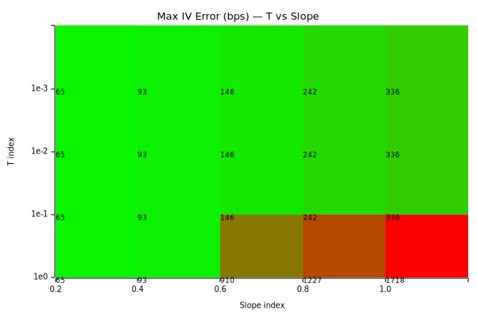

### Fit plots (corners of grid)

**T=1, slope=0.2** — max err: 65 bps

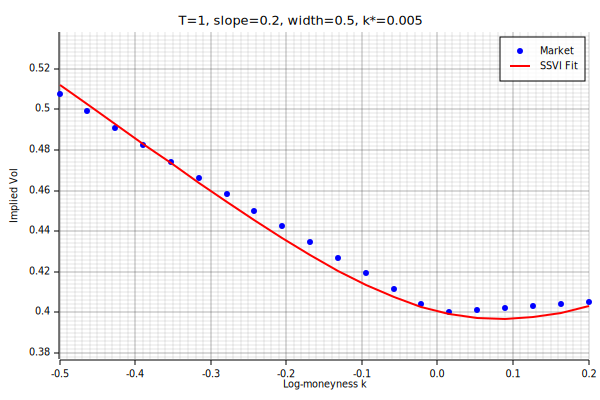

**T=1, slope=1** — max err: 1718 bps

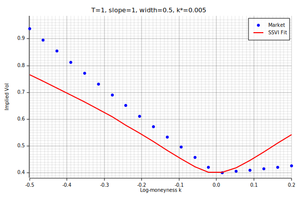

**T=0.001, slope=0.2** — max err: 65 bps

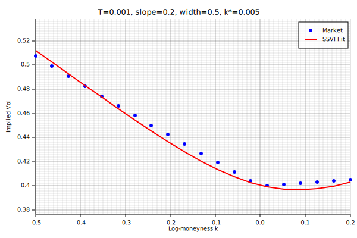

**T=0.001, slope=1** — max err: 336 bps

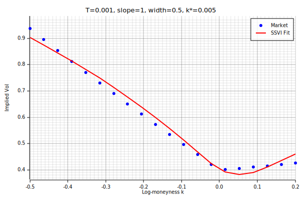

## 2. Moneyness Width

Fixed: slope=0.6, k\*=0.005

| T | Width | max IV err (bps) | RMSE IV (bps) | rho | phi |
|---|-------|-----------------|--------------|-----|-----|
| 1e0 | 0.3 | 443.2 | 154.7 | -0.019 | 10.40 |
| 1e0 | 0.5 | 910.1 | 293.0 | -0.020 | 10.15 |
| 1e0 | 0.7 | 1451.8 | 480.6 | -0.019 | 10.55 |
| 1e-1 | 0.3 | 83.5 | 44.0 | -0.182 | 8.35 |
| 1e-1 | 0.5 | 146.0 | 68.6 | -0.237 | 7.98 |
| 1e-1 | 0.7 | 273.4 | 156.3 | -0.295 | 8.04 |
| 1e-2 | 0.3 | 83.5 | 44.0 | -0.182 | 8.35 |
| 1e-2 | 0.5 | 146.0 | 68.6 | -0.237 | 7.98 |
| 1e-2 | 0.7 | 273.4 | 156.3 | -0.295 | 8.04 |
| 1e-3 | 0.3 | 83.5 | 44.0 | -0.182 | 8.35 |
| 1e-3 | 0.5 | 146.0 | 68.6 | -0.237 | 7.98 |
| 1e-3 | 0.7 | 273.4 | 156.3 | -0.295 | 8.04 |

### Width comparison (T=0.01, slope=0.6)

**width=0.3** — max err: 83 bps

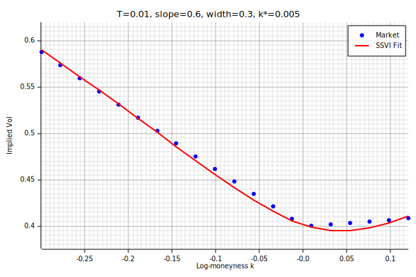

**width=0.5** — max err: 146 bps

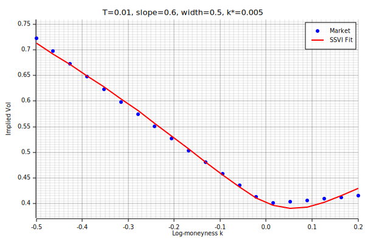

**width=0.7** — max err: 273 bps

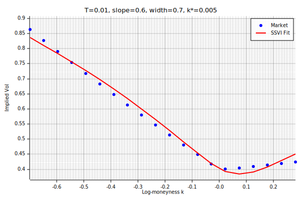

## 3. k\* (ATM Log-Moneyness Offset)

Fixed: slope=0.6, width=0.5

| T | k\* | max IV err (bps) | RMSE IV (bps) | theta | rho |
|---|-----|-----------------|--------------|-------|-----|
| 1e0 | 0.000 | 148.9 | 72.4 | 1.6000e-1 | -0.234 |
| 1e0 | 0.005 | 910.1 | 293.0 | 1.6016e-1 | -0.020 |
| 1e0 | 0.010 | 949.3 | 307.5 | 1.6016e-1 | -0.010 |
| 1e0 | -0.010 | 174.3 | 82.9 | 1.5701e-1 | -0.226 |
| 1e-1 | 0.000 | 148.9 | 72.4 | 1.6000e-2 | -0.234 |
| 1e-1 | 0.005 | 146.0 | 68.6 | 1.6153e-2 | -0.237 |
| 1e-1 | 0.010 | 144.7 | 66.0 | 1.6308e-2 | -0.240 |
| 1e-1 | -0.010 | 174.3 | 82.9 | 1.5701e-2 | -0.226 |
| 1e-2 | 0.000 | 148.9 | 72.4 | 1.6000e-3 | -0.234 |
| 1e-2 | 0.005 | 146.0 | 68.6 | 1.6153e-3 | -0.237 |
| 1e-2 | 0.010 | 144.7 | 66.0 | 1.6308e-3 | -0.240 |
| 1e-2 | -0.010 | 174.3 | 82.9 | 1.5701e-3 | -0.226 |
| 1e-3 | 0.000 | 148.9 | 72.4 | 1.6000e-4 | -0.234 |
| 1e-3 | 0.005 | 146.0 | 68.6 | 1.6153e-4 | -0.237 |
| 1e-3 | 0.010 | 144.7 | 66.0 | 1.6308e-4 | -0.240 |
| 1e-3 | -0.010 | 174.3 | 82.9 | 1.5701e-4 | -0.226 |

## 4. User Scenario: ATM=0.4, Wing=0.7 at k=-0.7

Steep skew (slope ~0.43/unit k), various T and k\*

| T | k\* | max IV err (bps) | RMSE IV (bps) | rho | converged |
|---|-----|-----------------|--------------|-----|----------|
| 1e0 | 0.000 | 158.8 | 78.3 | -0.234 | true |
| 1e0 | 0.005 | 228.6 | 81.5 | -0.212 | true |
| 1e0 | 0.010 | 614.8 | 197.6 | -0.095 | true |
| 1e0 | -0.010 | 167.7 | 84.2 | -0.228 | true |
| 1e-1 | 0.000 | 158.8 | 78.3 | -0.234 | true |
| 1e-1 | 0.005 | 157.0 | 76.2 | -0.236 | true |
| 1e-1 | 0.010 | 156.1 | 74.7 | -0.238 | true |
| 1e-1 | -0.010 | 167.7 | 84.2 | -0.228 | true |
| 1e-2 | 0.000 | 158.8 | 78.3 | -0.234 | true |

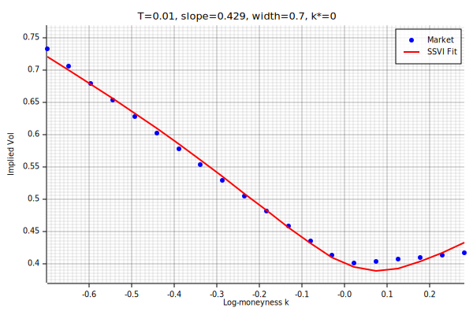

| 1e-2 | 0.005 | 157.0 | 76.2 | -0.236 | true |

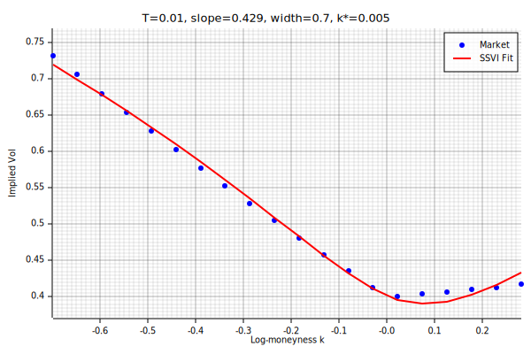

| 1e-2 | 0.010 | 156.1 | 74.7 | -0.238 | true |

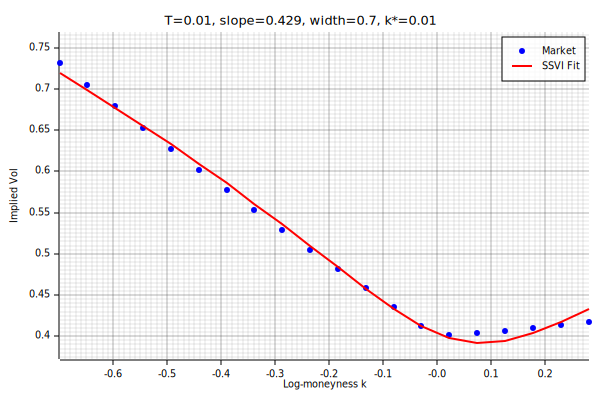

| 1e-2 | -0.010 | 167.7 | 84.2 | -0.228 | true |

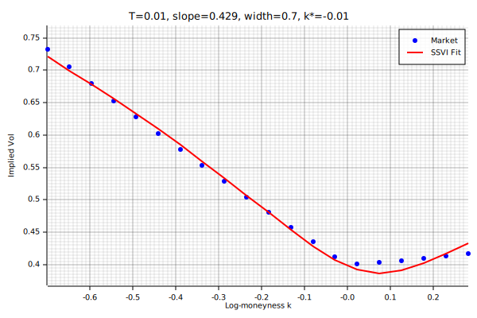

| 1e-3 | 0.000 | 158.8 | 78.3 | -0.234 | true |
| 1e-3 | 0.005 | 157.0 | 76.2 | -0.236 | true |
| 1e-3 | 0.010 | 156.1 | 74.7 | -0.238 | true |
| 1e-3 | -0.010 | 167.7 | 84.2 | -0.228 | true |
