# SSVI Real-World Fit Report

Calibration of SSVI to approximate real market data (12 expiry slices, ~40 points each).

## Calibration Summary

| T | max IV err (bps) | RMSE IV (bps) | avg price err (bps) | eta | gamma | rho | phi | eta*(1+\|rho\|) | converged |
|------:|-----------------:|--------------:|--------------------:|------:|------:|------:|------:|---------------:|:---------:|
| 0.0301 | 41.7 | 20.4 | 16.6 | 0.5404 | 0.2912 | -0.3247 | 3.684 | 0.716 | yes |
| 0.1068 | 46.0 | 23.9 | 20.1 | 0.5652 | 0.3309 | -0.3122 | 3.445 | 0.742 | yes |
| 0.1936 | 36.3 | 17.9 | 15.6 | 0.5573 | 0.3793 | -0.2562 | 3.683 | 0.700 | yes |
| 0.2795 | 37.4 | 19.0 | 16.5 | 0.5272 | 0.4004 | -0.2638 | 3.414 | 0.666 | yes |
| 0.4376 | 40.5 | 19.7 | 16.7 | 0.5215 | 0.4217 | -0.2662 | 3.159 | 0.660 | yes |
| 0.7014 | 24.5 | 9.7 | 7.6 | 0.5669 | 0.4253 | -0.2310 | 2.975 | 0.698 | yes |
| 0.9507 | 23.3 | 9.4 | 7.3 | 0.5452 | 0.4541 | -0.2296 | 2.833 | 0.670 | yes |
| 1.0274 | 22.8 | 9.3 | 7.1 | 0.5122 | 0.4648 | -0.2238 | 2.705 | 0.627 | yes |
| 1.1988 | 24.4 | 11.0 | 8.3 | 0.5789 | 0.4230 | -0.2326 | 2.468 | 0.713 | yes |
| 1.4495 | 24.2 | 10.4 | 7.9 | 0.5229 | 0.4584 | -0.2253 | 2.270 | 0.641 | yes |
| 1.9476 | 21.5 | 9.3 | 7.3 | 0.5291 | 0.4754 | -0.2203 | 2.036 | 0.646 | yes |
| 2.9452 | 33.1 | 14.6 | 11.5 | 0.5349 | 0.5011 | -0.2366 | 1.686 | 0.661 | yes |

## Fit Plots

### T = 0.0301

max err: 41.7 bps | RMSE: 20.4 bps | eta=0.5404, gamma=0.2912, rho=-0.3247

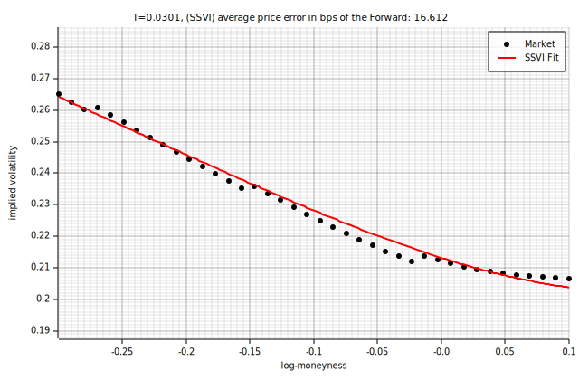

### T = 0.1068

max err: 46.0 bps | RMSE: 23.9 bps | eta=0.5652, gamma=0.3309, rho=-0.3122

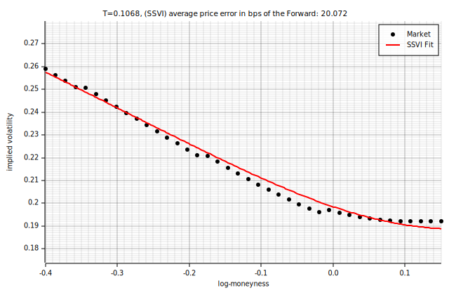

### T = 0.1936

max err: 36.3 bps | RMSE: 17.9 bps | eta=0.5573, gamma=0.3793, rho=-0.2562

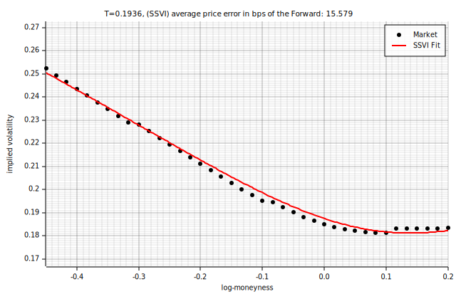

### T = 0.2795

max err: 37.4 bps | RMSE: 19.0 bps | eta=0.5272, gamma=0.4004, rho=-0.2638

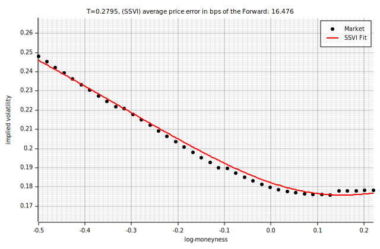

### T = 0.4376

max err: 40.5 bps | RMSE: 19.7 bps | eta=0.5215, gamma=0.4217, rho=-0.2662

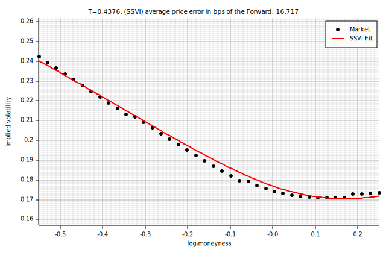

### T = 0.7014

max err: 24.5 bps | RMSE: 9.7 bps | eta=0.5669, gamma=0.4253, rho=-0.2310

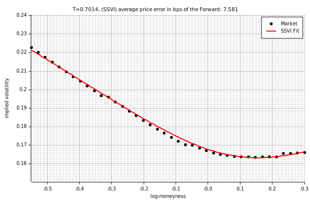

### T = 0.9507

max err: 23.3 bps | RMSE: 9.4 bps | eta=0.5452, gamma=0.4541, rho=-0.2296

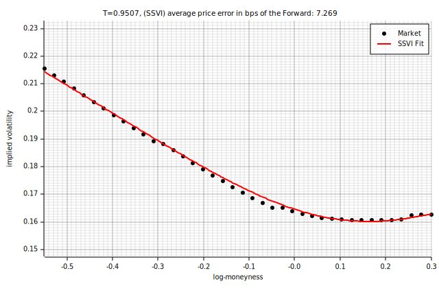

### T = 1.0274

max err: 22.8 bps | RMSE: 9.3 bps | eta=0.5122, gamma=0.4648, rho=-0.2238

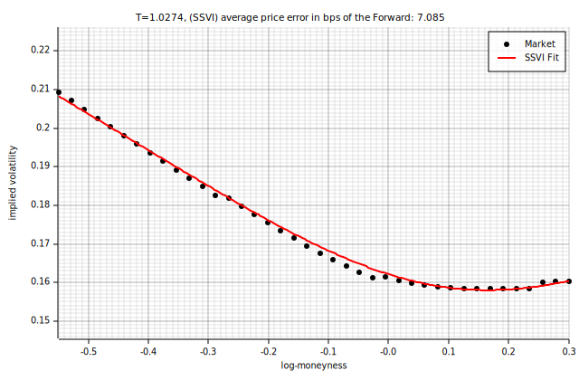

### T = 1.1988

max err: 24.4 bps | RMSE: 11.0 bps | eta=0.5789, gamma=0.4230, rho=-0.2326

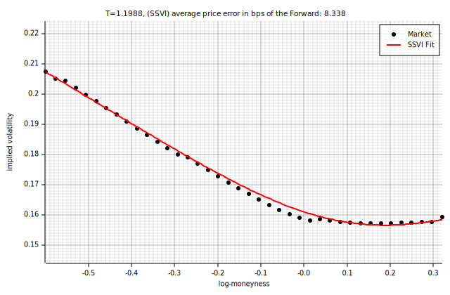

### T = 1.4495

max err: 24.2 bps | RMSE: 10.4 bps | eta=0.5229, gamma=0.4584, rho=-0.2253

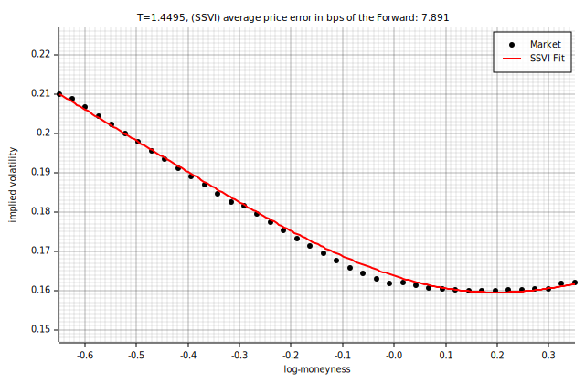

### T = 1.9476

max err: 21.5 bps | RMSE: 9.3 bps | eta=0.5291, gamma=0.4754, rho=-0.2203

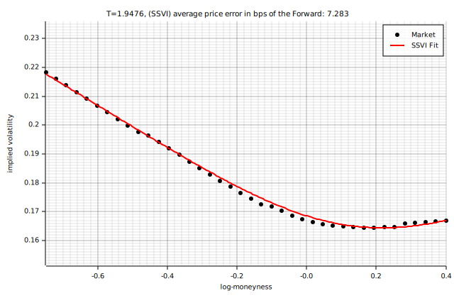

### T = 2.9452

max err: 33.1 bps | RMSE: 14.6 bps | eta=0.5349, gamma=0.5011, rho=-0.2366

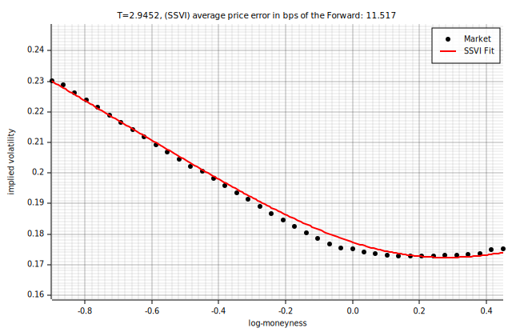

## No-Arbitrage Constraint Analysis

The SSVI no-arb condition requires `eta * (1 + |rho|) <= 2`.

| T | eta | rho | eta*(1+\|rho\|) | headroom | saturated |
|------:|------:|------:|---------------:|---------:|:---------:|
| 0.0301 | 0.5404 | -0.3247 | 0.716 | 1.284 | no |
| 0.1068 | 0.5652 | -0.3122 | 0.742 | 1.258 | no |
| 0.1936 | 0.5573 | -0.2562 | 0.700 | 1.300 | no |
| 0.2795 | 0.5272 | -0.2638 | 0.666 | 1.334 | no |
| 0.4376 | 0.5215 | -0.2662 | 0.660 | 1.340 | no |
| 0.7014 | 0.5669 | -0.2310 | 0.698 | 1.302 | no |
| 0.9507 | 0.5452 | -0.2296 | 0.670 | 1.330 | no |
| 1.0274 | 0.5122 | -0.2238 | 0.627 | 1.373 | no |
| 1.1988 | 0.5789 | -0.2326 | 0.713 | 1.287 | no |
| 1.4495 | 0.5229 | -0.2253 | 0.641 | 1.359 | no |
| 1.9476 | 0.5291 | -0.2203 | 0.646 | 1.354 | no |
| 2.9452 | 0.5349 | -0.2366 | 0.661 | 1.339 | no |
